# 基建项目级解决方案项目制交付方案

> 版本：V0.3  
> 日期：2026-07-30  
> 状态：内部讨论稿  
> 适用场景：目标项目筛选、售前沟通、解决方案设计、报价与项目交付  
> 方案名称：基建项目计划策划与动态管控解决方案

## 1. 阶段性结论与整体交付思路

### 1.1 阶段性结论

- 暂停独立基建版标准产品的持续开发。
- 用户并不缺少计划工具，Excel 等现有方式能够满足基本计划编制。
- 用户的主要问题是前期策划效率较低，以及现场变化后计划需要频繁调整。
- 客户当前更倾向于围绕已有方案讨论和优化，需要通过真实项目逐步引导客户建立精细化计划管理和多方案比选意识。
- 参数化建模与形象进度具有展示和汇报价值，但使用频率较低、项目交付成本较高，难以单独支撑持续产品经营。
- 下一阶段采用项目级解决方案方式，寻找少量计划管理需求强烈的大型项目，开展付费交付和商业验证。

### 1.2 整体交付思路

将参数化建模、形象进度、前期计划策划、多方案比选、重大变更影响与动态纠偏、总月周计划拆解与统计、产值分解与汇总组合成一个项目级解决方案。

整体采用：

> **基于基建项目进度管理解决方案介入，使用现有能力与验证方向分阶段交付、项目中验证、交付后沉淀。**

具体推进路径为：

> 意向项目扫描 → 明确客户问题和付费意愿 → 共识交付范围与报价 → FDE 主导项目交付 → 客户分阶段验收 → 回款与收入确认 → 评估成本和复用性 → 决定产品化沉淀

对外销售完整解决方案；对内先交付双方确认的现有能力，再结合客户真实业务场景逐步引入验证方向。项目成功需要同时回答：

1. 客户是否愿意付费。
2. 现有能力是否可以按约定完成交付。
3. 验证方向是否被持续使用并进入真实管理动作。
4. 项目收入是否能够覆盖交付成本。
5. 第二个项目是否能够复用首个项目的模型、规则和交付方法。

### 1.3 目标客户与关键角色

**目标客户**

- 大型基建线性项目施工总承包。
- 具有明确控制节点、较复杂施工组织和持续计划调整要求的项目。
- 能够提供工程结构、工程量、计划、实际进度及专业校核人员的项目。

**关键角色**

| 角色 | 主要职责 |
| --- | --- |
| 项目经理 | 确认项目管理目标、资源投入、采购意愿和最终管理决策 |
| 项目总工 | 确认施工逻辑、方案可实施性和变更影响 |
| 工程部长/计划负责人 | 编制和维护总月周计划，核实实际进度和计划偏差 |
| 统计/合同相关人员 | 确认工程量、单价和产值统计口径 |
| 市场/商务 | 确认付费主体、预算来源、报价、合同和回款 |
| 产品及 FDE | 负责解决方案范围、数据梳理、项目实施、验证记录和复盘 |

## 2. 产品解决方案核心内容

### 2.1 解决方案价值主张

本解决方案定位为**面向大型基建施工项目的项目级完整进度管理解决方案**。

解决方案以结构物参数化模型为基础底座，将工程结构、构件和空间关系转化为可计算、可关联的项目对象；在此基础上，进一步关联工程量、施工工艺与工效、资源配置和控制节点，形成项目进度策划与动态调整所需的统一数据和计算基础。

通过排程计算与 AI 辅助能力，解决方案重点支持两个核心场景：

- **前期计划策划与多方案比选**：围绕客户提出的可实施方案，测算不同工艺、工效、资源配置和施工顺序对工期、控制节点及资源占用的影响，辅助项目形成和选择一版可执行计划。
- **施工过程进度动态调整**：结合实际进度、资源变化和现场事件，识别受影响任务和控制节点，分析偏差传导关系，形成剩余计划和调整建议。

形象进度可视化作为解决方案的结果表达层，将前期策划方案、基准计划、实际完成状态和动态调整结果映射到结构物模型上，用于项目分析、方案沟通、过程管理和汇报展示。

AI 用于辅助约束识别、方案影响分析和调整建议，不替代项目总工、工程部门等专业人员确认施工逻辑、参数和最终决策，也不承诺自动求解全局“最优方案”。

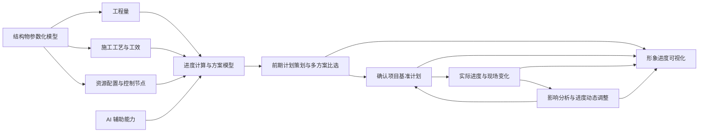

### 2.2 参数化建模与形象进度

**用户痛点**

工程结构、构件、工程量、空间位置和施工状态分散在图纸和表格中；形象进度通常依靠人工制作，维护成本较高，且容易与真实计划和实际进度脱节。

**产品切入思路**

根据工程结构和构件参数建立项目对象模型，将构件、工程量、计划任务和实际状态关联，统一形成形象进度可视化展示。参数化模型不仅承担展示功能，也作为后续计划、统计和动态纠偏的数据基础。

**价值描述**

- 减少重复建模和人工制作汇报材料。
- 让形象进度与计划和实际进度保持同源。
- 为工程量、产值和变更影响分析提供统一工程对象。

**初步验证结果**

模型可视化和形象进度的展示价值初步成立，客户存在相对明确的付费认知；但场景低频、交付成本较高，下一阶段需要验证其能否成为计划管理的数据底座。

### 2.3 前期计划策划与多方案比选

**用户痛点**

用户能够使用 Excel 和计划软件形成计划，但工程量、施工逻辑、工效、资源和外部约束仍依赖人工汇总。客户通常能够提出可选方案，但不同方案对工期、控制节点、资源周转和连锁任务的影响难以及时量化。

**产品切入思路**

先基于客户已有思路形成一版可解释、可校核的基准计划；再由客户提出 1—2 个真实可实施的局部备选方案，产品在统一约束条件下测算工期、节点、资源、任务和产值差异。

产品目前在探索使用 AI 自动生成多套策划方案，但目前暂无法证明求解全局最优。

**价值描述**

- 提高形成和校核一版可执行计划的效率。
- 将经验讨论转化为带影响测算的方案决策。
- 缩短方案反复调整和跨角色沟通周期。

**初步验证结果**

用户存在前期策划和反复调整需求，但 Excel 等工具已经能够满足基本计划编制。客户当前更倾向于围绕已有方案讨论和优化，多方案比选意识仍需逐步引导；方案影响测算能否形成明确付费价值仍待真实项目验证。

### 2.4 重大变更影响与动态纠偏

**用户痛点**

实际进度偏差、施工方法变化、工作面变化、资源变化或外部要求变化后，项目需要频繁调整计划。变化事实、已完成工程、剩余任务和控制节点之间的传导关系难以及时算清。

**产品切入思路**

锁定变更发生前的计划和实际状态，记录一个真实且尚未完成处置的重大变更事件，识别受影响任务、控制节点、工程量和产值，形成剩余计划和调整建议，并由项目总工或工程部门逐项确认。

**价值描述**

- 从“重新排一张计划表”升级为“判断变化后果并形成管理动作依据”。
- 提前识别控制节点风险和调整窗口。
- 支持计划修订、资源协调、施工组织调整和公司督办。

**初步验证结果**

现场变化导致计划频繁调整的痛点初步成立，是下一阶段最值得验证的管理价值；但当前尚未通过一个真实新事件验证影响识别、专业校核成本和管理动作效果，该能力仍属于假设验证方向。

### 2.5 总计划、月计划、周计划拆解与统计

**用户痛点**

总计划、月计划和周计划通常使用不同表格维护，拆解和汇总依赖人工重复整理。周期计划与实际完成缺少稳定关联；如果要求现场人员重复填报，还会增加新的维护负担。

**产品切入思路**

以客户确认的基准计划为来源，建立总计划、月计划和周计划之间的任务和工程量关系；尽量复用客户现有表格和实际进度数据，按周期汇总计划量、完成量、剩余量和偏差。

**价值描述**

- 减少总月周计划之间的重复拆分和手工汇总。
- 让周期计划、实际完成和剩余任务保持一致。
- 将计划编制、过程跟踪和偏差分析连接为同一工作流程。

**初步验证结果**

客户已有总月周计划和人工统计流程，但产品能否降低现有工作量、避免新增填报负担并形成持续使用，仍缺少真实项目运行证据。

### 2.6 产值分解与汇总

**用户痛点**

计划任务、工程量、计划产值和实际产值通常由不同岗位、不同表格分别维护。月周计划或实际进度变化后，需要重复拆分和汇总产值。

**产品切入思路**

将计划任务与工程量、单价或折算规则建立对应关系，随总月周计划形成计划产值，随实际进度汇总实际产值和偏差。

首期只处理客户确认的计划与进度统计产值，不直接扩展到业主计量、合同结算和对下计量等商务场景。

**价值描述**

- 减少月周计划与产值统计之间的重复计算。
- 让计划进度、实际进度和产值使用同一数据来源。
- 支持项目生产分析和周期目标检查。

**初步验证结果**

产值与计划联动具有业务合理性，但现有材料不足以证明不同项目的统计口径可以直接统一；能否替代真实统计工作、降低人工投入和形成付费价值仍待验证。

### 2.7 能力状态汇总

| 能力 | 当前判断 | 下一阶段关键验证 |
| --- | --- | --- |
| 参数化建模与形象进度 | 展示价值初步成立，持续价值和交付成本待验证 | 是否成为计划数据底座，第二项目成本是否下降 |
| 前期策划与方案比选 | 需求部分成立，付费决策价值待验证 | 是否缩短策划周期并进入正式报价 |
| 重大变更与动态纠偏 | 痛点初步成立，产品价值尚未验证 | 是否处理真实事件并触发管理动作 |
| 总月周计划拆解与统计 | 业务流程存在，持续使用效果待验证 | 是否减少重复工作并连续运行 |
| 产值分解与汇总 | 业务逻辑合理，客户口径和使用价值材料不足 | 统计口径能否确认，是否替代实际工作 |

### 2.8 当前产品实现页面补充

> 说明：以下截图用于补充说明当前产品已经形成的页面形态、数据对象和功能入口。截图本身只能证明可见页面与功能实现情况，不等同于完整项目级解决方案已经交付，也不代表持续使用、管理价值或商业价值已经验证通过。截图包含项目名称等内部信息，外发前需完成脱敏处理。

| 页面分组 | 截图反映的当前实现 | 对应解决方案能力 |
| --- | --- | --- |
| 参数化底座 | 线路空间配置、桥梁结构参数和构件模型管理 | 结构物参数化建模、工程对象底座 |
| 计划与约束配置 | 施工任务、工效、资源、工艺逻辑、里程碑和时空计划展示 | 前期计划策划、排程计算、多方案测算基础 |
| 过程跟踪与结果表达 | 实际进度填报、线性工程总览、隧道和桥梁形象进度 | 过程进度跟踪、动态调整输入、形象进度可视化 |

#### 2.8.1 参数化底座

**图1　线路空间配置：维护项目线路和空间位置，为线性工程对象关联提供基础。**

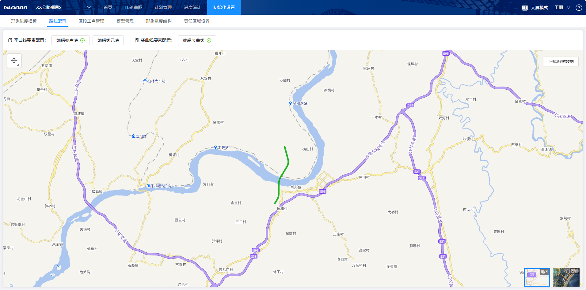

**图2　桥梁结构参数与构件模型管理：按桥跨、墩台和构件参数建立结构物模型。**

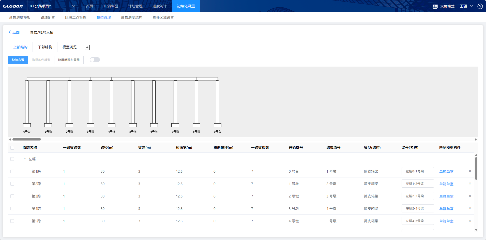

#### 2.8.2 计划、工效、资源与约束配置

**图3　工效配置：按构件和工艺维护工效分组及计算单位。**

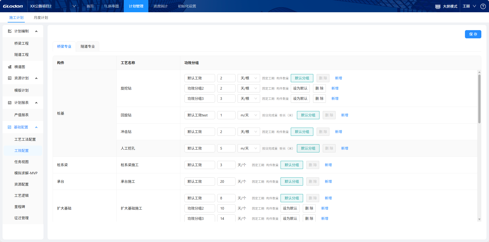

**图4　资源配置：维护关键资源的默认投入、可增上限和启用状态。**

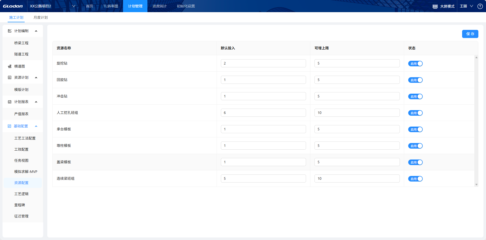

**图5　工艺逻辑：维护构件之间的前置关系、逻辑关系和时间间隔。**

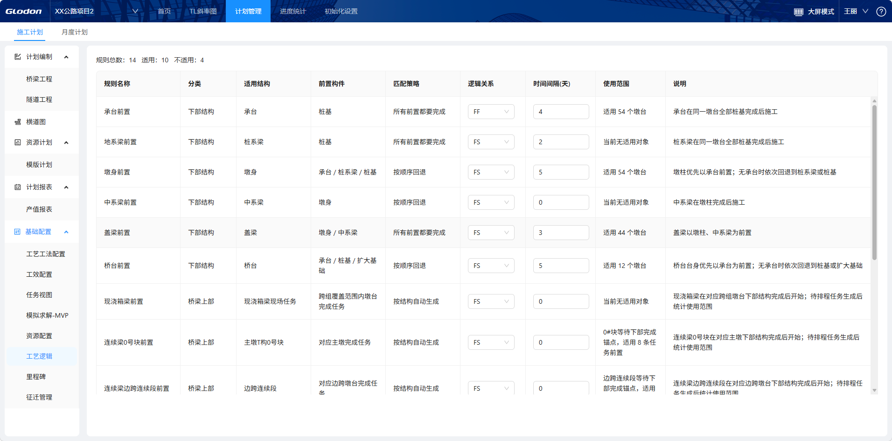

**图6　里程碑配置：维护工点范围、目标事件和目标完成日期。**

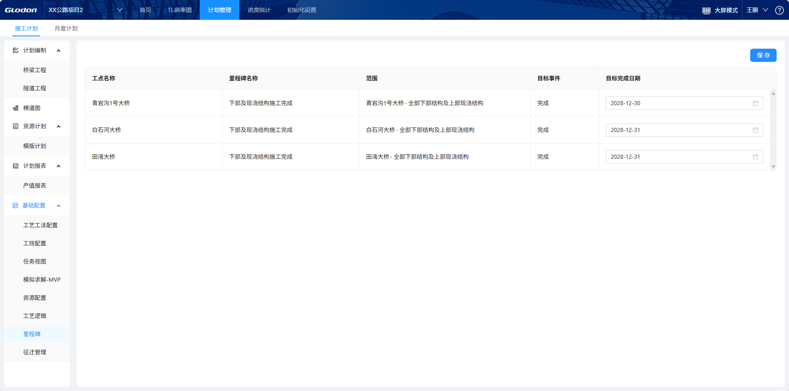

**图7　施工计划：展示任务层级、施工方向、前置任务、工程量、工效和计划日期。**

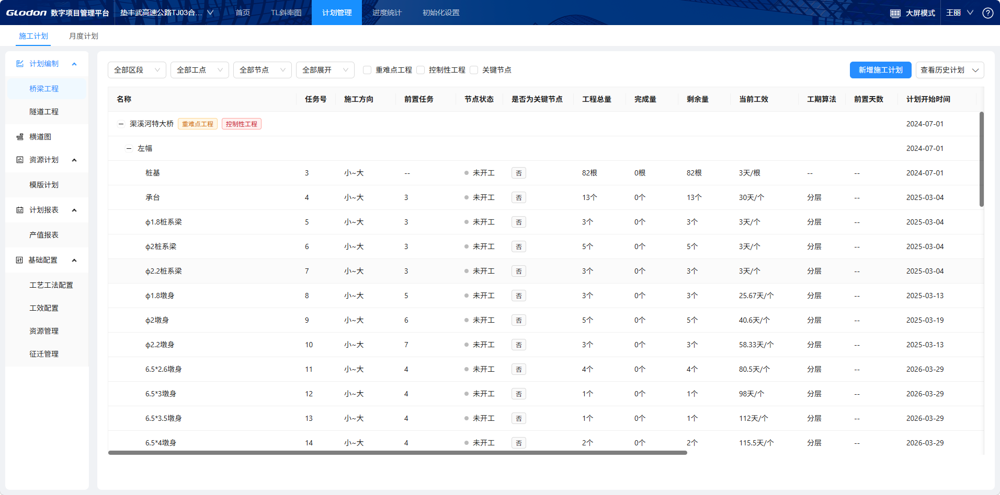

**图8　TL斜率图：从时间和里程维度表达任务安排及施工组织关系。**

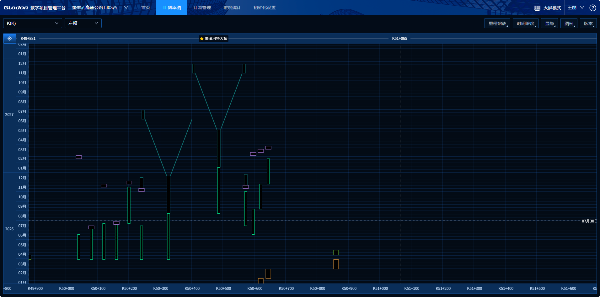

#### 2.8.3 过程跟踪与形象进度

**图9　实际进度跟踪：按结构物和构件维护开累完成量、状态及实际日期。**

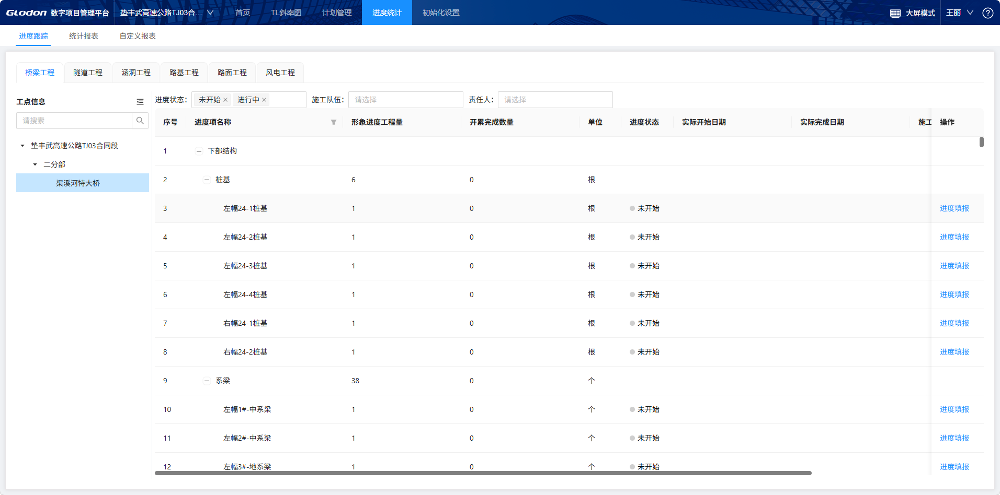

**图10　线性工程形象进度一张图：在地图上汇总桥梁、隧道和路基工点及总体状态。**

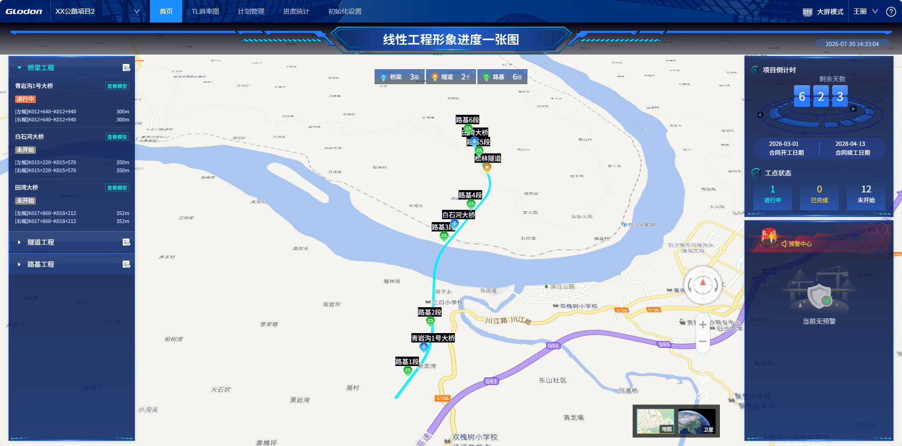

**图11　隧道形象进度：展示开挖、仰拱等工序的设计量、完成量、进度和偏差。**

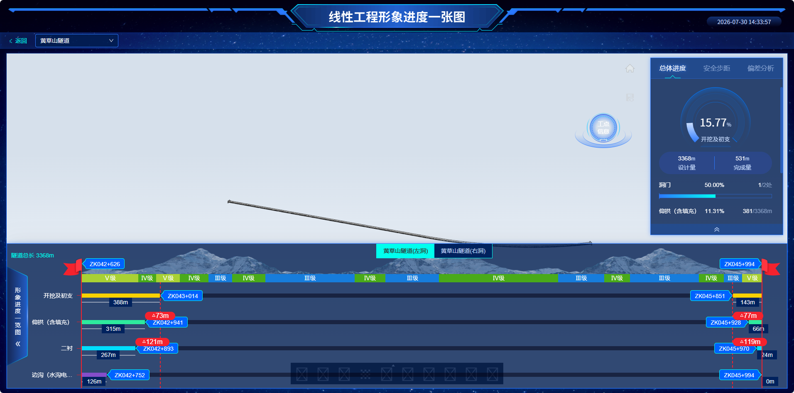

**图12　桥梁三维形象进度：按构件展示未开始、进行中、已完成、超前和延期状态。**

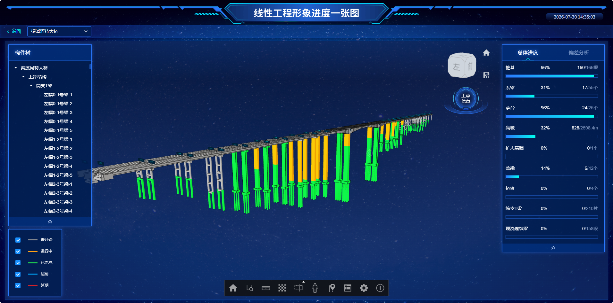

## 3. 解决方案交付思路

### 3.1 目标项目选择条件

- 存在明确的前期策划、计划拆解、产值统计或动态调整问题。
- 未来 1—2 个月内有真实方案决策或重大变更窗口。
- 能够提供工程结构、工程量、基准计划、实际进度和必要产值口径。
- 项目经理、总工、工程部门和计划统计责任人能够参与。
- 付费决策人愿意进入正式报价、预算或采购沟通。
- 项目类型、数据和规则具有一定复用价值。

只需要一次性展示、缺少基准计划、没有专业责任人或不进入付费讨论的项目，不进入深度交付。

### 3.2 现有能力与验证方向分阶段交付

分阶段交付不是将完整业务流程机械拆成多个建设阶段，而是根据能力成熟度和客户实际条件安排。

具体交付项以项目启动前的能力盘点和双方确认范围为准：

| 阶段 | 能力属性 | 交付目标 | 主要成果 | 客户验收重点 |
| --- | --- | --- | --- | --- |
| 第一阶段：现有能力交付 | 已具备能力 | 将双方确认的现有能力应用到项目，形成首期可用成果 | 优先包括参数化模型、形象进度，以及经盘点确认可直接交付的计划计算、数据导入和统计能力 | 按约定范围完成交付，客户能够使用成果完成对应项目工作 |
| 第二阶段：项目管理方向验证 | 现有能力组合及新增验证方向 | 在现有数据和产品基础上，验证计划策划、局部方案比选、总月周计划及产值联动 | 基准计划、1—2 个方案影响对比、总月周计划、计划与实际产值、周期偏差分析 | 成果进入连续计划周期，并用于项目例会、生产协调或方案决策 |
| 第三阶段：动态纠偏方向验证 | 核心验证方向 | 利用真实重大变更验证影响分析和动态调整价值 | 真实事件、影响任务和节点、剩余计划、版本对比、专业确认和管理动作记录 | 专业人员确认结果，并触发计划修订、资源协调、施工组织调整或督办 |

前一阶段形成的数据和成果作为后一阶段验证基础。某一验证方向不具备数据、事件或责任人条件时，可以暂缓，不影响已经明确的现有能力交付和验收。

### 3.3 交付范围共识与过程调整

报价和交付前，双方应共同明确：

- 项目规模和专业范围。
- 现有能力交付项和验证方向。
- 客户数据、专业校核和日常维护责任。
- 驻场周期、接口要求和培训安排。
- 各阶段交付成果、验收口径、周期和费用。

交付过程中发生新增需求、范围删减或前提条件变化时，应及时记录在案。双方评估其对范围、费用、周期和验收的影响，并争取通过补充报价、范围置换或计划调整形成一致；未经双方确认的内容不自动纳入原交付范围。

### 3.4 交付组织与责任

| 工作 | 市场/商务 | 产品 | FDE/解决方案 | 研发 | 客户 |
| --- | --- | --- | --- | --- | --- |
| 项目筛选与付费判断 | 主责 | 参与 | 参与 | 不介入 | 提供问题和采购信息 |
| 范围及验收设计 | 参与 | 主责 | 主责 | 可行性支持 | 确认业务边界 |
| 数据准备与项目实施 | 协调 | 监督范围 | 主责 | 受控支持 | 提供并确认数据 |
| 专业校核与最终决策 | 不介入 | 记录证据 | 支持 | 不承担专业判断 | 总工及工程部门主责 |
| 报价、合同和回款 | 主责 | 提供范围 | 提供人日成本 | 提供技术成本 | 确认预算与采购 |
| 商业验证复盘 | 提供商务证据 | 主责 | 提供交付成本 | 提供复用证据 | 确认实际价值 |

初期暂无独立 FDE 时，可以由产品临时兼顾方案设计和实施协调，但需要单独记录产品、实施和研发投入，避免低估真实交付成本。

### 3.5 交付后的产品化沉淀

每个项目结束后至少沉淀：

- 数据模板、字段映射和导入规则。
- 工程结构、计划任务、工程量和产值关联规则。
- 总月周计划、工效和资源配置模板。
- 变更事件处理和专业确认流程。
- 实施人日、研发投入、维护成本和问题清单。
- 客户使用、管理动作、回款和增购证据。
- 第二项目可直接复用和仍需定制的内容清单。

只有第二个项目能够减少专属开发、人工数据处理和专家代做，才考虑将相关能力沉淀为标准模块或插件。

## 4. 初步报价策略

### 4.1 报价原则

1. **对外整体报价**：以“基建项目计划策划与动态管控解决方案”统一报价。
2. **对内拆分核算**：分别核算产品能力、参数化建模、数据初始化、实施验证、持续维护和定制开发成本。
3. **首个项目必须付费**：可以采用商业验证价格，但不采用无边界免费试用。
4. **交付范围先共识、过程调整需留痕**：报价前明确范围、成果和验收；交付中的变化及时记录，并协商调整交付范围、项目周期或报价。

### 4.2 报价组成

| 报价项 | 主要内容 |
| --- | --- |
| 产品能力使用费 | 项目周期内使用双方确认的现有产品能力，以及纳入交付范围的阶段性验证能力 |
| 项目实施与验证交付费 | 数据梳理和初始化、参数化建模、计划与统计配置、验证方向实施、培训、专业协同和项目复盘 |
| 扩展与持续服务费 | 经双方确认的新增专业范围、接口、专属规则、定制开发、延长驻场或后续服务 |

### 4.3 首轮报价建议

以下价格属于内部商业验证假设，不代表已经确认的市场标准价：

| 项目类型 | 建议报价 | 适用边界 |
| --- | --- | --- |
| 最小商业验证项目 | 约 15 万元/项目 | 数据相对完整；一个主要专业范围；现有能力交付及有限验证方向；不含系统集成 |
| 标准项目级解决方案 | 20—25 万元/项目 | 包含较完整参数化建模、项目管理方向验证、持续实施和动态纠偏验证 |
| 复杂项目或扩展范围 | 25 万元以上，单独测算 | 多专业、多结构类型、数据治理、长期驻场、外部接口或专属开发 |

不得为了维持验证价格无限扩大交付范围。若数据治理、建模、驻场或定制投入明显超出前期共识，应缩小范围、置换内容或重新报价。

### 4.4 付款节点建议

可采用以下初步付款结构，具体以客户采购要求和双方确认的阶段为准：

- 合同生效并完成项目启动：30%。
- 第一阶段现有能力交付验收：30%。
- 第二阶段项目管理方向验证验收：25%。
- 第三阶段动态纠偏验证及项目复盘完成：15%。

如项目周期内没有出现合格的重大变更事件，应在合同中提前约定第三阶段顺延、范围置换或费用调整方式，不能临时使用已经处理完成的历史事件制造验证通过。

### 4.5 报价与成本复盘

每个项目必须记录客户预算、初始报价、范围调整、成交价格、付款节点，以及产品、FDE、研发、差旅和第三方实际投入。

项目结束后，根据成交价格能否覆盖完整交付成本、客户是否持续使用、成果是否进入真实管理动作、第二项目能否复用，决定维持项目解决方案、调整价格、收缩范围或停止扩大销售。

## 5. 下一步动作

1. 产品、市场、FDE 和研发共同盘点五项能力的成熟度，明确可直接交付、需要项目适配和暂不具备的内容。
2. 市场团队依据项目准入条件形成目标客户清单，并优先访谈付费决策人。
3. 对候选项目开展数据预审、真实事件窗口确认和交付人日测算。
4. 基于 15—25 万元的首轮价格假设，形成具体项目范围、报价和分阶段验收约定。
5. 选择 1—2 个项目开展付费交付，记录持续使用、管理动作、收入、成本和跨项目复用证据。
