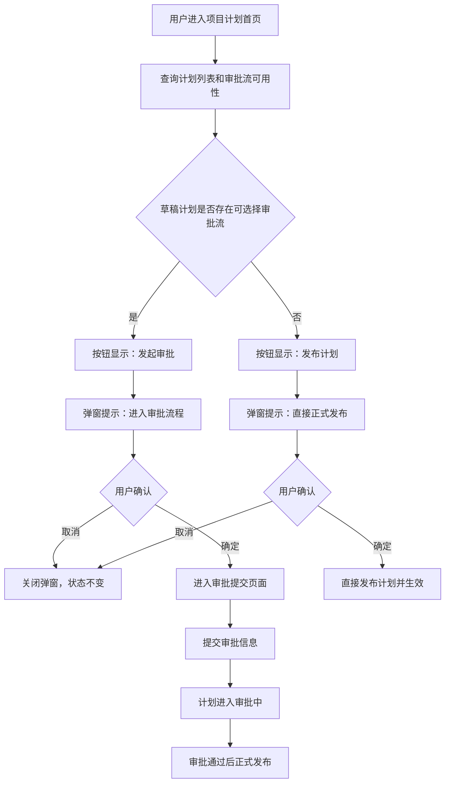

# 计划发布与审批入口需求文档

版本：v1.0

日期：2026-06-19

适用范围：斑马进度计划项目计划首页中草稿计划的发布 / 审批入口

面向对象：产品、前端研发、后端研发、测试、计划工程师

## 1. 功能模块核心定位

### 1.1 模块定位

计划发布与审批入口用于控制项目计划从“草稿”进入“正式发布”的最后确认流程。系统应根据当前项目是否存在适用于计划发布的可选择审批流，动态决定草稿计划行内主操作按钮的名称、确认弹窗文案和后续处理路径。

核心规则如下：

- 存在可选择审批流时，按钮显示“发起审批”，用户确认后进入审批提交页面，审批通过后计划正式发布。
- 不存在可选择审批流时，按钮显示“发布计划”，用户确认后计划直接正式发布并生效。

该入口是计划发布前的业务分流点，既要避免需要审批的项目绕过审批，也要避免未配置审批流的项目被阻塞在提交动作上。

### 1.2 当前页面效果和业务场景

截图页面为“斑马进度计划”的项目计划首页。当前项目为左侧导航选中的项目，主内容区按计划类型分组展示：

- 总计划
- 月计划
- 形象进度计划
- 专项计划

“总计划”分组中展示计划版本列表，其中草稿行示例为“总计划-第5版-2026/06/10 [草稿]”。草稿计划右侧已有行内操作区，包含当前发布入口以及“分享计划”“删除”等操作。页面当前弹窗标题为“提示”，按钮为“取消”和“确定”。

本需求要求替换当前草稿计划发布入口的按钮名称和确认弹窗文案，并补齐点击确认后的两种业务路径。

典型业务场景包括：

- 项目已配置计划发布审批流，计划编制人员提交草稿总计划，系统先发起审批，审批通过后再对公司或项目成员正式发布。
- 项目未配置计划发布审批流，计划编制人员提交草稿计划，系统经二次确认后直接发布为正式计划。
- 同一页面下的总计划、月计划、形象进度计划和专项计划均应按当前项目审批流配置使用一致的发布分流规则；如后续审批流按计划类型细分，则以当前计划类型可用审批流为准。

### 1.3 模块边界

本期覆盖：

- 草稿计划行内发布入口的按钮名称动态展示。
- 点击发布入口后的二次确认弹窗。
- 存在审批流时跳转审批提交页面。
- 不存在审批流时直接发布计划。
- 发布或发起审批后的计划状态更新、列表刷新和异常提示。
- 后端对当前项目审批流可用性的判断能力。

本期不覆盖：

- 审批流配置页面。
- 审批节点、审批人、抄送人、条件分支等审批引擎配置细节。
- 审批提交页面内的完整字段设计；本需求只要求能承接计划发布申请并发起审批。
- 审批通过后的通知、催办、撤回和审批详情页。
- 非草稿计划的历史版本管理、分享计划、删除计划等既有能力改造。

## 2. 数据定义

### 2.1 主数据对象

| 数据对象 | 说明 | 页面用途 |
| --- | --- | --- |
| `Project` | 当前项目基础信息 | 判断计划列表和审批流配置归属 |
| `PlanVersion` | 计划版本对象 | 展示计划名称、版本、状态和行内操作 |
| `ApprovalFlowOption` | 当前项目下可用于计划发布的审批流 | 判断发布入口进入审批还是直发 |
| `PlanPublishActionContext` | 发布入口上下文 | 返回按钮名称、弹窗文案和后续动作类型 |
| `ApprovalInstance` | 审批实例 | 记录草稿计划发起审批后的审批状态和实例 ID |

### 2.2 计划版本字段

| 字段 | 类型 | 必填 | 页面状态 | 说明 |
| --- | --- | --- | --- | --- |
| `project_id` | string | 是 | 内部使用 | 当前计划所属项目 |
| `plan_id` | string | 是 | 内部使用 | 计划主 ID |
| `plan_version_id` | string | 是 | 内部使用 | 计划版本 ID |
| `plan_type` | enum | 是 | 分组展示 | 总计划、月计划、形象进度计划、专项计划 |
| `plan_name` | string | 是 | 只读展示 | 页面中展示的计划名称 |
| `version_no` | string / number | 是 | 只读展示 | 版本号，如“第5版” |
| `business_date` | date | 否 | 只读展示 | 计划业务日期，如 `2026/06/10` |
| `status` | enum | 是 | 标签展示 | 草稿、审批中、已驳回、已发布等 |
| `updated_by` | string | 否 | 只读展示 | 最近更新人 |
| `updated_at` | datetime | 否 | 只读展示 | 最近更新时间 |
| `effective_at` | datetime | 否 | 只读展示 | 正式发布生效时间 |
| `approval_instance_id` | string | 否 | 内部使用 | 已发起审批的实例 ID |

### 2.3 审批流可用性字段

| 字段 | 类型 | 必填 | 说明 |
| --- | --- | --- | --- |
| `project_id` | string | 是 | 当前项目 ID |
| `plan_type` | enum | 否 | 如审批流按计划类型配置，则用于限定适用范围 |
| `has_selectable_approval_flow` | boolean | 是 | 是否存在适用于本次计划发布的可选择审批流 |
| `approval_flows` | `ApprovalFlowOption[]` | 否 | 可选择审批流列表；为空时走直接发布 |
| `publish_mode` | enum | 是 | `approval_required` 或 `direct_publish` |
| `action_label` | string | 是 | 行内按钮展示文案 |
| `confirmation_text` | string | 是 | 点击按钮后的确认弹窗正文 |

“可选择审批流”应满足以下条件：

- 属于当前项目，或属于当前项目可继承使用的组织级审批配置。
- 适用于计划发布场景；如区分计划类型，应适用于当前 `plan_type`。
- 审批流处于启用状态，且配置完整。
- 当前用户具备发起该计划发布审批的权限。

如果项目存在审批流配置，但当前用户无权发起审批，不应自动降级为直接发布，应禁用发布入口或提示无权限。

### 2.4 枚举、状态和展示文案

| 类别 | 值 | 展示或含义 |
| --- | --- | --- |
| 计划类型 | `master` | 总计划 |
| 计划类型 | `monthly` | 月计划 |
| 计划类型 | `image_progress` | 形象进度计划 |
| 计划类型 | `special` | 专项计划 |
| 发布模式 | `approval_required` | 需要先发起审批，审批通过后发布 |
| 发布模式 | `direct_publish` | 无审批流，确认后直接发布 |
| 计划状态 | `draft` | 草稿，可展示发布入口 |
| 计划状态 | `approving` | 审批中，不可重复发起审批或直接发布 |
| 计划状态 | `rejected` | 已驳回，可按产品规则回到草稿后重新提交 |
| 计划状态 | `published` | 已发布 / 已生效，不再展示发布入口 |

按钮和弹窗文案必须使用以下固定文案：

| 场景 | 按钮名称 | 弹窗正文 |
| --- | --- | --- |
| 存在可选择审批流 | 发起审批 | 该计划提交后将进入审批流程，审批通过后正式发布，确认继续吗？ |
| 不存在可选择审批流 | 发布计划 | 提交后该计划将直接正式发布，确认发布吗？ |

弹窗标题沿用当前页面样式，显示“提示”。弹窗底部保留“取消”和“确定”两个操作按钮。

## 3. 数据初始化和查询规则

### 3.1 页面进入时查询

用户进入项目计划首页时，系统应完成以下查询和初始化：

1. 查询当前项目的计划分组和计划版本列表。
2. 查询当前项目是否存在适用于计划发布的可选择审批流。
3. 为每条草稿计划生成发布入口上下文，包括按钮名称、弹窗正文和发布模式。
4. 渲染计划列表和行内操作。

如果审批流配置只按项目维度生效，可在项目级统一返回 `has_selectable_approval_flow`。如果审批流配置已细分到计划类型，后端应按 `plan_type` 返回每条草稿计划对应的发布模式。

### 3.2 数据归属

审批流配置归属于项目或项目可继承的组织配置。计划版本归属于当前项目，发布和审批只影响当前计划版本，不影响其他项目和其他计划版本。

直接发布和审批通过后的最终结果应保持一致：当前计划版本成为正式发布版本，并记录发布人、发布时间和生效状态。

### 3.3 列表刷新规则

以下动作完成后，前端应刷新当前计划分组列表：

- 发起审批成功。
- 直接发布成功。
- 审批提交页面返回计划首页。
- 后端返回审批流配置变化、计划状态变化或版本冲突。

刷新后，已进入审批或已发布的计划不应继续展示可点击的发布入口。

## 4. 页面功能交互

### 4.1 行内按钮展示

草稿计划行右侧展示发布入口按钮。按钮名称由当前项目审批流可用性决定：

- `publish_mode = approval_required` 时展示“发起审批”。
- `publish_mode = direct_publish` 时展示“发布计划”。

非草稿计划不展示该入口。已发布版本可继续展示“历史版本”“分享计划”等既有操作；审批中版本可展示审批状态或审批详情入口，具体入口不在本期范围内。

### 4.2 Case 1：存在可选择审批流

当当前项目存在可选择审批流时，草稿计划行内主操作按钮显示为“发起审批”。

用户点击“发起审批”后，系统弹出确认弹窗：

- 标题：提示
- 正文：该计划提交后将进入审批流程，审批通过后正式发布，确认继续吗？
- 按钮：取消、确定

用户点击“取消”时，弹窗关闭，计划状态不变。

用户点击“确定”时，系统进入审批提交页面。审批提交页面应带入当前计划版本信息，并允许用户确认审批流、审批信息和必要的提交说明。用户在审批提交页面确认提交后，系统创建审批实例，计划进入审批流程。

发起审批成功后：

- 计划状态更新为“审批中”。
- 当前计划版本不得被再次直接发布。
- 当前计划版本不得重复发起新的审批实例，除非原审批被撤回、驳回或按审批系统规则终止。
- 审批通过后，系统将该计划版本正式发布并生效。
- 审批驳回后，计划状态应回到可处理状态，具体展示为“已驳回”或“草稿”由现有计划状态体系确定，但必须允许用户修改后重新提交。

### 4.3 Case 2：不存在可选择审批流

当当前项目不存在可选择审批流时，草稿计划行内主操作按钮显示为“发布计划”。

用户点击“发布计划”后，系统弹出确认弹窗：

- 标题：提示
- 正文：提交后该计划将直接正式发布，确认发布吗？
- 按钮：取消、确定

用户点击“取消”时，弹窗关闭，计划状态不变。

用户点击“确定”时，系统直接发布当前计划版本。发布成功后：

- 计划状态更新为“已发布”或“已生效”。
- 记录发布人、发布时间和生效版本。
- 计划列表刷新，当前版本不再展示“发布计划”按钮。
- 如同一计划类型只能存在一个正式生效版本，旧正式版本应转为历史版本。

### 4.4 交互流程

## 5. 前后端能力要求

### 5.1 前端职责

前端应负责：

- 在计划列表中按后端返回的发布模式展示对应按钮文案。
- 点击按钮后展示对应确认弹窗，文案必须与需求固定文案一致。
- 在用户取消时关闭弹窗，不提交任何发布或审批请求。
- 在审批模式下，用户确认后携带当前计划版本上下文进入审批提交页面。
- 在直接发布模式下，用户确认后提交直接发布请求，并处理成功、失败和加载状态。
- 在发起审批或发布成功后刷新计划列表。
- 避免同一按钮在提交中被重复点击。

前端不应只依赖本地缓存决定是否可直接发布。最终发布模式和权限必须以后端校验为准。

### 5.2 后端职责

后端应负责：

- 判断当前项目和当前计划类型是否存在可选择审批流。
- 返回计划发布入口上下文，包括 `publish_mode`、`action_label` 和 `confirmation_text`。
- 校验当前用户是否具备发起审批或直接发布权限。
- 在直接发布时完成计划版本状态变更、生效版本切换、操作记录和并发校验。
- 在发起审批时创建审批实例或生成审批提交页面所需上下文。
- 接收审批通过结果，并将对应计划版本正式发布。
- 接收审批驳回、撤回或终止结果，并更新计划版本审批状态。

### 5.3 最小接口能力

实际接口路径可由工程实现确定，但必须具备以下能力：

| 能力 | 输入 | 输出 |
| --- | --- | --- |
| 查询计划列表 | 项目 ID | 按计划类型分组的计划版本列表 |
| 查询发布入口上下文 | 项目 ID、计划类型、计划版本 ID | 发布模式、按钮文案、弹窗文案、可选审批流摘要 |
| 发起审批提交 | 项目 ID、计划版本 ID、审批流 ID、提交说明 | 审批实例 ID、计划审批状态 |
| 直接发布计划 | 项目 ID、计划版本 ID、版本号或更新时间 | 发布结果、生效版本、发布时间 |
| 接收审批结果 | 审批实例 ID、审批结果 | 计划发布或驳回后的状态 |

## 6. 联动规则

### 6.1 与计划状态联动

- 只有草稿计划展示“发起审批”或“发布计划”。
- 审批中计划不得展示直接发布入口，避免绕过审批。
- 已发布计划不展示发布入口。
- 已驳回计划是否展示发布入口，应根据计划是否回到可提交状态判断。

### 6.2 与版本管理联动

直接发布或审批通过后，当前计划版本成为正式版本。若业务要求同一计划类型同一项目只保留一个当前生效版本，系统应自动将旧正式版本转为历史版本，并保证“历史版本”入口可查看旧版本。

发布失败或审批发起失败时，不得改变当前计划版本状态。

### 6.3 与权限联动

用户无发布权限时，发布入口应隐藏或禁用，并给出明确提示。用户无审批发起权限但项目存在审批流时，不得自动展示“发布计划”绕过审批。

### 6.4 与审批流配置变更联动

如果用户打开页面后，项目审批流配置发生变化，后端在用户点击确认后的最终校验中应重新判断发布模式：

- 原本无审批流但提交时已新增审批流时，应阻止直接发布，并提示刷新后发起审批。
- 原本有审批流但提交时审批流被停用时，应提示审批流不可用，并刷新按钮状态。
- 计划状态已被其他用户更新时，应提示当前计划状态已变化，并刷新列表。

## 7. 校验与异常处理

| 场景 | 系统处理 |
| --- | --- |
| 审批流查询失败 | 计划列表可展示，但草稿计划发布入口应置灰或展示加载失败提示，避免误直发 |
| 存在审批流但配置不完整 | 不允许直接发布，提示审批流配置异常 |
| 用户无发布权限 | 按钮隐藏或置灰，提示无权限 |
| 用户重复点击确定 | 只提交一次，按钮进入加载状态 |
| 计划已不是草稿 | 阻止操作，提示计划状态已变化，并刷新列表 |
| 直接发布失败 | 保持草稿状态，展示失败原因 |
| 审批实例创建失败 | 保持草稿状态，展示失败原因 |
| 审批通过回调失败 | 保留审批通过事件，支持重试发布或人工补偿 |
| 旧版本并发冲突 | 阻止发布，提示计划版本已更新，请刷新后重试 |

## 8. 验收标准

1. 当前项目存在适用于计划发布的可选择审批流时，草稿计划行内按钮显示为“发起审批”。
2. 点击“发起审批”后，弹窗正文显示“该计划提交后将进入审批流程，审批通过后正式发布，确认继续吗？”。
3. 在发起审批弹窗点击“取消”后，弹窗关闭，计划状态不变，未创建审批实例。
4. 在发起审批弹窗点击“确定”后，系统进入审批提交页面，并带入当前计划版本信息。
5. 用户在审批提交页面确认审批信息后，系统创建审批实例，计划状态更新为“审批中”。
6. 审批通过后，对应计划版本正式发布并生效。
7. 当前项目不存在适用于计划发布的可选择审批流时，草稿计划行内按钮显示为“发布计划”。
8. 点击“发布计划”后，弹窗正文显示“提交后该计划将直接正式发布，确认发布吗？”。
9. 在发布计划弹窗点击“取消”后，弹窗关闭，计划状态不变。
10. 在发布计划弹窗点击“确定”后，系统直接发布当前计划版本，计划状态更新为“已发布”或“已生效”。
11. 发布成功或发起审批成功后，计划列表刷新，当前计划不再展示原草稿发布入口。
12. 审批中或已发布计划不得展示可直接发布的入口。
13. 项目存在审批流但当前用户无权发起审批时，系统不得显示“发布计划”绕过审批。
14. 审批流配置、计划状态或计划版本发生并发变化时，系统以后端最新校验结果为准，并提示用户刷新或重试。
15. 当前截图中的旧确认文案“该计划提交后，可被公司查看，确认提交吗？”不再用于草稿计划发布入口。

## 9. 后续扩展建议

- 支持不同计划类型配置不同审批流，例如总计划强制审批、月计划可直接发布。
- 支持审批提交页面展示计划版本差异、附件、说明和影响范围。
- 支持审批中计划在列表页展示审批节点、当前审批人和审批详情入口。
- 支持发布后通知项目成员或公司成员查看正式计划。
- 支持审批撤回、重新提交和驳回后版本修订记录。
