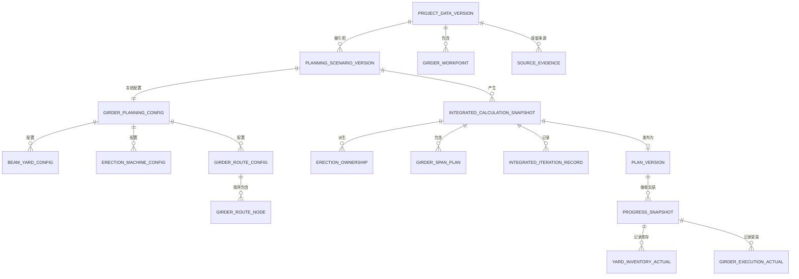

# 数据模型：架梁专项与综合排程融合

## 1. 设计原则

- 配置事实、算法派生结果和发布快照分开保存。
- 项目主数据可被多个方案引用，方案之间不共享可变配置。
- 路线节点表达“经过”，`erect/pass` 是联合计算结果，不是长期手工事实。
- 路线层采用“桥梁＋幅别”，`side` 表达幅别，线路方向只表达里程递增/递减；排程层采用分跨任务，梁片作为数量与库存单位。
- 所有正式结果都能追溯到项目版本、方案版本、算法参数和实绩版本。
- 既有非架梁场景通过可选字段保持兼容。

## 2. 关系总览



## 3. 项目数据层

### 3.1 `ProjectDataVersion`

统一项目主数据的不可变版本。

| 字段 | 类型 | 规则 |
|---|---|---|
| `project_data_version_id` | string | 全局唯一、创建后不变 |
| `project_id` | string | 关联现有项目标识 |
| `version_no` | integer | 同项目内单调递增，最小为 1 |
| `status` | enum | `draft`、`confirmed`、`superseded` |
| `project` | `ProjectModel` | 包含桥梁结构和分跨数据 |
| `workpoints` | `GirderWorkPoint[]` | 路基、桥梁幅别、隧道、涵洞、便道等统一工点 |
| `source_evidence` | `SourceEvidence[]` | 字段来源与导入证据 |
| `field_conflicts` | `FieldConflict[]` | 当前版本的字段冲突和处置结果 |
| `input_fingerprint` | string | 对规范化项目数据计算的稳定指纹 |
| `created_by` / `created_at` | string / datetime | 创建审计 |
| `confirmed_by` / `confirmed_at` | string? / datetime? | 确认审计 |

校验规则：

- `confirmed` 版本不得原地修改；任何修改创建下一版本。
- 同一 `project_id + version_no` 唯一。
- 存在未解决的阻断级 `FieldConflict` 时不得转为 `confirmed`。
- `ProjectModel` 中每个待架分跨必须能关联到一个桥梁幅别工点；粗粒度模式除外，但需显式标记。

状态迁移：

```text
draft -> confirmed（阻断冲突全部解决且用户确认）
confirmed -> superseded（创建并确认更新版本后）
```

### 3.2 `GirderWorkPoint`

用于路线与通道建模的统一工点。

| 字段 | 类型 | 规则 |
|---|---|---|
| `workpoint_id` | string | 项目内稳定唯一 |
| `name` | string | 非空 |
| `workpoint_type` | enum | `roadbed`、`bridge`、`tunnel`、`culvert`、`access` |
| `side` | enum | `left`、`right`、`both`、`unknown` |
| `mileage_start_m` / `mileage_end_m` | number | 起点不大于终点 |
| `corridor_id` | string | 同一运输走廊的稳定标识 |
| `bridge_id` | string? | `bridge` 类型必填，引用 `ProjectBridge.id` |
| `work_section_id` | string? | 可关联桥梁幅别/工区 |
| `requires_erection` | boolean | 是否需要唯一架梁归属 |
| `rough_granularity` | boolean | 缺少分跨数据时为 true |
| `explicit_readiness_date` | date? | 人工明确的通行开放日期 |
| `linked_condition_refs` | `PassageConditionRef[]` | 影响通行的稳定结构、构件或里程碑引用；不得保存方案生成任务 ID |
| `source_refs` | string[] | 引用 `SourceEvidence.evidence_id` |

唯一性规则：稳定 ID 优先；旧输入无 ID 时使用“线路/走廊＋桥名＋幅别＋里程范围”生成候选映射，低置信度必须人工确认。结构数据已有左右幅时，`both` 展开为 `left` 与 `right`；同一项目版本中参与架梁的 `both` 不得与左右幅节点并存；`unknown` 只允许粗粒度预览。

### 3.3 `PassageConditionRef`

| 字段 | 类型 | 规则 |
|---|---|---|
| `ref_type` | enum | `structure`、`upper_structure`、`milestone` |
| `entity_id` | string | 项目或方案内稳定业务 ID |
| `target_event` | enum | 首期固定为 `finish` |

任务生成后由适配器将稳定引用解析为当次任务 ID；解析不到有效任务时产生阻断诊断。

### 3.4 `SourceEvidence`

| 字段 | 类型 | 规则 |
|---|---|---|
| `evidence_id` | string | 唯一 |
| `source_type` | enum | `structure_import`、`girder_import`、`manual` |
| `file_name` | string? | 导入文件名 |
| `sheet_name` | string? | 工作表 |
| `row_or_region` | string? | 行号或区域 |
| `field_path` | string | 指向统一模型字段 |
| `original_value` | any | 原始值 |
| `normalized_value` | any | 规范化值 |
| `authority_domain` | enum | `structure`、`girder_workpoint`、`user_config` |
| `confirmed_by` / `confirmed_at` | string? / datetime? | 人工确认记录 |

### 3.5 `FieldConflict`

| 字段 | 类型 | 规则 |
|---|---|---|
| `conflict_id` | string | 唯一 |
| `entity_ref` / `field_path` | string | 冲突对象与字段 |
| `candidate_values` | object[] | 值、来源与权威等级 |
| `severity` | enum | `warning`、`blocking` |
| `status` | enum | `unresolved`、`resolved` |
| `selected_value` | any? | 已确认值 |
| `resolution_reason` | string? | 解决原因 |

## 4. 方案配置层

### 4.1 `PlanningScenarioVersion`

| 字段 | 类型 | 规则 |
|---|---|---|
| `scenario_version_id` | string | 全局唯一 |
| `scenario_id` | string | 同一方案跨版本稳定 |
| `version_no` | integer | 同方案单调递增 |
| `project_data_version_id` | string | 必须引用 `confirmed` 项目版本 |
| `scenario` | `ScenarioInput` | 综合工艺、资源、里程碑和策略快照 |
| `girder_planning` | `GirderPlanningConfig` | 架梁专项配置 |
| `input_fingerprint` | string | 项目版本与全部方案配置指纹 |
| `status` | enum | `draft`、`specialty_confirmed`、`stale`、`superseded` |
| `created_by` / `created_at` | string / datetime | 创建审计 |
| `specialty_confirmed_by` / `specialty_confirmed_at` | string? / datetime? | 专项确认审计 |

状态规则：

```text
draft -> specialty_confirmed
draft/specialty_confirmed -> superseded（创建新版本）
specialty_confirmed -> stale（引用的项目版本或配置发生变化）
```

方案版本保存后不可原地覆盖；编辑产生新 `version_no`。

### 4.2 `GirderPlanningConfig`

| 字段 | 类型 | 规则 |
|---|---|---|
| `enabled` | boolean | false 时保持旧非架梁流程 |
| `beam_yards` | `BeamYardConfig[]` | 启用专项时至少一个 |
| `erection_machines` | `ErectionMachineConfig[]` | 启用路线必须关联可用设备 |
| `routes` | `GirderRouteConfig[]` | 至少一条启用路线 |
| `parameters` | `GirderPlanningParameters` | 所有日期和容量参数 |
| `owner_overrides` | `ErectionOwnerOverride[]` | 仅用于解决归属歧义 |
| `manual_passage_overrides` | `PassageOverride[]` | 人工通道增删和明确日期 |
| `coarse_mode` | boolean | 是否允许粗粒度预览 |

### 4.3 `BeamYardConfig`

| 字段 | 类型 | 规则 |
|---|---|---|
| `beam_yard_id` | string | 方案内唯一 |
| `name` | string | 非空 |
| `mileage_m` / `side` / `corridor_id` | number / enum / string | 位置与运输走廊 |
| `production_start_date` | date | 不早于项目允许日期 |
| `daily_production_capacity` | number | 大于等于 0 |
| `initial_inventory_by_type` | map<string, number> | 各梁型非负 |
| `max_inventory_by_type` | map<string, number?> | 若设置则不小于期初量 |
| `calendar_id` | string | 引用现有资源日历 |
| `enabled` | boolean | 停用梁场不参与供梁 |

### 4.4 `ErectionMachineConfig`

| 字段 | 类型 | 规则 |
|---|---|---|
| `erection_machine_id` | string | 方案内唯一 |
| `name` | string | 非空 |
| `beam_yard_id` | string | 关联一个梁场 |
| `available_date` | date | 可用日期 |
| `daily_erection_capacity` | number | 大于 0 |
| `first_span_preparation_days` | integer | 大于等于 0 |
| `span_launching_days` | integer | 大于等于 0 |
| `bridge_transfer_days` | integer | 大于等于 0 |
| `side_switch_days` | integer | 大于等于 0 |
| `calendar_id` | string | 引用资源日历 |
| `enabled` | boolean | 启用路线必须使用启用设备 |

### 4.5 `GirderRouteConfig`

| 字段 | 类型 | 规则 |
|---|---|---|
| `route_id` | string | 方案内唯一 |
| `name` | string | 非空 |
| `beam_yard_id` | string | 引用启用梁场 |
| `erection_machine_id` | string | 引用启用设备 |
| `enabled` | boolean | 仅启用路线参与计算 |
| `confirmed` | boolean | 未确认路线不得进入正式联算 |
| `nodes` | `GirderRouteNode[]` | `sequence_index` 连续且唯一 |

首期校验：同一 `beam_yard_id` 最多一条启用路线；不同梁场可并行。

### 4.6 `GirderRouteNode`

| 字段 | 类型 | 规则 |
|---|---|---|
| `route_node_id` | string | 路线内唯一 |
| `workpoint_id` | string | 引用项目工点 |
| `sequence_index` | integer | 从 0 开始、不可重复 |
| `node_kind` | enum | `workpoint`、`turn`、`connection` |
| `connection_days` | integer? | 转场/换幅节点需要，非负 |
| `manual_include_passage_ids` | string[] | 人工增加的通道 |
| `manual_exclude_passage_ids` | string[] | 人工排除的自动通道 |

桥梁节点不保存永久 `erect/pass`；结果中的 `resolved_role` 由 `ErectionOwnership` 决定。

### 4.7 `GirderPlanningParameters`

| 字段 | 类型 | 默认/规则 |
|---|---|---|
| `substructure_acceptance_buffer_days` | integer | 迁移建议值 7，非负 |
| `roadbed_passage_buffer_days` | integer | 迁移建议值 4，非负 |
| `tunnel_passage_buffer_days` | integer | 迁移建议值 6，非负 |
| `post_erection_passage_buffer_days` | integer | 新方案必须确认，非负 |
| `post_erection_buffer_confirmed` | boolean | false 时不得发布 |
| `default_transfer_days` | integer | 迁移建议值 2，非负 |
| `default_bridge_preparation_days` | integer | 迁移建议值 3，非负 |
| `max_iterations` | integer | 默认 10，范围 1～50 |
| `date_tolerance_days` | integer | 固定为 0；日级精度完全一致才收敛 |
| `enable_supply_constraint` | boolean | 正式计算必须为 true |
| `enable_passage_constraint` | boolean | 正式计算必须为 true |
| `enable_stock_limit` | boolean | 正式计算必须为 true |

## 5. 联合计算结果层

### 5.1 `ErectionOwnership`

| 字段 | 类型 | 规则 |
|---|---|---|
| `bridge_id` / `side` | string / enum | 唯一业务桥梁幅别 |
| `owner_route_id` | string | 唯一架梁路线 |
| `owner_node_id` | string | 对应路线经过节点 |
| `arrival_date` | date | 本轮实际计算到达日 |
| `resolution_source` | enum | `earliest_arrival`、`manual_override`、`actual_fact` |
| `competing_occurrences` | object[] | 其他路线及到达日，用于解释 |

唯一索引：每个 `bridge_id + side` 在一次计算快照中恰好一条记录。

### 5.2 `PassageReleaseResult`

| 字段 | 类型 | 规则 |
|---|---|---|
| `workpoint_id` | string | 通道工点 |
| `passable_date` | date | 所有有效来源的最晚日期 |
| `erection_buffer_date` | date? | 架梁完成加缓冲 |
| `explicit_readiness_date` | date? | 人工明确日期 |
| `linked_task_finish_dates` | map<string, date> | 关联任务完成日期 |
| `controlling_source` | string | 决定最晚日期的来源 |
| `status` | enum | `ready`、`waiting`、`blocked` |

### 5.3 `GirderSpanPlan`

| 字段 | 类型 | 规则 |
|---|---|---|
| `task_id` | string | 与生成的通用 `Task.id` 一致且跨轮次稳定 |
| `bridge_id` / `work_section_id` / `span_id` | string | 精确关联分跨结构 |
| `route_id` / `beam_yard_id` / `erection_machine_id` | string | 归属与资源 |
| `beam_type` / `beam_count` | string / integer | `beam_count > 0` |
| `earliest_start_date` | date | 结构、设备、库存、通道和转场共同决定 |
| `suggested_latest_finish_date` | date? | 倒排软控制 |
| `planned_start_date` / `planned_finish_date` | date? | 综合排程返回日期 |
| `inventory_before` / `inventory_after` | number | 均不得为负 |
| `diagnostic_refs` | string[] | 关联诊断 |

### 5.4 `GirderPlanningResult`

| 字段 | 类型 | 规则 |
|---|---|---|
| `result_id` | string | 唯一 |
| `status` | enum | `ready`、`blocked` |
| `ownerships` | `ErectionOwnership[]` | 每座待架桥梁唯一 |
| `span_plans` | `GirderSpanPlan[]` | 分跨结果 |
| `passage_releases` | `PassageReleaseResult[]` | 通道结果 |
| `yard_inventory_series` | object[] | 每梁场、梁型、日期的产存耗序列 |
| `route_runs` | object[] | 路线推进和等待事件 |
| `latest_finish_controls` | object[] | 倒排建议日期 |
| `diagnostics` | `ValidationMessage[]` | 阻断、警告和提示 |
| `input_fingerprint` | string | 本轮输入指纹 |

### 5.5 `IntegratedIterationRecord`

| 字段 | 类型 | 规则 |
|---|---|---|
| `iteration_no` | integer | 从 1 开始 |
| `input_fingerprint` | string | 本轮输入状态 |
| `ownership_fingerprint` | string | 唯一归属映射指纹 |
| `date_fingerprint` | string | 相关日期指纹 |
| `girder_result_id` | string | 本轮专项结果 |
| `schedule_status` | string | 综合排程状态 |
| `changed_ownership_ids` | string[] | 相比上轮发生变化的桥梁 |
| `changed_date_refs` | string[] | 相比上轮发生变化的对象 |
| `started_at` / `finished_at` | datetime | 性能追踪 |

### 5.6 `IntegratedCalculationSnapshot`

| 字段 | 类型 | 规则 |
|---|---|---|
| `integrated_snapshot_id` | string | 全局唯一 |
| `project_data_version_id` | string | 固定项目输入 |
| `scenario_version_id` | string | 固定方案输入 |
| `progress_snapshot_id` | string? | 滚动计算时必填 |
| `status` | enum | `running`、`converged`、`not_converged`、`infeasible`、`blocked`、`stale` |
| `iterations` | `IntegratedIterationRecord[]` | 完整轮次记录 |
| `girder_result` | `GirderPlanningResult?` | 最后有效专项结果 |
| `generated_snapshot` | `GeneratedScheduleInput?` | 生成的通用任务图 |
| `schedule_result` | `ScheduleResult?` | 综合排程结果 |
| `input_fingerprint` | string | 所有输入与算法参数指纹 |
| `diagnostics` | `ValidationMessage[]` | 统一诊断 |
| `created_at` | datetime | 创建时间 |

状态迁移：

```text
running -> converged
running -> not_converged
running -> infeasible
running -> blocked
converged/not_converged/infeasible/blocked -> stale（任一输入版本变化）
```

只有 `converged` 且专项已确认的快照可以发布。

## 6. 发布与实绩层

### 6.1 `PlanVersion` 扩展

在现有字段基础上增加：

| 字段 | 类型 | 规则 |
|---|---|---|
| `project_data_version_id` | string? | 新联合计划必填；旧计划可空 |
| `scenario_version_id` | string? | 新联合计划必填；旧计划可空 |
| `integrated_snapshot_id` | string? | 新联合计划必填且状态必须为 `converged` |
| `girder_result_snapshot` | `GirderPlanningResult?` | 发布时原子冻结 |

### 6.2 `YardInventoryActual`

| 字段 | 类型 | 规则 |
|---|---|---|
| `beam_yard_id` | string | 引用发布计划中的梁场 |
| `beam_type` | string | 非空 |
| `cumulative_produced` | number | 非负且不小于上一有效快照，除非有修订原因 |
| `opening_inventory_adjustment` | number | 可正可负，非零时必须有原因 |
| `observed_inventory` | number | 非负 |
| `source` | enum | `manual`、`excel` |

物料恒等式：

```text
期初库存 + 累计生产 + 库存修订 - 累计实际架设 = 当前库存
```

不平衡时快照可保存为修订草稿，但不得生成滚动预测。

### 6.3 `GirderExecutionActual`

| 字段 | 类型 | 规则 |
|---|---|---|
| `span_task_id` | string | 引用发布计划中的分跨任务 |
| `status` | enum | `not_started`、`in_progress`、`completed` |
| `actual_route_id` | string? | 已开始时必填 |
| `actual_start_date` / `actual_finish_date` | date? | 不晚于状态日期 |
| `erected_beam_count` | integer | 非负，不超过任务数量 |
| `erection_machine_id` | string? | 已开始时记录实际设备 |

同一桥梁的实际完成只能归属一条路线；实际事实一旦确认，后续联合计算的 `ErectionOwnership.resolution_source` 为 `actual_fact`。

### 6.4 `GirderMachineActual` 与 `PassageActual`

- `GirderMachineActual`：设备 ID、状态日期位置、可用状态、预计恢复日期、原因。
- `PassageActual`：工点 ID、状态 `closed/conditional/open`、实际开放日期、限制说明。

### 6.5 `ProgressSnapshot` 扩展

新增可选字段：

- `yard_inventory_actuals: YardInventoryActual[]`
- `girder_execution_actuals: GirderExecutionActual[]`
- `girder_machine_actuals: GirderMachineActual[]`
- `passage_actuals: PassageActual[]`
- `material_balance_status: valid | warning | blocking`

旧进度请求不携带这些字段时仍按现有非架梁流程处理。

## 7. 存储升级与兼容

`PlanControlStore.schema_version` 从 `plan-control/v1` 升级至 `plan-control/v2`，新增：

- `project_data_versions`
- `planning_scenario_versions`
- `integrated_calculation_snapshots`

读取规则：

1. 旧文件缺少新集合时按空列表处理。
2. 旧 `PlanVersion` 和 `ProgressSnapshot` 的新增字段均可空。
3. 首次发生写入时整体以 v2 格式原子替换。
4. 不反向修改旧计划内容，不为旧结果伪造项目/方案版本 ID。
5. 所有新增写操作继续使用当前仓储锁、期望版本号和临时文件替换机制。
