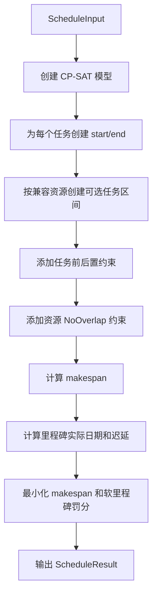
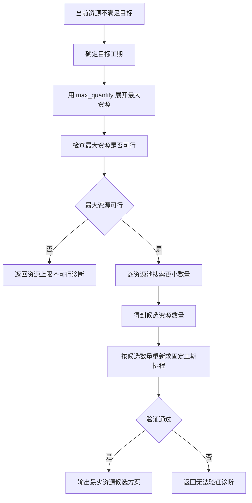

# CP-SAT MVP 算法实现文档

版本：v1.0

日期：2026-06-25

适用范围：桥梁施工排程算法 MVP 调通阶段

面向对象：后端研发、算法研发、测试、产品

## 1. MVP 目标

本 MVP 的第一目标是让结构物参数、工艺工效、资源和里程碑数据能够稳定进入 CP-SAT，并输出可解释的排程结果。算法实现不追求一次性还原当前 demo 的全部精排、均衡、连续性和资源成本能力。

MVP 分两层交付：

| 阶段 | 目标 | 结果 |
| --- | --- | --- |
| MVP-0 | 固定资源最短工期跑通 | 当前资源下任务开始、完成、资源分配、里程碑偏差 |
| MVP-1 | 固定工期最少资源建议跑通 | 在目标工期下输出候选资源数量，并验证可行排程 |

## 2. 最小输入

MVP 可以复用当前 `ScenarioInput -> ScheduleInput` 的边界。若研发需要先独立调通算法，也可以直接构造 `ScheduleInput`。

### 2.1 MVP-0 最小输入

| 数据 | 最低要求 |
| --- | --- |
| `start_date` | 项目计划开始日期 |
| `tasks` | 已生成任务清单，每个任务包含 `id`、`name`、`duration_days`、`compatible_resource_types` |
| `precedence_links` | 任务前后置关系，至少支持 `FS`，建议同步支持 `SS` |
| `resources` | 已按当前资源数量展开的命名资源 |
| `milestones` | 至少支持桥梁或项目级完成类强制节点 |
| `time_limit_seconds` | 单次求解时限 |

### 2.2 MVP-1 额外输入

| 数据 | 最低要求 |
| --- | --- |
| 当前资源数量 | 来自资源池 `quantity` |
| 可增配上限 | 来自资源池 `max_quantity` |
| 目标工期 | 优先使用可匹配强制里程碑；没有强制里程碑时，可使用上一轮固定资源最短工期 |

## 3. MVP-0 固定资源最短工期

### 3.1 算法流程

### 3.2 最小模型

| 模型元素 | MVP 实现要求 |
| --- | --- |
| `start_task` | 每个任务的开始偏移，范围为 `0..horizon` |
| `end_task` | 每个任务的结束偏移，满足 `end = start + duration_days` |
| `assign_task_resource` | 任务是否分配到某个兼容命名资源 |
| `interval_task_resource` | 可选区间变量，仅在任务分配给该资源时生效 |
| `makespan` | 所有任务结束时间最大值 |
| 资源互斥 | 每个命名资源上的任务区间 `NoOverlap` |
| 前后置 | 至少支持 `FS`；如直接复用当前模型，同步支持 `SS`、`FF`、`SF` |
| 目标函数 | 最小化 `makespan + 软里程碑迟延罚分` |

### 3.3 强制里程碑处理

MVP-0 应先按当前资源求最短工期，再评价强制里程碑是否满足。

| 结果 | 状态口径 |
| --- | --- |
| 当前资源排程满足强制里程碑 | 返回 `OPTIMAL` 或 `FEASIBLE` |
| 当前资源排程不满足强制里程碑 | 可返回 `INFEASIBLE`，但保留当前资源排程和迟延诊断 |
| 里程碑未匹配任务 | 返回 warning，该里程碑标记为 `not_evaluated` |

### 3.4 MVP-0 输出

| 输出 | 必须包含 |
| --- | --- |
| 任务排程 | 每个任务开始偏移、结束偏移、开始日期、完成日期 |
| 资源分配 | 每个受限资源占用的任务和时间区间 |
| 里程碑结果 | 目标日期、实际日期、迟延天数、状态 |
| 诊断信息 | 工艺逻辑满足、资源无重叠、里程碑迟延或未匹配 |
| 总工期 | `objective_days` 和计划完成日期 |

## 4. MVP-1 固定工期最少资源

### 4.1 目标

MVP-1 在 MVP-0 可稳定运行后增加资源建议能力。目标是在给定固定工期或强制里程碑目标下，找到不超过 `max_quantity` 的候选资源数量。

### 4.2 简化流程

### 4.3 最小实现策略

为了先调通算法，MVP-1 可以采用比当前 demo 更简单的搜索策略。

| 策略 | 说明 |
| --- | --- |
| 最大资源预检 | 先使用每个资源池 `max_quantity` 求解固定工期可行性 |
| 单池二分或递减 | 对每个资源池从当前可行数量向下压缩，保留仍可行的最小数量 |
| 固定工期验证 | 每次候选数量变化后，必须重新求解并校验不迟延强制里程碑 |
| 推荐数量输出 | 返回每个资源池的当前数量、推荐数量、新增数量和上限 |
| 候选方案输出 | 使用推荐数量生成一个可查看的排程结果 |

MVP-1 不要求一次实现全局最优资源组合；可以先输出“可验证候选资源方案”。如果使用逐资源池压缩，应在结果元数据中标明推荐为可行候选，不承诺全局最优。

### 4.4 关键路径预判

在进入资源搜索前，建议先计算不考虑资源排队的关键路径。如果关键路径本身已经超过目标工期，则直接返回“增加资源不能解决”的诊断。

## 5. 与当前 demo 的取舍

MVP 为调通优先，可以暂缓以下当前 demo 能力：

| 能力 | MVP 处理 |
| --- | --- |
| 控制优先精排 | MVP-0 可先不做，后续作为排程质量增强 |
| 普通工程均衡 | MVP-0 可先不做，后续用于结果更贴近施工组织 |
| 同结构同工艺连续性惩罚 | MVP-0 可先不做，后续用于减少资源跳转 |
| 池级容量快排 | MVP 可直接使用命名资源 `NoOverlap` 跑通；大规模性能优化后续再做 |
| 资源成本优化 | 不进入 MVP-0 和 MVP-1 |
| 并行重优化 | 不进入 MVP-1，先使用串行验证 |

必须保留的能力：

- 任务工期为正整数天。
- 前后置逻辑必须满足。
- 同一命名资源不得重叠。
- 强制里程碑必须能评价迟延。
- 资源推荐数量不得超过 `max_quantity`。
- 不可行时必须输出可解释诊断。

## 6. 推荐接口使用

工程化接入时建议直接复用现有接口边界：

| 阶段 | 能力 | 当前接口 |
| --- | --- | --- |
| 任务图核验 | 生成 `GeneratedScheduleInput` | `POST /api/generate-schedule-input` |
| MVP-0 | 固定资源最短工期 | `POST /api/solve-scenario` |
| MVP-1 | 固定工期最少资源 | `POST /api/solve-min-resources` |

如果算法服务先独立开发，也应保持输出结构能映射回 `ScheduleResult`，以便前端结果页、甘特图、里程碑表和资源分配表复用。

## 7. 验收场景

### 7.1 MVP-0 验收

1. 输入两个无前后置、同资源类型、两个资源的任务，系统能并行排程。
2. 输入两个无前后置、同资源类型、一个资源的任务，系统能串行排程且无资源重叠。
3. 输入 `FS` 前后置关系，后续任务开始时间不早于前置任务完成时间。
4. 输入 `SS + lag_days` 关系，后续任务开始时间不早于前置任务开始时间加滞后天数。
5. 输入完成类强制里程碑，系统能输出实际完成日期、迟延天数和状态。
6. 当前资源迟延时，系统保留任务排程，并给出强制里程碑迟延诊断。
7. 资源缺失或全部默认充足时，系统不产生资源分配冲突，并输出资源诊断。

### 7.2 MVP-1 验收

1. 当前资源数量不足、`max_quantity` 足够时，系统输出候选推荐数量。
2. 推荐数量重新求解后，应满足强制里程碑或目标工期。
3. 推荐数量不得超过每个资源池的 `max_quantity`。
4. 当前资源数量已经满足目标时，不应推荐增加资源。
5. 关键路径理论最短仍超过目标时，不应推荐增加资源。
6. `max_quantity` 仍不可行时，应返回资源上限不可行诊断。
7. 求解超时或无法验证时，应返回 unresolved 诊断，不应输出未经验证的推荐方案。

## 8. 开发顺序建议

1. 使用最小 `ScheduleInput` 写单元测试，先不接真实结构物参数。
2. 实现 MVP-0 命名资源模型，跑通任务、逻辑、资源和里程碑。
3. 接入 `ScenarioInput -> ScheduleInput` 生成链路，确认真实项目片段能跑通。
4. 增加强制里程碑迟延时保留当前排程的结果包装。
5. 实现关键路径预判。
6. 实现 MVP-1 最大资源预检和候选数量搜索。
7. 将候选数量生成 `alternative_results`，供前端展示和方案对比。
8. 再评估是否补入池级快排、控制优先精排、均衡推进和连续性指标。
