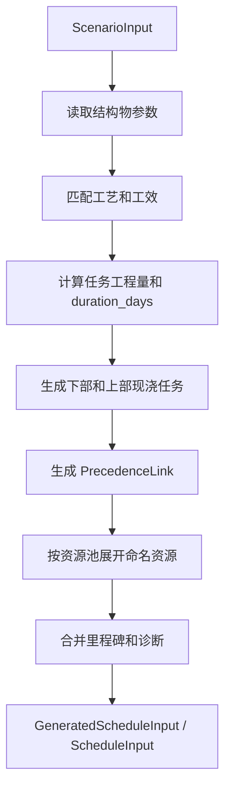
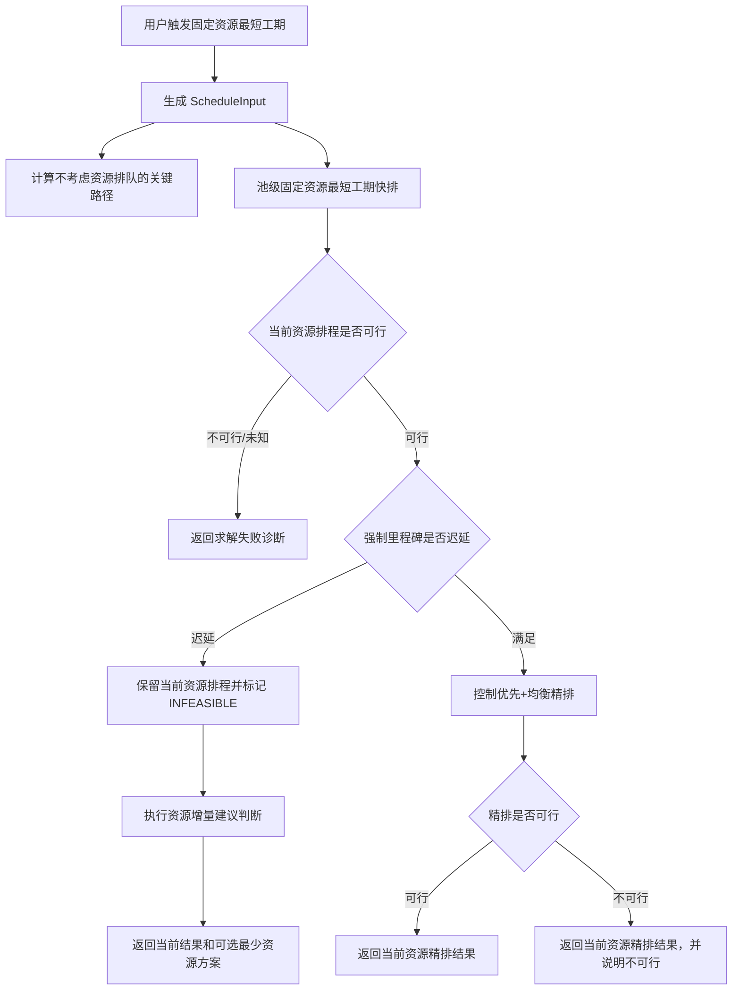
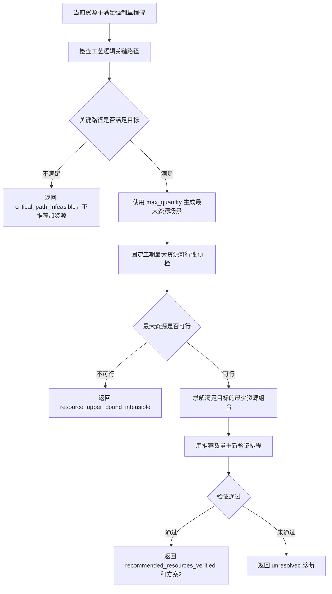

# CP-SAT 固定资源算法实现需求文档

版本：v1.0

日期：2026-06-25

适用范围：桥梁施工自动排程系统固定资源最短工期与资源建议能力

面向对象：产品、后端研发、前端研发、测试、计划工程师

## 1. 功能模块核心定位

### 1.1 模块定位

CP-SAT 固定资源算法用于在结构物参数、工艺工效、工艺逻辑、资源配置和里程碑已经完成初始化匹配后，测算当前资源组织下的最短参考排程，并判断关键里程碑是否满足。

该能力的产品目标不是让用户直接理解 CP-SAT 模型细节，而是回答三个业务问题：

| 业务问题 | 系统输出 |
| --- | --- |
| 当前投入的设备、模板或班组能否满足关键节点 | 满足、不满足、无法判断 |
| 如果不满足，当前资源下预计什么时候完成 | 当前资源参考排程、预测日期、迟延天数 |
| 如果单纯增加资源可能解决，建议增加到多少 | 最少资源候选方案、增量数量、上限诊断 |

当前代码口径中，“固定资源”表示使用资源池 `quantity` 作为当前投入数量，推算最短工期；“最少资源”表示在固定工期或强制里程碑目标下，使用资源池 `max_quantity` 作为可增配上限，推算满足目标所需的候选资源数量。

### 1.2 业务入口

算法由模拟求解模块触发。用户在任务视图核验任务、工期、前后置和候选资源后，执行“固定资源条件下，推算最短工期”。系统应基于当前 `ScenarioInput` 生成求解输入并返回 `ScenarioSolveResult`。

如固定资源结果不满足强制里程碑，系统应保留当前固定资源参考排程，同时根据关键路径和资源上限判断是否可生成资源增量候选方案。

### 1.3 范围边界

本需求覆盖：

- 当前固定资源下的最短工期测算。
- 强制里程碑满足性判断和迟延诊断。
- 当前固定资源不满足强制里程碑时的最少资源候选方案。
- 任务排程、资源分配、里程碑结果、诊断和目标函数拆解输出。
- 固定资源算法对现有结构物参数、工艺、工效、逻辑、资源和里程碑数据的消费方式。

本需求不覆盖：

- 资源成本优化作为主流程能力。
- 实际进度锁定、动态重排和月周计划发布审批。
- 用户手工编辑 CP-SAT 约束或目标函数。
- 新增数据库表结构或替换现有接口契约。

## 2. 输入条件

### 2.1 调用输入

固定资源算法以 `ScenarioInput` 为业务输入。研发在工程化接入时，应先保证当前项目或方案已形成完整 `ScenarioInput`，再调用求解能力。

| 输入对象 | 必要内容 | 用途 |
| --- | --- | --- |
| `project` | 项目开始日期、桥梁、工区、墩台、构件、上部现浇结构参数 | 生成任务清单、工程量和范围匹配 |
| `process_library` | 构件类型、施工工艺、工效分组、资源类型 | 计算任务工期和资源需求 |
| `logic_rules` | 下部结构前后置规则、关系类型、滞后天数 | 生成下部结构任务逻辑关系 |
| `upper_structure_logic_rules` | 上部现浇结构及上下部衔接规则 | 生成现浇箱梁、连续梁任务和衔接关系 |
| `task_overrides` | 构件工艺或工效分组覆盖 | 覆盖默认工艺和工效 |
| `resource_pools` | 当前数量、可增配上限、启用状态、资源模式 | 展开命名资源，形成容量约束和资源建议边界 |
| `milestones` | 强制或提醒节点、作用范围、目标事件、目标日期 | 判断节点达成、计算迟延和固定工期目标 |
| `schedule_strategy` | 控制优先、资源保障、普通任务均衡等策略 | 控制二次精排和结果排序 |
| `time_limit_seconds` | 单次求解时限 | 控制 CP-SAT 求解预算 |

### 2.2 求解前转换

系统应先将 `ScenarioInput` 转换为 `GeneratedScheduleInput`。该过程只生成任务图，不执行 CP-SAT 求解。

转换规则：

| 规则 | 产品口径 |
| --- | --- |
| 工期计算 | 根据工艺工效库和构件工程量计算，结果最小为 1 天 |
| 逻辑关系 | 支持 `FS`、`SS`、`FF`、`SF` 和非负 `lag_days` |
| 固定资源展开 | 固定资源求最短工期使用资源池 `quantity` 展开命名资源 |
| 最大资源展开 | 最少资源候选方案使用资源池 `max_quantity` 展开可选上限 |
| 不受限资源 | 关闭、未配置或 `UNLIMITED` 资源不形成等待约束，并输出诊断 |
| 里程碑范围 | 完成类取范围内任务最晚完成；开始类取范围内任务最早开始 |

## 3. 算法目标

### 3.1 主目标

固定资源算法的主目标是在当前资源数量约束下，找到满足工艺逻辑和资源容量约束的最短参考排程。

系统应优先保证：

1. 所有任务满足工艺前后置关系。
2. 同一受限资源同一时间不执行多个任务。
3. 当前资源下总工期尽量短。
4. 软里程碑迟延尽量小。
5. 同结构同工艺任务尽量保持资源连续性，减少不必要的资源拆分和跳转。

### 3.2 强制里程碑处理

固定资源最短工期阶段不直接把强制里程碑作为硬约束阻断排程，而是先计算当前资源下的最短可行排程，再根据排程结果判断强制里程碑是否迟延。

| 场景 | 系统处理 |
| --- | --- |
| 当前资源排程满足强制里程碑 | 进入控制优先和普通工程均衡精排，输出当前资源正式参考结果 |
| 当前资源排程不满足强制里程碑 | 结果状态标记为 `INFEASIBLE`，但保留当前资源参考排程供查看 |
| 工艺逻辑理论最早也无法满足强制里程碑 | 不推荐增加资源，提示目标日期与关键路径不匹配 |
| 最大资源上限可以满足强制里程碑 | 输出最少资源候选方案，并作为 `alternative_results` 返回 |
| 最大资源上限仍无法满足强制里程碑 | 输出资源上限、容量下界和不可行诊断 |

### 3.3 资源建议目标

资源建议只在固定资源排程不满足强制里程碑时触发。系统应先判断瓶颈是否可能通过增加资源解决，再使用 `max_quantity` 作为上限测算最少资源组合。

资源建议输出应定位为“候选方案”或“可尝试方案”，不得在业务文案中承诺一定是现场最优施工组织。

## 4. 当前固定资源算法流程

### 4.1 总体流程

### 4.2 池级固定资源快排

池级快排用于快速得到当前资源数量下的最短工期结果。模型以资源池为容量单位，而不是直接以每个命名资源建模。

| 模型元素 | 当前实现口径 |
| --- | --- |
| 任务变量 | 每个任务建立开始时间、结束时间 |
| 工期约束 | `结束时间 = 开始时间 + duration_days` |
| 资源选择 | 任务按兼容资源类型选择一个资源池 |
| 容量约束 | 同一资源池内同时执行任务数量不得超过当前 `quantity` |
| 逻辑约束 | 所有 `PrecedenceLink` 按关系类型进入约束 |
| 里程碑计算 | 按里程碑范围计算实际开始或完成日期 |
| 目标函数 | 最小化总工期和软里程碑迟延 |

快排结果用于：

- 当前资源是否满足强制里程碑的判断。
- 后续控制优先精排的基准和 warm start。
- 当前资源迟延时保留给用户查看的参考排程。

### 4.3 控制优先和均衡精排

当当前资源快排已经满足强制里程碑时，系统应进入控制优先和普通工程均衡精排。

精排目标包括：

| 优先级 | 目标 |
| --- | --- |
| 1 | 控制类里程碑尽量不迟延 |
| 2 | 控制链任务尽量减少资源等待 |
| 3 | 控制链任务尽量早完成 |
| 4 | 总工期和软里程碑罚分尽量小 |
| 5 | 普通任务尽量均衡推进 |
| 6 | 同结构同工艺资源尽量连续，空间分配尽量稳定 |

如果精排在求解时限内未得到可行结果，系统应回退展示池级固定资源快排结果，并给出回退诊断。

### 4.4 最少资源建议

固定资源结果不满足强制里程碑时，系统应按以下顺序处理资源建议：

资源建议结果应写入当前结果的 `stats` 和 `objective_breakdown`，并在可行时生成 `alternative_results`。

## 5. 输出结果

### 5.1 结果容器

固定资源求解返回 `ScenarioSolveResult`。

| 字段 | 输出内容 |
| --- | --- |
| `generated` | 本次用于求解的任务图、资源、里程碑和生成诊断 |
| `result` | 当前固定资源主结果 |
| `milestone_results` | 主结果的里程碑达成情况 |
| `diagnostics` | 任务生成和求解诊断合并结果 |
| `metrics` | 任务数、逻辑数、资源数、总工期、里程碑摘要 |
| `alternative_results` | 当前资源迟延且可推荐资源时返回的最少资源候选方案 |

### 5.2 当前资源主结果

`result` 应至少包含：

| 字段 | 产品含义 |
| --- | --- |
| `status` | 求解状态。当前资源不满足强制里程碑时可为 `INFEASIBLE`，但仍保留排程任务 |
| `objective_days` | 当前结果总工期天数 |
| `plan_start_date` / `plan_finish_date` | 计划起止日期 |
| `tasks` | 每个任务的开始、完成、所属结构、工艺、工期、资源分配 |
| `resource_allocations` | 每个命名资源的任务占用区间 |
| `milestone_results` | 目标日期、实际日期、迟延天数、罚分、状态 |
| `validation` | 工艺、资源、里程碑和求解诊断 |
| `stats` | 求解耗时、求解路径、资源建议状态等技术和业务元数据 |
| `objective_breakdown` | 目标函数拆解和业务结论字段 |

### 5.3 固定资源元数据

当前固定资源主流程应输出以下关键元数据：

| 字段 | 含义 |
| --- | --- |
| `solve_mode` | 固定为 `fixed_resources_shortest_control_balanced` |
| `baseline_makespan_days` | 当前资源快排总工期 |
| `hard_milestone_feasible` | 当前资源是否满足强制里程碑 |
| `schedule_source` | 当前展示排程来源 |
| `performance_path` | 当前求解路径，例如 `capacity_fast_path_named_refinement` |
| `capacity_precheck_status` | 池级快排或容量模型状态 |
| `warm_start_used` | 精排是否使用快排结果作为提示 |
| `resource_recommendation_status` | 资源建议状态 |
| `resource_recommendation_message` | 面向用户的资源建议说明 |

### 5.4 资源建议状态

| 状态 | 展示口径 |
| --- | --- |
| `not_needed` | 当前固定资源已满足强制里程碑，无需增加资源 |
| `recommended_resources_verified` | 已生成并验证固定工期最少资源候选方案 |
| `critical_path_infeasible` | 不考虑资源排队仍无法满足目标，增加资源不能解决 |
| `critical_path_unknown` | 关键路径无法计算，需检查逻辑闭环或不可满足约束 |
| `max_resource_generation_error` | 最大资源场景生成失败 |
| `resource_upper_bound_infeasible` | 达到资源上限仍无法满足目标 |
| `resource_recommendation_unresolved` | 求解时限内无法确认可验证推荐组合 |
| `not_evaluated` | 当前固定资源快排未得到可行结果，未进入建议判断 |

### 5.5 推荐资源数量

当 `resource_recommendation_status = recommended_resources_verified` 时，应返回 `recommended_resource_counts`：

| 字段 | 含义 |
| --- | --- |
| `resource_pool_id` | 资源池 ID |
| `label` | 资源池名称 |
| `resource_type` | 资源类型编码 |
| `current_quantity` | 当前投入数量 |
| `recommended_quantity` | 推荐候选数量 |
| `added_quantity` | 建议新增数量 |
| `max_quantity` | 可增配上限 |

可行资源候选方案应同步写入 `alternative_results`，其中 `role = minimum_resources`。

## 6. 前后端职责

### 6.1 前端职责

- 在用户触发求解前，提交当前有效 `ScenarioInput`。
- 在结构、工艺、工效、逻辑、资源、里程碑或求解策略变更后，使旧求解结果失效。
- 展示当前资源排程、里程碑偏差、资源建议状态和候选资源方案。
- 当前资源迟延但系统返回排程任务时，页面应同时展示“未满足强制节点”和“当前资源参考排程”，避免误解为完全无结果。
- 当存在 `alternative_results` 时，允许用户查看当前方案和最少资源候选方案的任务、资源和里程碑结果。

### 6.2 后端职责

- 将 `ScenarioInput` 标准化为 `GeneratedScheduleInput`。
- 校验任务、资源、逻辑和里程碑输入，输出明确诊断。
- 调用固定资源最短工期、控制优先精排和最少资源建议模型。
- 保证资源建议数量不超过资源池 `max_quantity`。
- 将固定资源主结果和候选方案统一包装为 `ScenarioSolveResult`。

### 6.3 调用边界

| 能力 | 当前接口 | 输入 | 输出 |
| --- | --- | --- | --- |
| 生成任务图 | `POST /api/generate-schedule-input` | `ScenarioInput` | `GeneratedScheduleInput` |
| 固定资源最短工期 | `POST /api/solve-scenario` | `ScenarioInput` | `ScenarioSolveResult` |
| 固定工期最少资源 | `POST /api/solve-min-resources` | `MinResourcesSolveRequest` | `ScenarioSolveResult` |

## 7. 异常处理

| 异常场景 | 系统处理 |
| --- | --- |
| 未生成任何任务 | 返回 `MODEL_INVALID` 或错误诊断，不进入求解 |
| 工艺缺失或工程量无法计算 | 在任务生成诊断中提示，不静默生成错误任务 |
| 资源池关闭或默认充足 | 相关任务不产生资源等待，并输出 warning |
| 受限资源数量为 0 | 不展开命名资源，并输出 warning |
| 里程碑范围未匹配任务 | 对该里程碑标记未评估，并输出 warning |
| 强制里程碑迟延 | 当前主结果标记不可行，保留参考排程并尝试资源建议 |
| 工艺逻辑关键路径已超目标 | 不推荐加资源，提示复核节点、工效或逻辑 |
| 资源上限仍不可行 | 返回资源上限和容量下界诊断 |
| 求解超时或未知 | 返回 `UNKNOWN` 或 unresolved 诊断，提示调整求解时限或输入配置 |
| OR-Tools 未安装 | 返回 `MODEL_INVALID` 和依赖缺失诊断 |

## 8. 验收标准

1. 系统能基于当前 `ScenarioInput` 生成 `GeneratedScheduleInput`，并在生成阶段不执行 CP-SAT 求解。
2. 固定资源最短工期使用资源池 `quantity` 作为当前投入数量。
3. 求解结果满足全部可用 `PrecedenceLink` 前后置关系。
4. 受限资源任务分配不发生同一命名资源时间重叠。
5. 软里程碑迟延按 `lateness_days * penalty_per_day` 计算罚分。
6. 当前资源满足强制里程碑时，结果状态为 `OPTIMAL` 或 `FEASIBLE`，并输出控制优先和均衡相关指标。
7. 当前资源不满足强制里程碑时，主结果状态可为 `INFEASIBLE`，但仍保留当前资源参考排程、资源分配和迟延诊断。
8. 工艺逻辑理论最短工期已超过强制里程碑时，系统不调用或不输出最少资源推荐，并提示增加资源无法解决。
9. 最大资源上限可以满足目标时，系统输出 `recommended_resources_verified`、`recommended_resource_counts` 和 `alternative_results`。
10. 最大资源上限仍不可行时，系统输出 `resource_upper_bound_infeasible`、资源上限和容量下界诊断，不生成候选方案。
11. 推荐资源数量不得超过对应资源池 `max_quantity`，新增数量等于推荐数量减当前数量且不小于 0。
12. 同一输入在相同求解时限和随机种子下，结果应稳定或差异可由求解状态解释。

## 9. 后续建议

- 将资源建议从“自动附加候选方案”逐步扩展为可解释的瓶颈资源分析。
- 为固定资源结果和最少资源候选方案增加版本号，便于后续保存、对比和复盘。
- 在真实项目接入后，用实际工程规模校准求解时限、快排路径和资源建议触发条件。
- 资源成本优化可作为后续增强能力，但不应阻塞固定资源最短工期和最少资源候选方案的主闭环。
