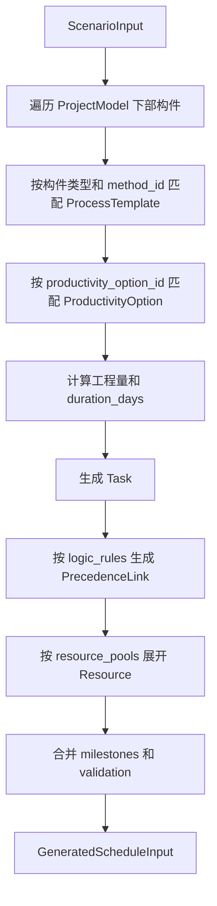
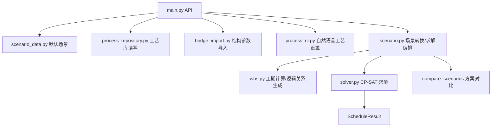

# 项目排程系统整体说明

版本：v1.0

日期：2026-06-11

适用范围：桥梁下部结构自动排程系统实际工程化版本

## 1. 系统定位

项目排程系统用于将工程结构物参数、施工工艺工效、工艺逻辑、资源配置和里程碑目标统一建模，自动生成可求解的施工任务网络，并通过 CP-SAT 求解器输出排程计划、资源分配、里程碑偏差和方案对比结果。

当前 demo 已从单一 WBS 原型升级为场景化排程模型。核心思想是：前端维护一个完整 `ScenarioInput`，后端把 `ScenarioInput` 转换成 `ScheduleInput`，再由求解器生成 `ScheduleResult`，最终回到前端模拟结果页面展示。

实际工程中，结构物参数应来自项目结构物参数 API；Excel 导入保留为补充导入、历史兼容或校核能力。

## 2. 系统模块划分

### 2.1 前端页面模块

| 模块 | 主要职责 | 输入 | 输出 |
| --- | --- | --- | --- |
| 项目参数 | 展示项目结构树，配置构件工艺和工效 | 项目结构物参数、工艺工效库 | 更新后的项目结构树、构件 `method_id`、构件 `productivity_option_id` |
| 工艺工效库 | 维护构件类型、施工工艺、工效分组、默认资源 | 后端标准化工艺工效库、资源池 | 更新后的 `process_library` |
| 工艺逻辑 | 维护构件之间前后置关系 | 默认工艺逻辑规则 | 更新后的 `logic_rules` |
| 资源配置 | 维护资源池数量、最大数量、日历和启用状态 | 默认资源池、资源日历 | 更新后的 `resource_pools`、`resource_calendars` |
| 里程碑 | 维护合同、强控、内部节点 | 默认里程碑配置 | 更新后的 `milestones` |
| 模拟结果 | 生成/求解/展示排程结果，保存并对比方案 | `ScenarioInput`、`GeneratedScheduleInput`、`ScenarioSolveResult` | 甘特图、资源分配、诊断、里程碑结果、方案对比 |

前端所有配置页共同编辑同一个场景对象 `ScenarioInput`。任何会影响任务、资源、工期或逻辑的修改，都需要清空旧的生成结果和求解结果，避免展示过期排程。

### 2.2 后端服务模块

| 模块 | 主要职责 | 关键输入 | 关键输出 |
| --- | --- | --- | --- |
| API 网关 | 暴露前端调用接口，处理请求校验和错误返回 | HTTP 请求 | 标准响应模型 |
| 默认场景构造 | 构造 demo 场景、默认工艺库、资源池、里程碑 | 内置默认数据、本体配置 | `ScenarioInput` |
| 结构参数导入/接入 | 将 Excel 或结构物参数服务数据映射为项目结构树 | Excel/结构参数 API、结构本体 | `ProjectModel`、质量检查、告警 |
| 工艺工效库 | 加载和保存工艺模板、工效分组 | 数据库历史结构或标准表 | `ProcessTemplate[]` |
| 自然语言工艺设置 | 将用户指令解析为批量工艺修改 | 当前场景、自然语言文本 | 更新后的 `ScenarioInput`、变更摘要 |
| 场景转换 | 将场景配置转换成求解输入 | `ScenarioInput` | `GeneratedScheduleInput` |
| 任务逻辑生成 | 生成任务、前后置关系、资源实例和诊断 | 项目结构、工艺库、逻辑库、资源池 | `Task[]`、`PrecedenceLink[]`、`Resource[]` |
| CP-SAT 求解 | 执行最短工期或最少资源求解 | `ScheduleInput` | `ScheduleResult` |
| 方案对比 | 对多个求解结果做综合评分和推荐 | `ScenarioSolveResult[]` | `ScenarioCompareResponse` |

## 3. 核心数据模型

### 3.1 场景输入模型

`ScenarioInput` 是前后端的核心业务载体，包含一次排程模拟所需的全部配置：

| 字段 | 含义 |
| --- | --- |
| `scenario_id` | 方案 ID |
| `scenario_name` | 方案名称 |
| `project` | 项目结构物参数 |
| `process_library` | 工艺工效库 |
| `logic_rules` | 工艺逻辑规则 |
| `resource_calendars` | 资源日历 |
| `resource_pools` | 资源池配置 |
| `milestones` | 里程碑约束 |
| `time_limit_seconds` | 求解时限 |

### 3.2 项目结构模型

结构物参数按以下层级组织：

```text
ProjectModel
  -> ProjectBridge
    -> WorkSection
      -> StructureModel
        -> ComponentModel
      -> UpperStructureComponent
```

下部结构 `ComponentModel` 会进入任务生成；上部结构 `UpperStructureComponent` 当前用于展示和辅助判断连续梁主墩等规则，不直接生成下部结构任务。

### 3.3 求解输入模型

`ScheduleInput` 是求解器直接消费的数据结构：

| 字段 | 含义 |
| --- | --- |
| `project_name` | 项目名称 |
| `start_date` | 计划开始日期 |
| `tasks` | 已计算工期的任务清单 |
| `precedence_links` | 任务之间的 FS/SS 逻辑关系 |
| `resources` | 已展开的命名资源 |
| `milestones` | 里程碑目标 |
| `time_limit_seconds` | 求解时限 |

### 3.4 求解输出模型

`ScheduleResult` 是求解结果：

| 字段 | 含义 |
| --- | --- |
| `status` | 求解状态，如最优、可行、不可行、模型无效 |
| `objective_days` | 总工期天数 |
| `plan_start_date` / `plan_finish_date` | 计划开始/完成日期 |
| `tasks` | 带开始结束日期和资源分配的任务 |
| `resource_allocations` | 资源占用明细 |
| `milestone_results` | 里程碑实际日期、迟延和罚分 |
| `validation` | 数据校验和求解诊断 |
| `stats` | 求解器统计和连续性指标 |
| `objective_breakdown` | 目标函数拆解 |

## 4. 数据输入

### 4.1 结构物参数输入

实际工程以项目结构物参数 API 为权威数据源。接口应返回项目、桥梁、工区/幅别、墩台、构件、尺寸、来源追踪和质量检查信息，并映射为 `ProjectModel`。

当前 demo 还支持 Excel 导入：

- 读取 `.xlsx/.xlsm` 桥梁结构参数表。
- 标准化合并表头和合并单元格。
- 根据结构本体识别左右幅、墩台、桩基、承台、系梁、墩柱、盖梁、桥台和上部结构。
- 转换为 `ProjectModel` 并覆盖当前场景项目结构。

### 4.2 工艺工效输入

工艺工效库来自后端标准化接口。实际工程可从历史工效表迁移而来：

```text
历史结构类型-施工工艺-工效
  -> ProcessTemplate
    -> ProductivityOption 默认工效
```

项目参数页的构件通过 `method_id` 匹配施工工艺，通过 `productivity_option_id` 匹配工效分组。若未指定，则使用默认工艺和默认工效。

### 4.3 工艺逻辑输入

工艺逻辑规则描述构件之间的前后置关系：

- 同一墩台内规则：如承台在桩基后、墩柱在承台/地系梁/桩基后、盖梁在墩柱/中系梁后。
- 跨墩台顺序规则：按结构顺序生成前后置关系，当前保留扩展能力。
- 关系类型支持 `FS` 和 `SS`，并支持滞后天数 `lag_days`。

### 4.4 资源输入

资源配置以资源池为输入：

- `quantity`：固定资源最短工期模式下使用的默认数量。
- `max_quantity`：固定工期最少资源模式下允许展开的最大数量。
- `calendar_id`：资源日历。
- `enabled`：是否启用。

后端会将资源池展开为命名资源，例如“旋挖钻1、旋挖钻2、旋挖钻3”。

### 4.5 里程碑输入

里程碑支持合同节点、强控节点和内部节点。约束模式包括：

- `hard`：强制目标。固定工期最少资源模式下作为目标工期约束；固定资源最短工期模式下会输出偏差诊断。
- `soft`：提醒目标。迟延天数按 `penalty_per_day` 转换为目标函数罚分。

## 5. 数据输出

系统主要输出包括：

- 任务图：任务清单、工期、工程量、候选资源和前后置关系。
- 求解结果：每个任务的开始/结束日期、分配资源、前置任务。
- 资源分配：每个命名资源的任务占用区间。
- 甘特图：按墩台或按工艺聚类展示。
- 里程碑结果：目标日期、实际日期、迟延天数、罚分和状态。
- 诊断信息：缺少工艺、工程量为 0、资源缺失、里程碑未匹配、求解不可行等。
- 方案对比：总工期、计划完成日期、软节点迟延、硬节点偏差、资源数量和推荐方案。

## 6. 内部数据流转

### 6.1 初始化流


实际工程中，初始化应替换为调用项目结构物参数 API，并与工艺工效库、逻辑库、资源库、里程碑模板组合成 `ScenarioInput`。

### 6.2 结构参数接入流


Excel 导入会额外输出质量检查和告警；实际工程 API 也应提供类似数据质量信息。

### 6.3 配置编辑流


影响求解的配置包括构件工艺、工效分组、工艺工效库、工艺逻辑、资源池、里程碑、计划开始日期和求解时限。

### 6.4 任务图生成流



任务生成阶段不直接求解，只负责把业务配置变成可求解输入。如果存在严重错误，例如构件没有匹配工艺或没有启用资源，则应在诊断中标记。

### 6.5 固定资源最短工期求解流


该模式使用资源池 `quantity` 展开命名资源，目标是固定资源条件下推算最短工期。

### 6.6 固定工期最少资源求解流


该模式使用资源池 `max_quantity` 作为可选上限。若存在强制里程碑，则以强制目标为工期目标；否则可使用上一轮最短工期结果作为 fallback target。

### 6.7 方案对比流


## 7. 调用关系

### 7.1 前端到后端接口

| 前端动作 | 后端接口 | 输入 | 输出 |
| --- | --- | --- | --- |
| 初始化场景 | `GET /api/demo-scenario` | 无 | `ScenarioInput` |
| 获取工艺库 | `GET /api/process-library` | 无 | `ProcessTemplate[]` |
| 保存工艺库 | `PUT /api/process-library` | `ProcessLibrarySaveRequest` | `ProcessTemplate[]` |
| 导入桥梁参数 | `POST /api/import-bridge-params` | Excel、当前 `ScenarioInput`、目标桥名 | 更新后的 `ScenarioInput`、导入摘要、质量检查 |
| AI 工艺设置 | `POST /api/apply-process-natural-language` | 当前 `ScenarioInput`、自然语言指令 | 更新后的 `ScenarioInput`、变更摘要、告警 |
| 生成任务图 | `POST /api/generate-schedule-input` | `ScenarioInput` | `GeneratedScheduleInput` |
| 固定资源求最短工期 | `POST /api/solve-scenario` | `ScenarioInput` | `ScenarioSolveResult` |
| 固定工期求最少资源 | `POST /api/solve-min-resources` | `MinResourcesSolveRequest` | `ScenarioSolveResult` |
| 方案对比 | `POST /api/compare-scenarios` | `ScenarioSolveResult[]` | `ScenarioCompareResponse` |

### 7.2 后端内部调用关系



## 8. 关键业务规则

### 8.1 工艺与工效匹配

1. 构件指定 `method_id` 时，按工艺 `id` 或 `method_id` 匹配。
2. 构件未指定工艺时，使用该构件类型的默认工艺。
3. 构件指定 `productivity_option_id` 时，使用该工艺下对应工效分组。
4. 构件未指定工效分组时，使用该工艺默认工效。
5. 匹配失败时生成严重诊断，不静默求解。

### 8.2 工期计算

| 算法 | 说明 | 公式 |
| --- | --- | --- |
| `units_per_day` | 按日完成量计算 | `ceil(工程量 / 工效值)` |
| `days_per_unit` | 按单位耗时计算 | `ceil(工程量 * 工效值)` |
| `fixed_days` | 固定工期 | `ceil(工效值)` |

计算结果最小为 1 天。桩基可按桩长或根数计算，墩柱可按墩高计算，承台、扩大基础、系梁、盖梁、桥台通常按构件数量或固定工期计算。

### 8.3 资源约束

- 工艺模板决定任务候选资源类型。
- 资源池展开为命名资源。
- 求解器对每个命名资源建立 `NoOverlap`，确保同一资源同一时间只能执行一个任务。
- 固定资源最短工期使用 `quantity`。
- 固定工期最少资源使用 `max_quantity`。

### 8.4 里程碑约束

- 里程碑可作用于项目、桥梁、工区、结构物、构件类型或单个构件。
- 完成类里程碑取范围内任务最大完成时间。
- 开始类里程碑取范围内任务最早开始时间。
- 软里程碑迟延进入目标函数罚分。
- 强制里程碑在不同求解模式下承担不同目标约束或偏差诊断作用。

## 9. 工程化接入建议

实际工程落地时建议按以下顺序接入：

1. 接入项目结构物参数 API，替代 demo 的本地 Excel 自动导入。
2. 将历史工效数据迁移为 `ProcessTemplate + ProductivityOption` 标准结构。
3. 将工艺逻辑规则从本地 JSON 升级为可配置规则库，保留默认规则模板。
4. 将资源池、日历和里程碑模板与项目/标段/工区权限绑定。
5. 建立场景保存机制，支持多方案持久化、复用和审批。
6. 为生成任务、求解结果、资源分配和方案对比增加导出能力。

## 10. 相关文档

- [项目参数页面需求文档](project-parameters-requirements.md)
- [工艺工效库页面需求文档](process-productivity-library-requirements.md)
