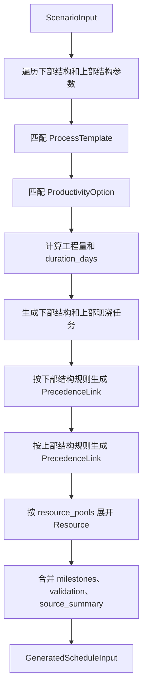
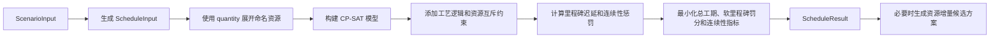
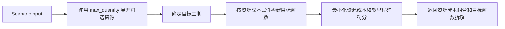
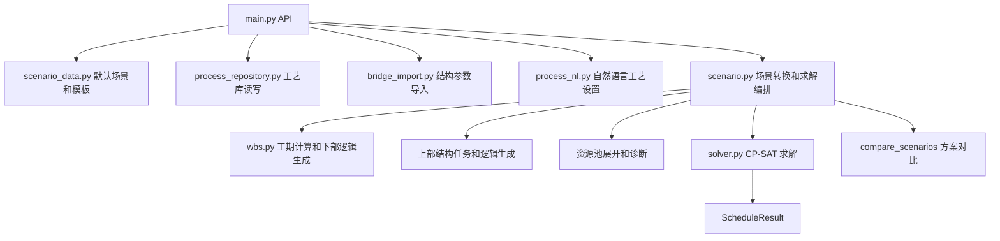

# 项目排程系统整体说明

版本：v1.1

日期：2026-06-16

适用范围：桥梁施工自动排程系统工程化版本

面向对象：产品、前端研发、后端研发、测试、计划工程师

## 1. 系统定位

项目排程系统用于将桥梁工程结构物参数、施工工艺工效、工艺逻辑、资源配置、里程碑目标和求解策略统一建模，生成求解前任务网络，并通过 OR-Tools CP-SAT 输出施工计划、资源分配、里程碑偏差、资源建议、连续性指标和方案对比结果。

系统的核心数据链路为：

```text
ScenarioInput -> GeneratedScheduleInput / ScheduleInput -> ScheduleResult / ScenarioSolveResult
```

实际工程版本中，结构物参数应以项目结构物参数服务为权威来源。Excel 导入保留为补充导入、历史数据兼容和校核能力。系统默认模板应在项目或方案首次进入排程配置时初始化为项目级或方案级配置，用户后续修改不应污染系统默认模板和其他项目。

当前排程范围以桥梁施工为主，覆盖桩基、承台、扩大基础、地系梁、中系梁、墩身、盖梁、桥台等下部结构任务，并纳入现浇箱梁、现浇连续梁 / 连续刚构等上部现浇结构任务派生。简支梁、钢箱梁和桥面系主要作为结构参数、工艺模板或后续扩展对象保留。

## 2. 系统模块划分

### 2.1 前端页面模块

| 模块 | 主要职责 | 关键输入 | 关键输出 |
| --- | --- | --- | --- |
| 工艺工效库 | 维护构件类型、施工工艺、工效分组、默认资源类型 | 项目级 `process_library`、系统工艺模板 | 标准化后的 `ProcessTemplate[]` |
| 工艺逻辑 | 维护下部结构和桥梁上部任务前后置规则 | `logic_rules`、`upper_structure_logic_rules`、项目结构 | 更新后的项目级逻辑配置 |
| 任务视图 | 生成求解前任务图，核验结构、工艺、工效、资源候选和前置关系 | `ScenarioInput`、导入文件、任务覆盖配置 | `GeneratedScheduleInput`、任务图诊断 |
| 资源配置 | 维护受限资源池默认投入数量、可增配上限和启用状态 | `resource_pools`、`resource_calendars` | 更新后的项目级或方案级资源配置 |
| 里程碑 | 维护桥梁 / 工点关键完成节点目标日期 | `milestones`、项目桥梁清单 | 更新后的里程碑配置 |
| 模拟求解 | 执行固定资源最短工期、固定工期最少资源、资源成本优化和方案对比 | 任务图、资源池、里程碑、求解策略 | `ScenarioSolveResult`、甘特图、资源分配、方案对比 |
| AI 操作助手 | 根据自然语言批量设置构件工艺 | 当前 `ScenarioInput`、自然语言指令 | 更新后的 `ScenarioInput`、变更摘要和告警 |

前端所有配置页共同编辑同一个排程场景。凡是会影响任务、资源、工期、逻辑、里程碑或求解策略的变更，都应使旧任务图、旧求解结果和旧方案对比失效，用户需要重新生成任务视图或重新求解后才能得到当前有效结果。

### 2.2 后端服务模块

| 模块 | 主要职责 | 关键输入 | 关键输出 |
| --- | --- | --- | --- |
| API 网关 | 暴露前端调用能力，处理请求校验和错误返回 | 前端请求 | 标准响应模型 |
| 默认场景和模板初始化 | 初始化默认项目、工艺库、逻辑库、资源池和里程碑 | 系统模板、本体配置 | `ScenarioInput` |
| 结构参数导入 / 接入 | 接入结构参数 API 或解析 Excel，并映射为标准项目结构 | 结构参数 API、Excel、本体配置 | `ProjectModel`、Canonical Bridge JSON、质量检查 |
| 工艺工效库持久化 | 读取、标准化、校验和保存工艺模板及工效分组 | `ProcessTemplate[]` | 标准化后的工艺工效库 |
| 自然语言工艺设置 | 解析自然语言意图并批量更新构件工艺 | `ScenarioInput`、prompt | 新场景、变更摘要、告警 |
| 场景转换和任务生成 | 将项目结构和配置转换为可求解任务网络 | `ScenarioInput` | `GeneratedScheduleInput` |
| 下部结构逻辑生成 | 生成同一墩台和结构序列内的前后置关系 | `logic_rules`、下部结构任务 | `PrecedenceLink[]` |
| 上部结构任务 / 逻辑生成 | 派生现浇箱梁、连续梁任务及上下部衔接关系 | `UpperStructureComponent`、上部逻辑规则 | 上部任务和前后置关系 |
| CP-SAT 求解 | 执行固定资源、最少资源和资源成本优化模型 | `ScheduleInput` | `ScheduleResult` |
| 方案对比 | 对多个求解结果做工期、资源、里程碑和评分对比 | `ScenarioSolveResult[]` | `ScenarioCompareResponse` |

## 3. 核心数据模型

### 3.1 场景输入模型

`ScenarioInput` 是前后端共享的核心业务载体，包含一次排程模拟所需的项目结构和配置。

| 字段 | 含义 |
| --- | --- |
| `scenario_id` | 方案 ID |
| `scenario_name` | 方案名称 |
| `project` | 项目结构物参数 |
| `process_library` | 施工工艺及工效库 |
| `logic_rules` | 下部结构工艺逻辑规则 |
| `upper_structure_logic_rules` | 桥梁上部工艺逻辑规则 |
| `task_overrides` | 任务级工艺和工效覆盖配置 |
| `resource_calendars` | 资源日历 |
| `resource_pools` | 资源池配置 |
| `milestones` | 里程碑约束 |
| `schedule_strategy` | 求解策略、连续性和资源保障配置 |
| `time_limit_seconds` | 求解时限 |

### 3.2 项目结构模型

结构物参数按以下层级组织：

```text
ProjectModel
  -> ProjectBridge
    -> WorkSection
      -> StructureModel
        -> ComponentModel
      -> UpperStructureComponent
```

| 数据对象 | 说明 |
| --- | --- |
| `ProjectModel` | 项目结构主数据，包含项目 ID、项目名称、开工日期和桥梁 / 工点列表 |
| `ProjectBridge` | 桥梁或工点对象，包含桥梁名称、排序、工点类型和工区 |
| `WorkSection` | 工区 / 幅别，包含下部结构和上部结构 |
| `StructureModel` | 墩台等下部结构，包含结构类型、墩号、排序、管控级别和构件 |
| `ComponentModel` | 下部结构构件，包含构件类型、数量、属性、工艺和工效配置 |
| `UpperStructureComponent` | 上部结构参数，包含跨号、支座范围、跨径、结构类型和连续梁配置 |

下部结构 `ComponentModel` 直接参与任务生成。上部结构 `UpperStructureComponent` 用于派生现浇箱梁、连续梁等现场任务，并为上下部衔接关系、主墩判断和合龙顺序提供参数。

### 3.3 配置模型

| 数据对象 | 说明 |
| --- | --- |
| `ProcessTemplate` | 施工工艺模板，定义构件类型、工艺名称、方法 ID、工效分组、默认资源类型 |
| `ProductivityOption` | 工效分组，定义工程量来源、工期算法、工效值、单位和默认分组 |
| `LogicRule` | 下部结构前后置规则，定义适用范围、前置候选、匹配策略、关系类型和滞后天数 |
| `UpperStructureLogicRule` | 桥梁上部逻辑规则，定义上部现场任务及上下部衔接关系的关系类型和滞后天数 |
| `ResourcePool` | 受限资源池，定义资源类型、默认数量、最大数量、启用状态、日历和成本属性 |
| `MilestoneConstraint` | 里程碑约束，定义节点名称、层级、软硬模式、作用范围、目标事件和目标日期 |

资源配置页面本期聚焦容量配置，不开放资源成本编辑入口。系统总览层面需保留资源成本优化求解能力，因为求解器和模拟结果已使用资源池成本属性进行最低成本组合测算。

### 3.4 任务图和求解模型

`GeneratedScheduleInput` 是任务视图和求解器之间的边界对象，包含 `ScheduleInput`、诊断信息和来源统计。

`ScheduleInput` 是求解器直接消费的数据结构：

| 字段 | 含义 |
| --- | --- |
| `project_name` | 项目名称 |
| `start_date` | 计划开始日期 |
| `tasks` | 已计算工程量和工期的任务清单 |
| `precedence_links` | 任务之间的 FS / SS / FF / SF 逻辑关系 |
| `resources` | 已展开的受限命名资源 |
| `milestones` | 里程碑目标 |
| `schedule_strategy` | 求解策略配置 |
| `time_limit_seconds` | 求解时限 |

`ScheduleResult` 是单次求解结果，包含状态、计划起止日期、排程任务、资源分配、里程碑结果、诊断、连续性指标和目标函数拆解。

`ScenarioSolveResult` 是前端模拟求解页面使用的结果容器，包含生成的任务图、求解结果、诊断、指标和候选方案。固定资源最短工期未满足强制里程碑时，系统可返回资源增量建议候选方案，供用户比较。

## 4. 数据输入和初始化

### 4.1 结构物参数输入

实际工程以项目结构物参数服务为权威数据源。系统应能获取项目、桥梁 / 工点、工区 / 幅别、墩台、下部构件、上部结构、尺寸、工程量属性、来源追踪和质量检查信息，并映射为 `ProjectModel`。

Excel 导入用于历史数据迁移、临时补录和校核。导入过程应完成表头标准化、字段映射、结构层级识别、质量检查和告警输出，导入失败时不得破坏当前有效项目数据。

### 4.2 系统模板初始化

项目或方案首次进入排程配置时，后端应将系统模板初始化为项目级或方案级配置：

| 模板 | 初始化结果 | 归属 |
| --- | --- | --- |
| 工艺工效模板 | `process_library` | 项目级或方案级可调整配置 |
| 工艺逻辑模板 | `logic_rules`、`upper_structure_logic_rules` | 项目级或方案级可调整配置 |
| 资源模板 | `resource_pools`、`resource_calendars` | 项目级或方案级可调整配置 |
| 里程碑模板 | `milestones` | 项目级或方案级可调整配置 |
| 结构参数 | `project` | 项目结构主数据 |

用户后续修改应保存到当前项目或当前方案。系统默认模板升级时，可以补齐新增模板项，但不得无提示覆盖用户已修改的项目级配置。

### 4.3 工艺工效输入

工艺工效库使用 `ProcessTemplate + ProductivityOption` 标准结构。任务生成时，构件通过 `method_id` 匹配施工工艺，通过 `productivity_option_id` 匹配工效分组；未指定时使用默认工艺和默认工效。

### 4.4 工艺逻辑输入

工艺逻辑规则分为下部结构规则和桥梁上部规则：

- 下部结构规则描述同一墩台内承台、桩基、系梁、墩身、盖梁、桥台等任务关系。
- 桥梁上部规则描述现浇箱梁、连续梁任务与下部完成任务之间的衔接，以及连续梁内部 0 号块、标准段、边跨合龙、中跨合龙等顺序。
- 关系类型支持 `FS`、`SS`、`FF`、`SF`，并支持非负 `lag_days`。

### 4.5 资源和里程碑输入

资源配置以 `ResourcePool` 为输入。固定资源最短工期使用 `quantity` 展开命名资源；固定工期最少资源和资源成本优化使用 `max_quantity` 作为可选上限；关闭或数量为 0 的资源池不展开命名资源，并应产生明确诊断。

里程碑以 `MilestoneConstraint` 为输入。桥梁级完成里程碑默认用于控制下部结构及上部现浇结构完成目标。强制里程碑用于偏差诊断、资源建议和固定工期目标；软里程碑迟延按 `penalty_per_day` 进入目标函数罚分。

## 5. 数据输出

系统输出应覆盖研发、测试和计划工程师核验排程结果所需的信息：

| 输出 | 说明 |
| --- | --- |
| 任务图 | 任务清单、工程量、工期、工期计算表达式、资源候选和前置关系 |
| 求解结果 | 每个任务的开始 / 完成日期、分配资源、前置任务和排程状态 |
| 资源分配 | 每个命名资源的任务占用区间、资源类型和任务来源 |
| 甘特图 | 按结构物或工艺分组展示任务起止关系 |
| 里程碑结果 | 目标日期、实际日期、迟延天数、罚分和状态 |
| 资源建议 | 固定资源无法满足强制里程碑时的资源增量建议，或固定工期下的最少资源推荐 |
| 资源成本结果 | 固定工期下的资源成本组合、资源成本、软里程碑罚分和目标函数拆解 |
| 连续性指标 | 同工艺拆分、跳墩、换幅、跨幅跳转和方向反转等施工连续性评价 |
| 诊断信息 | 工艺缺失、工程量无效、资源缺失、前置缺失、里程碑未匹配、求解不可行等 |
| 方案对比 | 多个结果的总工期、完成日期、里程碑偏差、资源数量、评分和推荐方案 |

## 6. 内部数据流转

### 6.1 初始化流


```mermaid
flowchart LR
  A["前端进入排程系统"] --> B["查询项目或方案排程场景"]
  B --> C["读取项目结构参数"]
  C --> D["初始化或加载项目级配置"]
  D --> E["返回 ScenarioInput"]
  E --> F["渲染工艺、逻辑、任务、资源、里程碑、求解页面"]
```

当前演示接口可通过 `GET /api/demo-scenario` 返回默认场景。实际工程接口应按项目和方案维度查询、保存和初始化场景。

### 6.2 结构参数接入流


```mermaid
flowchart LR
  A["结构参数 API 或 Excel"] --> B["结构参数标准化"]
  B --> C["本体和字段映射"]
  C --> D["Canonical Bridge JSON 或标准结构"]
  D --> E["ProjectModel"]
  E --> F["同步默认资源和桥梁级里程碑"]
  F --> G["ScenarioInput.project"]
```

### 6.3 配置编辑和结果失效流


```mermaid
flowchart LR
  A["用户编辑项目级配置"] --> B["更新 ScenarioInput"]
  B --> C["标记旧任务图失效"]
  C --> D["标记旧求解结果失效"]
  D --> E["标记旧方案对比失效"]
  E --> F["等待重新生成任务视图或重新求解"]
```

影响结果有效性的配置包括结构参数、管控级别、任务工艺、工效分组、工艺工效库、工艺逻辑、资源池、里程碑、计划开始日期、求解策略和求解时限。

### 6.4 任务图生成流


```mermaid
flowchart TD
  A["ScenarioInput"] --> B["遍历下部结构和上部结构参数"]
  B --> C["匹配 ProcessTemplate"]
  C --> D["匹配 ProductivityOption"]
  D --> E["计算工程量和 duration_days"]
  E --> F["生成下部结构和上部现浇任务"]
  F --> G["按下部结构规则生成 PrecedenceLink"]
  G --> H["按上部结构规则生成 PrecedenceLink"]
  H --> I["按 resource_pools 展开 Resource"]
  I --> J["合并 milestones、validation、source_summary"]
  J --> K["GeneratedScheduleInput"]
```

任务图生成阶段不执行 CP-SAT 求解，只负责把业务配置转成可求解输入。严重诊断应提示任务图暂不适合进入求解。

### 6.5 固定资源最短工期求解流


```mermaid
flowchart LR
  A["ScenarioInput"] --> B["生成 ScheduleInput"]
  B --> C["使用 quantity 展开命名资源"]
  C --> D["构建 CP-SAT 模型"]
  D --> E["添加工艺逻辑和资源互斥约束"]
  E --> F["计算里程碑迟延和连续性惩罚"]
  F --> G["最小化总工期、软里程碑罚分和连续性指标"]
  G --> H["ScheduleResult"]
  H --> I["必要时生成资源增量候选方案"]
```

### 6.6 固定工期最少资源求解流


```mermaid
flowchart LR
  A["ScenarioInput"] --> B["使用 max_quantity 展开最大资源"]
  B --> C["确定目标工期"]
  C --> D["CP-SAT 求解资源选择"]
  D --> E["输出推荐资源数量"]
  E --> F["ScenarioSolveResult"]
```

若存在可匹配强制里程碑，应优先使用强制目标作为目标工期；否则可使用上一轮固定资源最短工期作为 fallback target。

### 6.7 资源成本优化流


```mermaid
flowchart LR
  A["ScenarioInput"] --> B["使用 max_quantity 展开可选资源"]
  B --> C["确定目标工期"]
  C --> D["按资源成本属性构建目标函数"]
  D --> E["最小化资源成本和软里程碑罚分"]
  E --> F["返回资源成本组合和目标函数拆解"]
```

### 6.8 方案对比流


```mermaid
flowchart LR
  A["用户保存多个求解结果"] --> B["提交方案结果列表"]
  B --> C["汇总状态、总工期、里程碑偏差、资源数量"]
  C --> D["计算评分和推荐方案"]
  D --> E["返回对比摘要"]
```

## 7. 前后端调用能力

### 7.1 当前接口清单

| 前端动作 | 当前接口 | 输入 | 输出 |
| --- | --- | --- | --- |
| 初始化默认场景 | `GET /api/demo-scenario` | 无 | `ScenarioInput` |
| 查询工艺库 | `GET /api/process-library` | 无 | `ProcessTemplate[]` |
| 保存工艺库 | `PUT /api/process-library` | `ProcessLibrarySaveRequest` | `ProcessTemplate[]` |
| 上传导入桥梁参数 | `POST /api/import-bridge-params` | Excel、当前 `ScenarioInput`、目标桥名 | 更新后的 `ScenarioInput`、Canonical Bridge JSON、质量检查 |
| 导入本地样例桥梁参数 | `POST /api/import-local-bridge-params` | 当前 `ScenarioInput` | 更新后的 `ScenarioInput`、导入摘要、质量检查 |
| AI 工艺设置 | `POST /api/apply-process-natural-language` | 当前 `ScenarioInput`、自然语言指令 | 更新后的 `ScenarioInput`、变更摘要、告警 |
| 生成任务图 | `POST /api/generate-schedule-input` | `ScenarioInput` | `GeneratedScheduleInput` |
| 固定资源求最短工期 | `POST /api/solve-scenario` | `ScenarioInput` | `ScenarioSolveResult` |
| 固定工期求最少资源 | `POST /api/solve-min-resources` | `MinResourcesSolveRequest` | `ScenarioSolveResult` |
| 固定工期求最低资源成本 | `POST /api/solve-resource-cost` | `ResourceCostSolveRequest` | `ScenarioSolveResult` |
| 方案对比 | `POST /api/compare-scenarios` | `ScenarioSolveResult[]` | `ScenarioCompareResponse` |

兼容接口包括 `GET /api/demo`、`POST /api/generate-wbs` 和 `POST /api/solve`。这些接口用于早期 WBS 或直接求解能力兼容，不作为新工程化页面的主要交互边界。

### 7.2 工程化接口能力要求

实际工程落地时，接口不需要沿用 demo 路径，但必须具备以下能力：

- 按项目和方案查询完整 `ScenarioInput`。
- 从系统模板初始化项目级或方案级工艺、逻辑、资源和里程碑配置。
- 保存项目级或方案级配置，并进行权限、合法性和版本校验。
- 接入项目结构物参数服务，并在结构变化后同步任务、资源、里程碑和失效状态。
- 生成任务图、执行求解、保存求解结果和对比多个方案。
- 返回可测试的诊断信息，避免静默忽略工艺、工程量、资源、逻辑和里程碑问题。

### 7.3 后端内部调用关系


```mermaid
flowchart TD
  A["main.py API"] --> B["scenario_data.py 默认场景和模板"]
  A --> C["process_repository.py 工艺库读写"]
  A --> D["bridge_import.py 结构参数导入"]
  A --> E["process_nl.py 自然语言工艺设置"]
  A --> F["scenario.py 场景转换和求解编排"]
  F --> G["wbs.py 工期计算和下部逻辑生成"]
  F --> H["上部结构任务和逻辑生成"]
  F --> I["资源池展开和诊断"]
  F --> J["solver.py CP-SAT 求解"]
  J --> K["ScheduleResult"]
  F --> L["compare_scenarios 方案对比"]
```

## 8. 关键业务规则

### 8.1 工艺与工效匹配

任务生成时的工艺匹配优先级为：

1. 任务级覆盖配置。
2. 构件 `method_id`。
3. 当前构件类型的默认工艺。
4. 当前构件类型第一条可用工艺。

工效匹配优先级为：

1. 任务级覆盖配置。
2. 构件 `productivity_option_id`。
3. 当前工艺的默认工效分组。
4. 当前工艺第一条可用工效分组。

匹配失败时应生成严重诊断，不应静默求解。

### 8.2 工期计算

| 算法 | 说明 | 公式 |
| --- | --- | --- |
| `units_per_day` | 按日完成量计算 | `ceil(工程量 / 工效值)` |
| `days_per_unit` | 按单位耗时计算 | `ceil(工程量 * 工效值)` |
| `fixed_days` | 固定工期 | `ceil(工效值)` |

计算结果最小为 1 天。桩基可按桩长或根数计算，墩身可按墩高或标准节高换算节段计算，连续梁标准块按节段数量计算，桥面系可按桥面长度计算。

### 8.3 工艺逻辑约束

- 下部结构规则按同一墩台、结构类型、后续构件、候选前置和匹配策略生成前后置关系。
- 上部结构规则按跨组、主墩、边跨、中跨和合龙顺序生成现浇任务及衔接关系。
- `relationship` 支持 `FS`、`SS`、`FF`、`SF`。
- `lag_days` 必须为非负自然日。
- 找不到应有前置任务时应生成诊断；逻辑形成不可满足约束时求解结果应返回不可行或明确诊断。

### 8.4 资源约束

- 工艺模板决定任务需要的资源类型。
- 资源池决定该资源类型是否作为受限资源参与排程。
- 固定资源最短工期使用 `quantity` 展开命名资源。
- 固定工期最少资源和资源成本优化使用 `max_quantity` 作为资源可选上限。
- 求解器对每个命名资源建立 `NoOverlap`，确保同一资源同一时间只能执行一个任务。
- 关闭资源池或数量为 0 时，不展开命名资源，并应返回资源诊断。

### 8.5 里程碑约束

- 里程碑可作用于项目、桥梁、工区、结构物、构件类型或单个构件。
- 完成类里程碑取范围内任务最大完成时间。
- 开始类里程碑取范围内任务最早开始时间。
- 软里程碑迟延进入目标函数罚分。
- 强制里程碑在固定资源最短工期下用于偏差诊断和资源增量建议，在固定工期最少资源和资源成本优化下可作为目标工期依据。

### 8.6 结果失效规则

以下变更发生后，系统不得继续把旧任务图、旧求解结果和旧方案对比结果展示为当前有效结果：

- 结构参数重新导入或接入。
- 修改管控级别、构件工艺、工效分组或任务覆盖配置。
- 修改工艺工效库、工艺逻辑、资源配置或里程碑配置。
- 修改计划开始日期、求解策略或求解时限。
- 切换项目、方案或排程版本。

## 9. 验收标准

1. 系统能基于 `ScenarioInput` 生成 `GeneratedScheduleInput`，且任务图生成不执行 CP-SAT 求解。
2. 任务图能展示下部结构和已纳入范围的上部现浇结构任务，并包含工程量、工期、资源候选和前置关系。
3. 工艺、工效、逻辑、资源和里程碑配置变更后，旧任务图、旧求解结果和旧方案对比结果失效。
4. 固定资源最短工期求解使用资源池 `quantity` 展开命名资源，并返回排程任务、资源分配、里程碑结果和诊断。
5. 固定资源方案不满足强制里程碑时，系统能展示迟延诊断，并在可测算时返回资源增量建议。
6. 固定工期最少资源求解使用资源池 `max_quantity` 作为上限，推荐资源数量不得超过配置上限。
7. 资源成本优化能在目标工期下返回资源成本组合、成本摘要和目标函数拆解；资源配置页面本期不要求编辑成本字段。
8. 方案对比能汇总多个 `ScenarioSolveResult` 的工期、完成日期、里程碑偏差、资源数量和推荐方案。
9. 结构参数导入失败、工艺缺失、工程量无效、资源缺失、前置缺失、里程碑未匹配和求解不可行时，系统返回明确诊断。
10. 工程化版本应按项目或方案隔离配置，用户修改当前项目配置不影响系统默认模板和其他项目。

## 10. 工程化接入建议

实际工程落地建议按以下顺序推进：

1. 接入项目结构物参数服务，建立项目、桥梁、工区、墩台、构件和上部结构的标准模型。
2. 将历史工效数据迁移为 `ProcessTemplate + ProductivityOption`，并建立项目级工艺库保存能力。
3. 将下部结构和桥梁上部工艺逻辑升级为可配置规则库，保留系统默认模板和项目级配置。
4. 将资源池、资源日历和里程碑模板与项目、标段、工区、方案和权限绑定。
5. 建立排程方案保存机制，支持多方案复制、复用、审批和归档。
6. 为任务图、求解结果、资源分配、连续性指标和方案对比增加导出能力。
7. 建立结构参数、配置版本、任务图和求解结果之间的版本追踪，保证结果可复盘。
