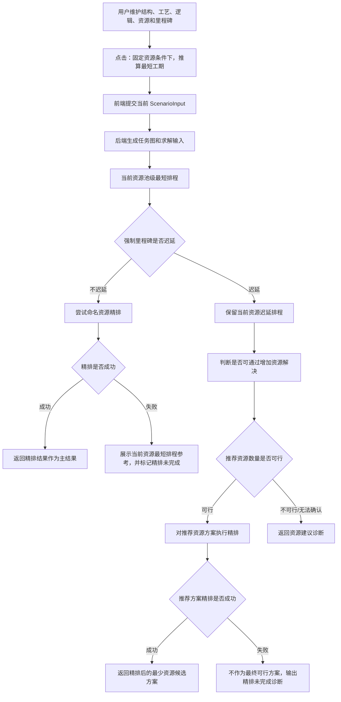
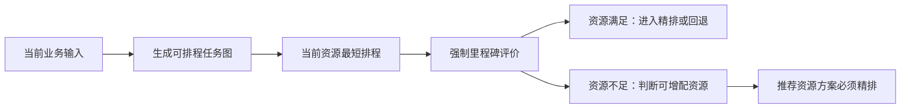
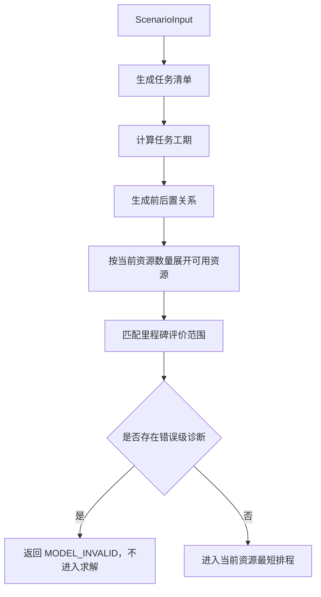
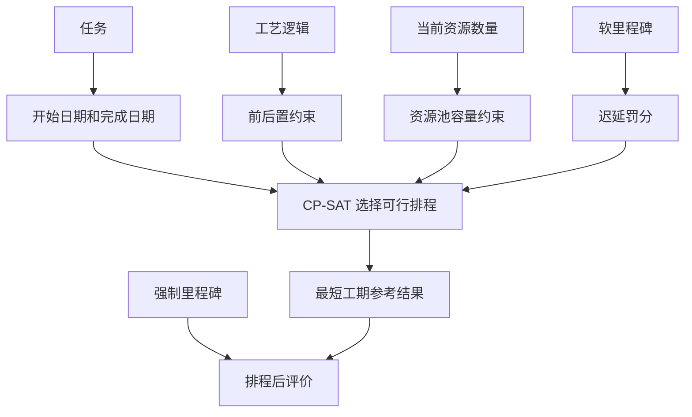
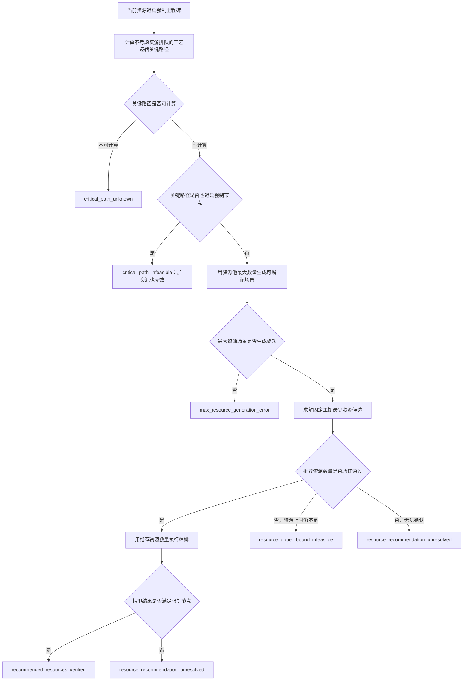

# 固定资源下最短工期算法需求文档

版本：v1.0

日期：2026-07-03

适用范围：用户点击“固定资源条件下，推算最短工期”后，系统从前端请求、后端任务生成、当前资源最短排程、强制里程碑判断、资源建议和精排回退之间的判断与调用规则。

面向对象：产品经理、算法研发、后端研发、前端研发、测试、计划工程师

## 1. 文档目标

本文档用于说明当前固定资源下最短工期算法的实现主线，重点回答：

| 业务问题 | 文档回答 |
| --- | --- |
| 用户点击按钮后调用哪条链路 | 前端固定调用“固定资源最短工期”接口，后端统一进入固定资源编排流程 |
| 当前资源够不够怎么判断 | 先用当前资源做一版池级最短排程，再用该排程评价强制里程碑是否迟延 |
| 什么情况下触发资源建议 | 只有当前资源最短排程迟延强制里程碑时，才继续判断增加资源是否可能解决 |
| 什么情况下进入精排 | 当前资源满足时精排当前资源结果；当前资源不满足但资源建议可行时，必须精排推荐资源结果 |
| 资源不足时用户最终拿到什么 | 推荐资源数量只是中间判断，用户最终可查看的可行候选方案必须是经过精排后的结果 |
| 精排在本文中的边界 | 本文只说明精排何时被调用、成功如何返回、失败如何处理，不展开精排目标函数 |
| 前端和测试如何验收 | 用结果状态、排程来源、资源建议状态、候选方案和诊断信息判断分支是否正确 |

本文不是精排目标函数说明，不定义新的接口、字段、数据库或页面。

## 2. 系统链路位置

“固定资源条件下，推算最短工期”是模拟结果模块的主求解入口。它使用用户当前配置的资源数量，不主动改变资源投入，先回答“现有资源最短能排到什么程度”。

前端按钮不会直接调用“固定工期最少资源”入口。资源建议是后端在固定资源主流程里，根据当前资源是否迟延强制里程碑自动触发的内部判断。

## 3. 用户点击后的前端行为

用户点击按钮后，前端应执行以下动作：

| 环节 | 产品口径 |
| --- | --- |
| 入口可用条件 | 当前存在有效方案；求解中、加载中或其他求解执行中时按钮不可重复点击 |
| 提交前处理 | 将当前工作区方案标准化，确保结构、工艺、资源、里程碑等配置按统一对象提交 |
| 页面状态 | 自动打开模拟结果区域，展示“正在按固定资源推算最短工期”的求解中提示 |
| 调用能力 | 调用固定资源最短工期求解能力，不由前端预判资源是否满足 |
| 返回后处理 | 写入本次任务图、主排程结果、诊断、指标和候选方案，用于甘特图、资源泳道和里程碑展示 |
| 异常处理 | 接口失败或后端返回错误诊断时，前端展示错误信息，不复用旧结果冒充当前方案 |

前端只负责发起和展示，不负责判断“当前资源够不够”。资源满足性、资源建议和精排回退由后端统一判断。

## 4. 核心算法思想

固定资源下最短工期算法采用“两步判断、资源建议、精排验收”的思路。

算法主线不是一开始就把强制里程碑作为不可违反条件挡住结果。它先排出当前资源下能做到的最短参考计划，再用这版计划判断强制里程碑是否迟延。这样即使当前资源不足，用户也能看到“现有资源会晚到哪一天、迟延多少天”，并进一步判断是否需要加资源。

当系统判断增加资源可能解决问题时，最少资源求解只负责找到“建议增加到多少”的资源数量。该数量不能直接作为用户最终可执行方案；系统必须用推荐资源数量再跑一次精排。只有精排结果满足强制里程碑，才可以作为用户最终拿到的可行候选方案。

## 5. 输入和求解前校验

固定资源主流程以当前方案为输入，核心信息如下：

| 输入内容 | 业务含义 | 对算法的影响 |
| --- | --- | --- |
| 项目开始日期 | 排程起算日期 | 决定任务开始、完成和里程碑实际日期 |
| 桥梁、工区、墩台、构件 | 施工对象范围 | 生成可排程任务 |
| 工艺工效库 | 每类构件采用什么工艺、工效多少 | 计算任务工期和默认资源类型 |
| 工艺逻辑 | 任务之间先后关系和间隔 | 形成 CP-SAT 前后置约束 |
| 资源池当前数量 | 当前投入设备、模板或班组数量 | 固定资源最短工期使用该数量作为容量边界 |
| 资源池最大数量 | 可增配上限 | 只有资源不足分支会用于资源建议 |
| 里程碑 | 合同、强控或提醒节点 | 固定资源结果完成后计算是否迟延 |
| 求解策略 | 控制优先、资源保障、普通均衡等偏好 | 影响后续精排和部分当前资源约束 |
| 求解时限 | 单次求解预算 | 决定未得到可行结果时的失败或回退诊断 |

任务图生成阶段只负责把业务方案转换为可求解输入，不执行正式排程。若生成阶段出现错误级诊断，例如无法生成任务、关键输入缺失、逻辑不可解析，系统直接返回模型无效结果，不进入固定资源最短排程。

## 6. 当前资源最短排程

### 6.1 阶段定位

当前资源最短排程是固定资源算法的第一道核心判断。它回答：

1. 在当前资源数量下，是否能排出满足施工逻辑和资源容量的计划。
2. 在能排出的情况下，总工期最短是多少。
3. 该最短计划是否迟延强制里程碑。

该阶段使用资源池容量建模，重点是快速得到“当前资源最短参考排程”。它不是最终精排，也不是资源成本优化。

### 6.2 业务建模口径

| 模型内容 | 产品解释 |
| --- | --- |
| 任务工期 | 每个任务必须连续占用自身工期天数 |
| 工艺逻辑 | 前后置关系必须满足，包括开始后开始、完成后开始等关系和滞后天数 |
| 当前资源容量 | 同一类受限资源在同一时间可并行的任务数不能超过当前投入数量 |
| 普通工作面限制 | 普通任务仍受可配置的时间窗口和最大并行工作面约束 |
| 软里程碑 | 可以迟延，但迟延会形成罚分，和总工期一起影响最短排程选择 |
| 强制里程碑 | 本阶段不作为阻断性硬约束，而是在排出结果后评价是否迟延 |

这种处理方式的业务价值是：当当前资源不够时，系统仍然能输出一版可查看的迟延排程，而不是只告诉用户“不可行”。

### 6.3 当前资源结果的用途

| 用途 | 说明 |
| --- | --- |
| 主判断依据 | 用强制里程碑迟延情况判断当前资源是否满足目标 |
| 迟延参考排程 | 当前资源不足时，保留该结果给用户查看迟延原因和预计完成日期 |
| 精排基准 | 当前资源满足时，将该结果作为后续精排的基准和求解提示 |
| 回退结果 | 后续精排失败时，回退展示该结果 |

## 7. 强制里程碑判断

当前资源最短排程得到可行结果后，系统检查强制里程碑的评价结果。

| 判断结果 | 业务含义 | 后续动作 |
| --- | --- | --- |
| 没有强制里程碑迟延 | 当前资源能满足强制节点 | 进入命名资源精排，争取输出更细、更易解释的主结果 |
| 存在强制里程碑迟延 | 当前资源不能满足强制节点 | 主结果标记为未满足，保留当前资源排程，并进入资源建议判断 |
| 当前资源最短排程未得到可行结果 | 无法判断当前资源是否满足 | 返回求解失败诊断，不进入精排，也不做资源建议 |

只有强制里程碑迟延才触发资源建议。软里程碑迟延不会触发资源增量建议，只作为排程质量和提醒节点风险展示。

## 8. 分支调用规则

### 8.1 总体分支表

| 条件 | 系统动作 | 主结果口径 | 是否精排 | 是否资源建议 | 用户看到的重点 |
| --- | --- | --- | --- | --- | --- |
| 任务图生成错误 | 停止求解 | 模型无效 | 否 | 否 | 输入或配置错误诊断 |
| 当前资源最短排程未得到可行结果 | 停止后续判断 | 求解失败或未知 | 否 | 否 | 当前资源无法形成可评价计划 |
| 当前资源满足强制里程碑，精排成功 | 返回精排结果 | 当前资源满足，主结果来自精排 | 是 | 否 | 推荐排程、资源泳道、控制和均衡诊断 |
| 当前资源满足强制里程碑，精排失败 | 展示当前资源最短排程参考，并标记精排未完成 | 当前资源满足，但未形成精排最终方案 | 是，但失败 | 否 | 强制节点已满足，但详细优化未完成，不能承诺为最终精排方案 |
| 当前资源迟延强制里程碑，关键路径也迟延 | 不推荐加资源 | 当前资源未满足 | 否 | 已判断不可通过加资源解决 | 增加资源也无法满足当前目标 |
| 当前资源迟延强制里程碑，推荐资源数量可满足且精排成功 | 生成推荐资源数量，并对推荐资源方案精排 | 当前资源未满足，同时返回经过精排的可行候选方案 | 是，针对推荐资源方案 | 是 | 当前方案迟延，另有经过精排的方案 2 可查看 |
| 当前资源迟延强制里程碑，推荐资源数量可满足但精排失败 | 不把未精排成功的候选排程作为最终可行方案 | 当前资源未满足，输出资源建议和精排未完成诊断 | 是，但未成功 | 已判断可增配但结果未可交付 | 可说明资源增配方向，但不能承诺可执行排程 |
| 当前资源迟延强制里程碑，最大资源仍不可行 | 不生成候选方案 | 当前资源未满足 | 否 | 已判断上限不可行 | 需提高资源上限或调整目标/逻辑 |
| 当前资源迟延强制里程碑，资源建议无法确认 | 返回未确认诊断 | 当前资源未满足 | 否 | 已尝试但无可验证推荐 | 当前求解预算内无法确认资源组合 |

### 8.2 结果来源口径

| 结果来源 | 代表含义 | 业务解释 |
| --- | --- | --- |
| 当前资源池级最短排程 | 当前资源最短参考结果 | 用于判断资源是否满足，也可作为迟延或回退展示 |
| 当前资源控制优先精排 | 当前资源已满足后的主结果 | 在不违反强制里程碑的前提下，输出更细的命名资源排程 |
| 当前资源快排参考 | 精排失败后的参考结果 | 当前资源已满足强制节点，但详细精排本次未成功；可展示参考排程，不应表述为最终精排方案 |
| 最少资源候选方案 | 资源不足时的备选方案 | 当前资源不满足，系统给出推荐资源数量，并返回经过精排的候选排程 |

研发和测试可在诊断字段中对齐现有状态名称，例如 `current_resources_capacity_shortest`、`current_resources_control_priority_balanced`、`current_resources_capacity_shortest_fallback`、`minimum_resources_control_priority_balanced`。正文不把这些字段作为业务主线。若存在未经过精排的最少资源容量模型结果，只能作为推荐数量验证或诊断依据，不应作为用户最终可执行候选方案。

## 9. 资源建议判断

资源建议只在“当前资源最短排程迟延强制里程碑”时触发。它不是用户单独点击“固定工期条件下，推算最少资源”的页面操作，而是固定资源主流程内部为了说明“是否加资源有用”而自动执行的判断。

资源建议状态的业务解释如下：

| 状态 | 什么时候出现 | 用户应如何理解 | 是否返回候选方案 |
| --- | --- | --- | --- |
| `not_needed` | 当前资源已满足强制里程碑 | 不需要增加资源 | 否 |
| `not_evaluated` | 当前资源最短排程未得到可行结果 | 当前资源本身无法评价，暂不建议加资源 | 否 |
| `critical_path_unknown` | 工艺逻辑关键路径无法计算 | 需要先检查逻辑闭环或不可满足关系 | 否 |
| `critical_path_infeasible` | 不考虑资源排队也无法满足强制节点 | 增加资源不能解决，应调整目标、工效或工艺逻辑 | 否 |
| `max_resource_generation_error` | 最大资源场景生成失败 | 资源上限场景存在配置错误 | 否 |
| `recommended_resources_verified` | 推荐资源数量已得到验证，且推荐资源方案已精排成功 | 当前资源不够，但可查看一版经过精排的最少资源候选方案 | 是 |
| `resource_upper_bound_infeasible` | 达到资源池最大数量仍无法满足 | 当前资源上限不足或资源类型结构不合理 | 否 |
| `resource_recommendation_unresolved` | 求解时限内无法确认推荐组合，或推荐资源方案精排未得到可用结果 | 系统无法在本次预算内给出可信的最终可行候选方案 | 否 |

## 10. 精排调用边界

本文只规定精排在固定资源主流程中的调用条件和结果处理，不展开精排目标函数。

| 场景 | 精排处理 |
| --- | --- |
| 当前资源最短排程迟延强制里程碑 | 不对当前资源迟延结果做精排；当前资源已被判定不满足强制节点 |
| 当前资源迟延，但推荐资源数量可满足目标 | 必须对推荐资源数量下的方案做精排 |
| 推荐资源方案精排成功 | 精排后的最少资源方案作为可行候选方案返回 |
| 推荐资源方案精排失败或超时 | 不把未精排成功的容量模型排程作为最终可行方案；输出资源建议未完成诊断 |
| 当前资源最短排程满足强制里程碑 | 调用精排，尝试生成命名资源级的控制优先和均衡排程 |
| 当前资源精排成功 | 精排结果作为主结果返回 |
| 当前资源精排失败或超时 | 可展示当前资源最短排程作为参考，并输出精排未完成诊断；不应表述为最终精排方案 |

精排不是“判断当前资源够不够”的第一依据。当前资源是否满足强制里程碑，由池级最短排程先判断。但只要系统要给用户一个“可执行的最终排程方案”，无论是当前资源方案还是推荐资源候选方案，都应来自精排结果。当前资源满足但精排失败时，可以展示当前资源最短排程作为参考和诊断；资源不足分支的推荐候选方案如果精排失败，则不能作为最终可行方案对用户承诺。

## 11. 输出结果和展示口径

固定资源主流程统一返回一个求解结果容器。前端应围绕主结果和候选方案进行展示。

| 输出内容 | 产品含义 | 展示建议 |
| --- | --- | --- |
| 本次任务图 | 本次由业务输入生成的任务、资源、里程碑和诊断 | 用于任务视图和求解诊断 |
| 主排程结果 | 当前固定资源主结果，可能是精排、回退或迟延参考排程 | 甘特图、资源泳道、里程碑摘要默认展示它 |
| 里程碑结果 | 每个里程碑的目标日期、实际日期、迟延天数和状态 | 强制节点迟延应突出展示 |
| 诊断信息 | 生成层、求解层、资源建议和回退原因 | 放在诊断区，帮助用户理解为什么进入某分支 |
| 候选方案 | 仅推荐资源数量验证通过且推荐方案精排成功时返回最少资源方案 | 作为方案 2 或备选方案展示 |

### 11.1 当前资源满足时

当前资源满足强制里程碑时，主结果应表达：

| 项目 | 期望口径 |
| --- | --- |
| 强制里程碑状态 | 无迟延 |
| 资源建议状态 | 无需增加资源 |
| 候选方案 | 不返回最少资源候选 |
| 主结果来源 | 最终可执行方案应来自精排；精排失败时只能展示当前资源最短排程参考 |
| 用户提示 | “当前资源已满足强制节点”，若精排失败则补充“详细优化未完成，当前仅展示参考排程” |

### 11.2 当前资源不满足时

当前资源不满足强制里程碑时，主结果应表达：

| 项目 | 期望口径 |
| --- | --- |
| 主结果状态 | 当前资源未满足强制节点，但仍保留排程任务和资源分配 |
| 强制里程碑 | 展示目标日期、当前预计日期、迟延天数 |
| 精排 | 不精排当前资源迟延主结果；若推荐资源数量可行，则必须精排推荐资源候选结果 |
| 资源建议 | 根据关键路径、资源上限和求解验证输出状态 |
| 候选方案 | 只有推荐资源数量验证通过且推荐方案精排成功时返回 |
| 用户提示 | 同时说明“当前资源会迟延”和“是否存在经过精排的可行资源增配方案” |

### 11.3 加权综合目标解释值

结果中的 `weighted_objective` 只作为“加权综合目标解释值”或研发测试复核指标，不应被产品文案描述为业务唯一评分，也不应被理解为严格等价的原始求解器目标。

## 12. 典型案例

### 12.1 当前资源足够，进入精排

场景：当前有 2 套模板和 2 台设备，池级最短排程下所有强制里程碑均无迟延。

系统判断：

1. 当前资源最短排程可行。
2. 强制里程碑无迟延。
3. 不触发资源建议。
4. 调用精排生成更细的命名资源结果。

用户看到：主结果为推荐排程，资源建议显示无需增加资源；若精排成功，甘特图和资源泳道来自精排结果。

### 12.2 当前资源不足，但增加资源可以满足

场景：当前只有 1 台设备，强制里程碑迟延；资源池最大数量允许增加到 3 台。

系统判断：

1. 当前资源最短排程保留下来，并标记强制节点迟延。
2. 关键路径本身不迟延，说明增加资源可能有效。
3. 使用最大资源上限求解最少资源数量。
4. 用推荐资源数量再执行一次精排。
5. 只有推荐资源精排结果满足强制节点，才返回最少资源候选方案。

用户看到：当前方案未满足强制节点，同时出现经过精排的方案 2，说明建议增加哪些资源、新增数量以及推荐方案的可执行排程。

### 12.3 增加资源也无法满足

场景：即使不考虑资源排队，单按工艺逻辑关键路径计算，强制节点仍然迟延。

系统判断：

1. 当前资源最短排程迟延。
2. 关键路径理论最早也迟延。
3. 不继续调用最少资源候选求解。
4. 返回“增加资源也无法满足”的诊断。

用户看到：需要调整里程碑目标、工艺逻辑、工效或施工方案，而不是单纯增加设备。

### 12.4 当前资源满足，但精排未完成

场景：池级当前资源最短排程已经满足强制节点，但命名资源精排在求解时限内没有得到可行结果。

系统判断：

1. 当前资源满足强制里程碑。
2. 资源建议状态仍为无需增加资源。
3. 精排失败后可展示当前资源最短排程作为参考。
4. 该参考排程不能被表述为最终精排可执行方案。

用户看到：系统说明当前资源具备满足强制节点的可能，但详细优化未完成；页面可展示参考排程和诊断，但不应把它包装成最终精排方案。这不是资源不足，也不应出现新增资源建议。

### 12.5 推荐资源数量可行，但推荐方案精排未完成

场景：当前资源不足，最少资源模型找到一组推荐资源数量，但推荐资源数量下的命名资源精排在求解时限内没有得到可用结果。

系统判断：

1. 当前资源主结果仍表达未满足强制节点。
2. 推荐资源数量可作为资源增配方向的诊断信息。
3. 不把未精排成功的容量模型排程作为用户最终可行候选方案。
4. 输出“推荐方案精排未完成”或等价诊断，提示需要延长求解时限、调整资源配置或重新求解。

用户看到：系统可以说明“增加资源可能有方向”，但不会把未经精排验证的方案 2 当作可执行最终计划展示。

## 13. 前后端职责

| 角色 | 职责 |
| --- | --- |
| 前端 | 提交当前方案、展示求解中状态、接收并展示主结果、候选方案和诊断；不自行判断资源是否满足 |
| 后端编排 | 生成任务图，按当前资源求最短排程，判断强制里程碑，分派当前资源精排、资源建议和推荐方案精排 |
| 求解器 | 提供当前资源最短排程、最少资源数量候选和推荐资源方案精排能力 |
| 测试 | 用状态、里程碑迟延、结果来源、资源建议状态、推荐方案精排状态和候选方案验证分支 |
| 产品 | 确认按钮文案、诊断文案、资源建议展示口径和精排回退提示是否符合用户理解 |

## 14. 验收标准

| 编号 | 场景 | 预期结果 |
| --- | --- | --- |
| 1 | 用户点击“固定资源条件下，推算最短工期” | 前端进入求解中状态，并调用固定资源最短工期能力 |
| 2 | 当前没有有效方案或正在求解 | 按钮不可用，不重复发起求解 |
| 3 | 任务图生成出现错误级诊断 | 返回模型无效结果，不进入当前资源最短排程 |
| 4 | 当前资源最短排程未得到可行结果 | 返回失败或未知诊断，资源建议状态为未评价 |
| 5 | 当前资源最短排程满足所有强制里程碑 | 进入精排调用；资源建议状态为无需增加资源 |
| 6 | 当前资源满足且精排成功 | 主结果来自当前资源控制优先精排，不返回最少资源候选方案 |
| 7 | 当前资源满足但精排失败 | 可展示当前资源最短排程作为参考，仍标记强制里程碑满足，但不能作为最终精排方案 |
| 8 | 当前资源最短排程迟延强制里程碑 | 主结果保留当前资源排程，状态表达未满足强制节点 |
| 9 | 当前资源迟延且关键路径理论最早也迟延 | 不生成资源候选方案，提示增加资源无法满足 |
| 10 | 当前资源迟延且推荐资源数量验证通过 | 必须继续对推荐资源方案执行精排 |
| 10.1 | 推荐资源方案精排成功 | 返回推荐资源数量，并在候选方案中提供经过精排的最少资源方案 |
| 10.2 | 推荐资源数量验证通过但推荐方案精排失败 | 不把容量模型排程作为最终可行候选方案，输出精排未完成诊断 |
| 11 | 当前资源迟延但最大资源上限仍不可行 | 不返回候选方案，提示资源上限不足或资源类型结构不合理 |
| 12 | 当前资源迟延但求解时限内无法确认推荐组合 | 不返回候选方案，输出无法确认的资源建议诊断 |
| 13 | 当前资源迟延时 | 不对当前资源迟延主结果做精排，不展示当前资源控制优先精排结果作为主结果 |
| 14 | 只存在软里程碑迟延 | 不触发资源建议，可作为排程质量或提醒节点风险展示 |
| 15 | 返回候选方案时 | 候选方案角色为最少资源方案，新增资源数量不超过资源池最大数量，结果来源应为推荐资源精排结果 |
| 16 | 返回主结果时 | 甘特图、资源泳道和里程碑摘要均使用当前主结果，不能混用旧结果 |

## 15. 交付边界

| 边界 | 说明 |
| --- | --- |
| 不新增接口 | 本文描述现有固定资源按钮和后端编排，不新增 API |
| 不新增字段 | 本文使用现有诊断和结果口径说明验收，不要求新增模型字段 |
| 不展开精排目标函数 | 精排只说明调用条件、成功返回和失败处理 |
| 不覆盖固定工期最少资源按钮 | 用户单独点击最少资源按钮属于另一条入口；本文只描述固定资源按钮触发后的内部资源建议 |
| 不描述资源成本优化 | 资源成本优化不属于固定资源最短工期主流程 |
| 不修改算法实现 | 本文是当前实现的产品化研发交底文档，不要求代码改造 |
