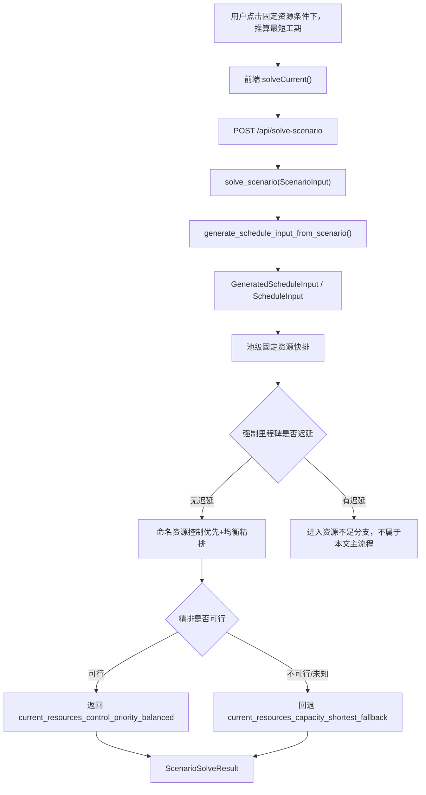
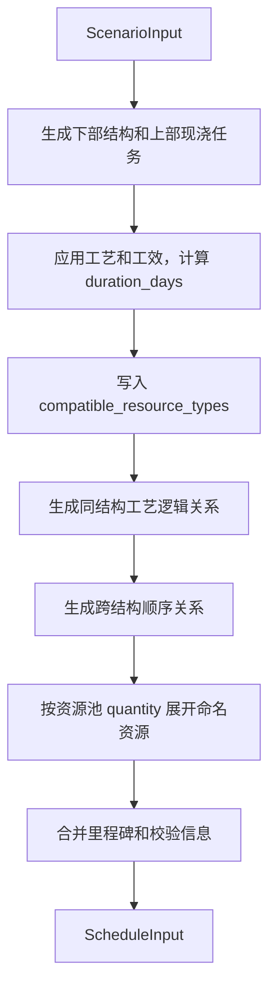

# 固定资源满足分支详细排程算法文档

版本：v1.0

日期：2026-06-27

适用范围：用户点击`固定资源条件下，推算最短工期`后，且当前资源能够满足强制里程碑时的详细排程算法

面向对象：产品、算法研发、后端研发、前端研发、测试、计划工程师

## 1. 文档目标

本文档说明当前项目中“固定资源条件下，推算最短工期”按钮触发后，在当前资源能够满足强制里程碑的情况下，系统如何从场景数据生成最终详细排程结果。

本文档用于回答以下问题：

| 问题 | 文档口径 |
| --- | --- |
| 按钮触发后调用哪条链路 | 前端调用`solveCurrent()`，后端进入`POST /api/solve-scenario` |
| 当前资源够不够如何判断 | 先用池级固定资源快排得到当前资源最短排程，再评价强制里程碑是否迟延 |
| 当前资源满足后为什么还要二次排程 | 快排用于判断和基准，二次精排用于生成更适合展示和施工组织讨论的命名资源详细排程 |
| 最终详细排程来自哪里 | 优先来自`current_resources_control_priority_balanced`，精排失败时回退`current_resources_capacity_shortest_fallback` |
| 前端展示哪些结果 | 展示计划状态、总工期、诊断、甘特图、资源泳道、资源路径、里程碑结果和方案对比入口 |

## 2. 触发入口和总体链路

### 2.1 前端入口

用户在模拟结果区域点击`固定资源条件下，推算最短工期`。前端执行以下动作：

1. 将当前页面维护的`ScenarioInput`做标准化处理。
2. 打开模拟结果模块。
3. 设置求解中状态。
4. 调用`solveScenario(requestScenario)`。
5. 请求后端`POST /api/solve-scenario`。
6. 将返回的`ScenarioSolveResult`写入当前求解结果，并用于甘特图、资源泳道、诊断和指标展示。

### 2.2 后端总体链路

本文档只展开`强制里程碑无迟延`分支。

## 3. 输入转换

### 3.1 业务输入

按钮触发时的业务输入是当前方案的`ScenarioInput`。该对象由前端页面统一维护，包含结构物、工艺工效、施工逻辑、资源池、里程碑和求解策略。

| 输入内容 | 进入算法后的用途 |
| --- | --- |
| 项目开始日期 | 作为所有任务开始和完成日期的偏移基准 |
| 桥梁、工区、墩台、构件、上部现浇结构 | 生成可排程工作项 |
| 工艺工效库 | 计算每个工作项的工期和默认资源类型 |
| 工艺逻辑规则 | 生成任务前后置关系 |
| 资源池`quantity` | 固定资源求最短工期的当前资源数量 |
| 资源池`enabled`和`resource_mode` | 判断资源是否形成受限等待 |
| 里程碑 | 判断目标节点是否满足 |
| 排程策略 | 控制资源保障、控制链优先、普通工程均衡等精排行为 |
| 求解时限 | 限制单次 CP-SAT 求解时间 |

### 3.2 任务图生成

后端先执行`generate_schedule_input_from_scenario()`，将`ScenarioInput`转换为`GeneratedScheduleInput`。

该阶段只生成任务图，不执行 CP-SAT。若任务生成阶段出现`error`级诊断，后端直接返回`MODEL_INVALID`，不进入固定资源满足分支。

## 4. 第一阶段：池级固定资源快排

### 4.1 阶段目标

池级固定资源快排用于快速回答：在当前资源数量下，是否能排出一个满足工艺逻辑、资源容量和软里程碑目标的最短工期参考排程。

该阶段由`solve_capacity_shortest_schedule()`执行。它使用资源池容量建模，而不是先精确分配到每一台设备或每一套模板。

### 4.2 建模规则

| 模型元素 | 当前实现口径 |
| --- | --- |
| 任务时间变量 | 每个任务创建开始偏移`start`和结束偏移`end` |
| 工期约束 | `end = start + duration_days` |
| 资源池选择 | 任务根据`compatible_resource_types`选择一个兼容资源池 |
| 池级容量约束 | 同一资源池在任意时间的并发任务数不得超过当前资源数量 |
| 前后置约束 | 所有`PrecedenceLink`按`FS`、`SS`、`FF`、`SF`和`lag_days`进入模型 |
| 普通工程窗口 | 对普通任务应用最早开始、最晚完成和工作面并行约束 |
| 资源保障 | 当策略为严格保障时，控制链和普通任务之间增加资源保障约束 |
| 里程碑事件 | 完成类取范围任务最晚完成；开始类取范围任务最早开始 |
| 目标函数 | 最小化总工期和软里程碑迟延罚分 |

### 4.3 快排输出用途

池级快排的结果不一定是最终展示结果。它在资源满足分支中承担三项职责：

| 职责 | 说明 |
| --- | --- |
| 判断当前资源是否满足强制里程碑 | 对快排结果中的强制里程碑计算`lateness_days` |
| 提供总工期基准 | 写入`baseline_makespan_days` |
| 给精排提供求解提示 | 作为`warm_start_result`传给命名资源精排 |

### 4.4 资源满足判定

系统检查池级快排结果中的强制里程碑：

| 判定条件 | 后续分支 |
| --- | --- |
| 存在强制里程碑`lateness_days > 0` | 当前资源不满足，进入资源不足和资源建议分支 |
| 所有已评价强制里程碑`lateness_days = 0` | 当前资源满足，进入控制优先和均衡精排 |
| 快排状态不是`OPTIMAL`或`FEASIBLE` | 返回求解失败诊断，不进入精排 |

当前资源满足时，最终主结果应写入`hard_milestone_feasible = true`，并且`resource_recommendation_status = not_needed`。

## 5. 第二阶段：命名资源控制优先和均衡精排

### 5.1 阶段目标

当池级快排已经证明当前资源能满足强制里程碑后，系统再执行`solve_control_priority_schedule()`，生成更细粒度的详细排程。

该阶段的目标不是重新判断资源够不够，而是在当前资源已够的前提下，尽量让结果更符合施工组织表达：

1. 控制性工程优先保障。
2. 控制链任务尽量减少资源等待。
3. 控制链任务尽量早完成。
4. 总工期和软里程碑迟延尽量小。
5. 普通工程尽量均衡推进。
6. 同结构同工艺尽量使用更连续的资源组织。
7. 资源空间路径尽量稳定，减少不必要跳墩、跳幅和转场。

### 5.2 精排与快排的核心差异

| 对比项 | 池级固定资源快排 | 命名资源精排 |
| --- | --- | --- |
| 资源粒度 | 资源池容量 | 具体命名资源 |
| 资源约束 | `Cumulative`容量约束 | 每个命名资源`NoOverlap` |
| 主要职责 | 判断最短工期和强制节点是否满足 | 生成可展示、可复核的详细排程 |
| 资源分配 | 快排后按资源可用时间映射到命名资源 | CP-SAT 直接选择具体命名资源 |
| 控制优先 | 仅作为部分约束和目标辅助 | 明确进入加权目标函数 |
| 普通均衡 | 作为普通任务窗口和工作面约束 | 叠加普通任务均衡目标 |
| 连续性 | 输出连续性指标，惩罚较轻 | 同结构同工艺拆分和空间路径惩罚进入目标 |

### 5.3 精排约束

| 约束类型 | 规则 |
| --- | --- |
| 任务工期 | 每个任务`end = start + duration_days` |
| 资源互斥 | 同一命名资源上的可选任务区间不得重叠 |
| 任务资源选择 | 有兼容受限资源的任务必须选择一个命名资源 |
| 施工逻辑 | 全部有效前后置关系必须满足 |
| 强制里程碑 | 资源满足分支的精排中作为硬约束，即事件偏移不得晚于目标偏移 |
| 普通工程窗口 | 普通任务受最早开始、最晚完成和工作面最大并行限制 |
| 严格资源保障 | 当资源保障为`strict`时，控制链任务获得更强资源保障约束 |

### 5.4 精排目标函数

命名资源精排采用加权目标。目标项从高到低表达如下：

| 目标项 | 业务含义 |
| --- | --- |
| 控制节点迟延 | 控制类和硬节点不得迟延，软控制节点迟延也要优先压低 |
| 控制链资源等待 | 控制链任务之间尽量少等待资源 |
| 控制链任务完成时间 | 控制任务尽量靠前完成 |
| 总工期和软里程碑罚分 | 在控制目标之后压缩总体工期和提醒节点迟延 |
| 普通工程均衡 | 普通工程按配置的周/月节奏均衡展开 |
| 同结构同工艺连续性 | 同一结构同一工艺尽量不要拆给太多资源 |
| 空间资源路径稳定性 | 同一资源尽量减少跳墩、跳幅和不连续转场 |

这意味着：当前资源满足强制节点后，最终详细排程不一定只追求绝对最短总工期，而是在强制节点满足的前提下兼顾控制链、均衡性和资源连续性。

### 5.5 warm start

精排会把池级快排结果作为求解提示。若提示被成功写入，结果元数据中应体现`warm_start_used = true`。

warm start 只用于帮助 CP-SAT 更快找到解，不改变业务约束，也不改变接口字段。

## 6. 资源满足分支的最终结果来源

### 6.1 优先成功路径

当命名资源精排得到`OPTIMAL`或`FEASIBLE`时，后端返回精排结果作为主结果。

主结果应具备以下关键元数据：

| 字段 | 期望值或含义 |
| --- | --- |
| `status` | `OPTIMAL`或`FEASIBLE` |
| `solve_mode` | `fixed_resources_shortest_control_balanced` |
| `hard_milestone_feasible` | `true` |
| `schedule_source` | `current_resources_control_priority_balanced` |
| `performance_path` | `capacity_fast_path_named_refinement` |
| `baseline_makespan_days` | 池级快排总工期 |
| `warm_start_used` | 是否使用快排结果作为求解提示 |
| `resource_recommendation_status` | `not_needed` |
| `resource_recommendation_message` | 当前固定资源最短工期已满足强制里程碑，无需增加资源 |

此时不应返回最少资源候选方案，`alternative_results`应为空。

### 6.2 精排失败回退路径

如果池级快排已经满足强制里程碑，但控制优先和均衡精排在求解时限内未得到可行结果，系统应回退展示池级快排结果。

回退结果的口径为：

| 字段 | 期望值或含义 |
| --- | --- |
| `hard_milestone_feasible` | `true` |
| `schedule_source` | `current_resources_capacity_shortest_fallback` |
| `performance_path` | `capacity_fast_path_named_refinement_fallback` |
| `skipped_named_refinement_reason` | 标记精排失败状态 |
| `resource_recommendation_status` | `not_needed` |

回退路径的业务含义是：当前资源已经满足强制节点，但更细粒度的命名资源精排没有在本次求解预算内完成；系统仍展示当前资源最短参考排程，并给出回退诊断。

## 7. 输出结果结构

固定资源满足分支返回`ScenarioSolveResult`。

| 输出字段 | 内容 |
| --- | --- |
| `generated` | 本次任务图、资源、里程碑和生成诊断 |
| `result` | 当前资源主排程结果 |
| `milestone_results` | 主结果中的里程碑达成情况 |
| `diagnostics` | 生成层和求解层诊断合并结果 |
| `metrics` | 任务数、资源数、总工期、强制里程碑摘要等 |
| `alternative_results` | 资源满足分支为空 |

`result`中应重点关注以下内容：

| 字段 | 研发和测试关注点 |
| --- | --- |
| `tasks` | 每个任务的开始偏移、结束偏移、开始日期、完成日期和分配资源 |
| `resource_allocations` | 每条命名资源上的任务占用区间 |
| `milestone_results` | 强制里程碑应无迟延；软里程碑可记录迟延和罚分 |
| `validation` | 应包含资源无重叠、里程碑达成、连续性提示等诊断 |
| `stats.continuity_metrics` | 资源路径、拆分、跳墩、跳幅等连续性指标 |
| `stats.normal_balance_metrics` | 普通工程均衡指标 |
| `stats.control_priority_analysis` | 控制链任务和瓶颈资源分析 |
| `objective_breakdown` | 总工期、软里程碑罚分、控制等待、均衡和连续性拆解 |

## 8. 前端展示规则

前端收到`ScenarioSolveResult`后，应使用主结果展示详细排程。

| 页面区域 | 展示内容 |
| --- | --- |
| 计划状态指标 | 根据求解状态、强制节点、里程碑摘要推导当前计划状态 |
| 总工期指标 | 展示`result.objective_days` |
| 工作项指标 | 展示本次排程任务数量 |
| 资源 / 里程碑指标 | 展示资源和里程碑摘要 |
| 约束诊断 | 展示`diagnostics`中的生成、求解和里程碑检查信息 |
| 甘特图 | 按墩台或工艺展示`result.tasks` |
| 资源泳道 | 使用`result.resource_allocations`展示每条资源的占用区间 |
| 资源路径图 | 使用`continuity_metrics.resource_paths`展示资源经过的墩台序列 |
| 方案保存/对比 | 当前结果可保存，并参与后续方案对比 |

资源满足分支不展示资源增量建议表，因为`resource_recommendation_status = not_needed`。

## 9. 合理性判断要点

产品和研发可用以下规则判断当前实现是否合理：

1. 快排先判断强制里程碑是否满足，避免一开始就把硬节点作为不可行约束导致用户看不到当前资源下最好能做到什么程度。
2. 资源满足后再进入命名资源精排，能兼顾性能和结果可解释性。
3. 最终展示的详细排程优先来自命名资源精排，因此资源泳道、资源路径和任务分配具有可复核意义。
4. 精排失败时回退快排结果是合理的降级策略，因为池级快排已经证明当前资源满足强制节点。
5. 当前资源满足时不应触发最少资源建议，避免向用户推荐不必要的新增资源。
6. 精排目标包含均衡和连续性，因此最终结果可能不是单纯“最短总工期唯一最优”，而是符合控制节点、普通推进和资源组织的综合方案。

## 10. 验收标准

| 编号 | 场景 | 预期结果 |
| --- | --- | --- |
| 1 | 用户点击`固定资源条件下，推算最短工期` | 前端调用`POST /api/solve-scenario`并展示求解中状态 |
| 2 | 当前`ScenarioInput`可生成任务图 | 后端返回`GeneratedScheduleInput`，并进入固定资源求解 |
| 3 | 当前资源池`quantity`足以满足强制里程碑 | 主结果`hard_milestone_feasible = true` |
| 4 | 命名资源精排成功 | 主结果`status`为`OPTIMAL`或`FEASIBLE`，`schedule_source = current_resources_control_priority_balanced` |
| 5 | 命名资源精排成功 | 主结果包含`control_priority_analysis`、`normal_balance_metrics`和`continuity_metrics` |
| 6 | 当前资源满足强制里程碑 | `resource_recommendation_status = not_needed`，`alternative_results`为空 |
| 7 | 精排未能在时限内得到可行解 | 系统回退`current_resources_capacity_shortest_fallback`，并保留`hard_milestone_feasible = true` |
| 8 | 输出任务排程 | 每个已排任务包含开始日期、完成日期、工期和资源分配信息 |
| 9 | 输出资源分配 | 同一命名资源的任务区间不得重叠 |
| 10 | 输出里程碑结果 | 强制里程碑不得出现`lateness_days > 0` |
| 11 | 前端展示主结果 | 甘特图、资源泳道和资源路径图均来自当前选中的主结果 |

## 11. 边界说明

| 边界 | 说明 |
| --- | --- |
| 当前资源不满足强制里程碑 | 进入资源不足、关键路径判断和资源建议分支，不属于本文主流程 |
| 固定工期最少资源 | 由`POST /api/solve-min-resources`或资源不足分支触发，不属于资源满足分支 |
| 资源成本优化 | 由`POST /api/solve-resource-cost`触发，不属于本文主流程 |
| 动态重排和实际进度锁定 | 当前文档不定义相关规则 |
| 接口和类型变更 | 本文档不要求新增或修改 API、字段、数据库表或前端类型 |
