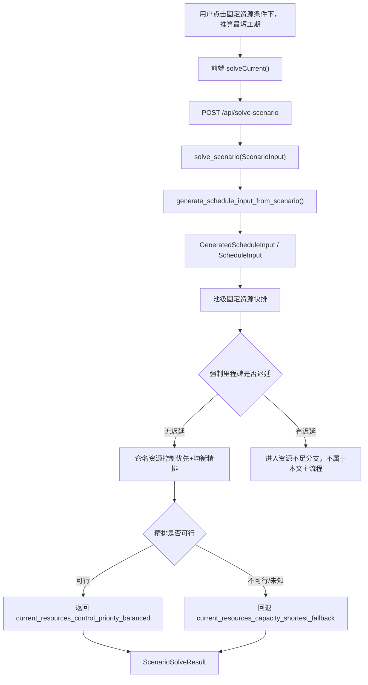
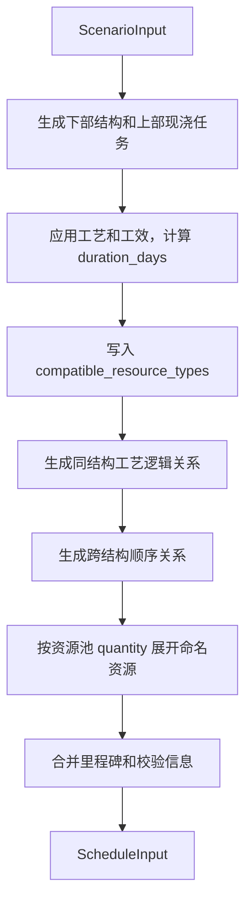

# 固定资源满足分支详细排程算法文档

版本：v1.1

日期：2026-07-01

适用范围：用户点击`固定资源条件下，推算最短工期`后，且当前资源能够满足强制里程碑时的详细排程算法

面向对象：产品、算法研发、后端研发、前端研发、测试、计划工程师

## 1. 文档目标

本文档说明当前项目中“固定资源条件下，推算最短工期”按钮触发后，在当前资源能够满足强制里程碑的情况下，系统如何从场景数据生成最终详细排程结果。

本文档用于回答以下问题：

| 问题 | 文档口径 |
| --- | --- |
| 按钮触发后调用哪条链路 | 前端调用`solveCurrent()`，后端进入`POST /api/solve-scenario` |
| 当前资源够不够如何判断 | 先用池级固定资源快排得到当前资源最短排程，再评价强制里程碑是否迟延 |
| 当前资源满足后为什么还要二次排程 | 快排用于判断和基准，二次精排用于生成更适合展示和施工组织讨论的命名资源详细排程 |
| 资源本身是否均衡如何判断 | 精排按命名资源分组、再按资源类型汇总，评价同类资源工作量差、空闲和路径连续性 |
| 最终详细排程来自哪里 | 优先来自`current_resources_control_priority_balanced`，精排失败时回退`current_resources_capacity_shortest_fallback` |
| 前端展示哪些结果 | 展示计划状态、总工期、诊断、甘特图、资源泳道、资源路径、里程碑结果和方案对比入口 |

## 2. 触发入口和总体链路

### 2.1 前端入口

用户在模拟结果区域点击`固定资源条件下，推算最短工期`。前端执行以下动作：

1. 将当前页面维护的`ScenarioInput`做标准化处理。
2. 打开模拟结果模块。
3. 设置求解中状态。
4. 调用`solveScenario(requestScenario)`。
5. 请求后端`POST /api/solve-scenario`。
6. 将返回的`ScenarioSolveResult`写入当前求解结果，并用于甘特图、资源泳道、诊断和指标展示。

### 2.2 后端总体链路



本文档只展开`强制里程碑无迟延`分支。

### 2.3 后端函数链路

固定资源满足分支的后端主链路如下：

| 环节 | 函数 | 输入 | 输出 / 作用 |
| --- | --- | --- | --- |
| 求解入口 | `solve_scenario()` | `ScenarioInput` | 统一返回`ScenarioSolveResult` |
| 输入转换 | `generate_schedule_input_from_scenario()` | `ScenarioInput` | 生成`GeneratedScheduleInput`和`ScheduleInput` |
| 固定资源分支编排 | `_solve_fixed_resources_shortest_scenario()` | `ScenarioInput`、`GeneratedScheduleInput` | 分派池级快排、强制里程碑判断、命名资源精排或资源建议 |
| 池级快排 | `solve_capacity_shortest_schedule()` | `ScheduleInput` | 使用资源池容量模型计算当前资源最短参考排程 |
| 命名资源精排 | `solve_control_priority_schedule()` | `ScheduleInput`、快排结果 | 在强制里程碑已满足后生成命名资源级详细排程 |

## 3. 输入转换

### 3.1 业务输入

按钮触发时的业务输入是当前方案的`ScenarioInput`。该对象由前端页面统一维护，包含结构物、工艺工效、施工逻辑、资源池、里程碑和求解策略。

| 输入内容 | 进入算法后的用途 |
| --- | --- |
| 项目开始日期 | 作为所有任务开始和完成日期的偏移基准 |
| 桥梁、工区、墩台、构件、上部现浇结构 | 生成可排程工作项 |
| 工艺工效库 | 计算每个工作项的工期和默认资源类型 |
| 工艺逻辑规则 | 生成任务前后置关系 |
| 资源池`quantity` | 固定资源求最短工期的当前资源数量 |
| 资源池`enabled`和`resource_mode` | 判断资源是否形成受限等待 |
| 里程碑 | 判断目标节点是否满足 |
| 排程策略 | 控制资源保障、控制链优先、普通工程均衡等精排行为 |
| 求解时限 | 限制单次 CP-SAT 求解时间 |

### 3.2 任务图生成

后端先执行`generate_schedule_input_from_scenario()`，将`ScenarioInput`转换为`GeneratedScheduleInput`。



该阶段只生成任务图，不执行 CP-SAT。若任务生成阶段出现`error`级诊断，后端直接返回`MODEL_INVALID`，不进入固定资源满足分支。

## 4. 第一阶段：池级固定资源快排

### 4.1 阶段目标

池级固定资源快排用于快速回答：在当前资源数量下，是否能排出一个满足工艺逻辑、资源容量和强制里程碑的最短工期参考排程。

该阶段只负责判断强制节点是否满足，并提供总工期基准和 warm start 提示；控制对象、控制缓冲和前置影响任务不在该阶段作为精排目标展开。

该阶段由`solve_capacity_shortest_schedule()`执行。它使用资源池容量建模，而不是先精确分配到每一台设备或每一套模板。

### 4.2 建模规则

| 模型元素 | 当前实现口径 |
| --- | --- |
| 任务时间变量 | 每个任务创建开始偏移`start`和结束偏移`end` |
| 工期约束 | `end = start + duration_days` |
| 资源池选择 | 任务根据`compatible_resource_types`选择一个兼容资源池 |
| 池级容量约束 | 同一资源池在任意时间的并发任务数不得超过当前资源数量 |
| 前后置约束 | 所有`PrecedenceLink`按`FS`、`SS`、`FF`、`SF`和`lag_days`进入模型 |
| 普通工程窗口 | 对普通任务应用最早开始、最晚完成和工作面并行约束 |
| 资源保障 | 当策略为严格保障时，控制链和普通任务之间增加资源保障约束 |
| 里程碑事件 | 完成类取范围任务最晚完成；开始类取范围任务最早开始 |
| 目标函数 | 最小化`makespan + total_soft_penalty` |

池级快排阶段的强制里程碑用于事后评价当前资源是否迟延，不在该阶段作为硬约束阻断求解。这样即使当前资源无法满足强制节点，系统也能返回一版可查看的当前资源参考排程。

### 4.3 快排输出用途

池级快排的结果不一定是最终展示结果。它在资源满足分支中承担三项职责：

| 职责 | 说明 |
| --- | --- |
| 判断当前资源是否满足强制里程碑 | 对快排结果中的强制里程碑计算`lateness_days` |
| 提供总工期基准 | 写入`baseline_makespan_days` |
| 给精排提供求解提示 | 作为`warm_start_result`传给命名资源精排 |

### 4.4 资源满足判定

系统检查池级快排结果中的强制里程碑：

| 判定条件 | 后续分支 |
| --- | --- |
| 存在强制里程碑`lateness_days > 0` | 当前资源不满足，进入资源不足和资源建议分支 |
| 所有已评价强制里程碑`lateness_days = 0` | 当前资源满足，进入控制优先和均衡精排 |
| 快排状态不是`OPTIMAL`或`FEASIBLE` | 返回求解失败诊断，不进入精排 |

当前资源满足时，最终主结果应写入`hard_milestone_feasible = true`，并且`resource_recommendation_status = not_needed`。

## 5. 第二阶段：命名资源控制优先和均衡精排

### 5.1 阶段目标

当池级快排已经证明当前资源能满足强制里程碑后，系统再执行`solve_control_priority_schedule()`，生成更细粒度的详细排程。

该阶段的目标不是重新判断资源够不够，而是在当前资源已够的前提下，尽量让结果更符合施工组织表达：

1. 控制对象优先保障。
2. 控制对象任务保留必要缓冲。
3. 控制链前置影响任务仅在缓冲不足或导致风险相关等待时进入高权重惩罚。
4. 总工期和软里程碑迟延尽量小。
5. 普通工程尽量均衡推进。
6. 同类资源尽量均衡承担工作量，避免部分资源闲置、部分资源过载。
7. 同一资源尽量减少长时间空档，提高资源组织连续性。
8. 同结构同工艺尽量使用更连续的资源组织。
9. 资源空间路径尽量稳定，减少不必要跳墩、跳幅和转场。

### 5.2 控制对象分层口径

固定资源满足分支不再把所有进入控制链的任务都展示为“控制性目标”。控制相关对象应按三层输出和展示：

| 层级 | 含义 | 示例 | 排程影响 |
| --- | --- | --- | --- |
| 控制对象 | 业务上真正需要保障的结构物或关键工程对象 | 现浇连续梁、连续梁 T 构、中跨合龙、被明确标记为控制性的主墩下部结构 | 作为控制缓冲和节点保护的业务对象，是前端“谁是控制对象”的主列表 |
| 控制对象任务 | 控制对象拆解出的具体可排程任务 | 0号块、标准段、合龙段、主墩桩基、承台、墩身 | 参与控制缓冲计算和控制对象完成时间诊断 |
| 控制链前置影响任务 | 自身不一定是控制对象，但沿工艺逻辑会影响控制对象完成的前置任务 | 边跨侧墩桩基、承台、盖梁，或被 `PrecedenceLink` 追溯到控制对象的普通任务 | 只在造成缓冲不足、节点风险或风险相关等待时进入高权重惩罚 |

判断原则：

1. 任务位于里程碑评价范围内，不等于该任务自动成为控制对象。
2. 普通任务进入控制链，不等于升级为控制对象；它应作为控制链前置影响任务解释“影响了谁”。
3. 现浇连续梁生成任务本期默认属于控制对象任务，不提供自动降级为普通工程的规则。
4. 前端展示应讲清楚“谁是控制对象、谁只是影响它、风险从哪里来”，避免把前置影响任务误读为控制性工程本体。

### 5.3 精排与快排的核心差异

| 对比项 | 池级固定资源快排 | 命名资源精排 |
| --- | --- | --- |
| 资源粒度 | 资源池容量 | 具体命名资源 |
| 资源约束 | `Cumulative`容量约束 | 每个命名资源`NoOverlap` |
| 主要职责 | 判断最短工期和强制节点是否满足 | 生成可展示、可复核的详细排程 |
| 资源分配 | 快排后按资源可用时间映射到命名资源 | CP-SAT 直接选择具体命名资源 |
| 控制优先 | 先用于硬里程碑满足性判断 | 使用控制对象、控制对象任务、控制缓冲和前置影响任务优化详细排程 |
| 普通均衡 | 作为普通任务窗口和工作面约束 | 叠加普通任务均衡目标 |
| 资源本身均衡 | 不作为主要目标 | 按命名资源和资源类型计算工作量差、空闲和路径连续性并进入目标 |
| 普通工作均衡 | 作为普通任务窗口和工作面约束 | 作为普通工程时间节奏目标，不等同于资源队伍工作量均衡 |
| 连续性 | 输出连续性指标，惩罚较轻 | 同结构同工艺拆分、空间资源分配偏好和资源路径目标进入目标 |

### 5.4 精排约束

| 约束类型 | 规则 |
| --- | --- |
| 任务工期 | 每个任务`end = start + duration_days` |
| 资源互斥 | 同一命名资源上的可选任务区间不得重叠 |
| 任务资源选择 | 有兼容受限资源的任务必须选择一个命名资源 |
| 施工逻辑 | 全部有效前后置关系必须满足 |
| 强制里程碑 | 资源满足分支的精排中作为硬约束，即事件偏移不得晚于目标偏移 |
| 普通工程窗口 | 普通任务受最早开始、最晚完成和工作面最大并行限制 |
| 严格资源保障 | 当资源保障为`strict`时，控制对象任务和高风险前置影响任务获得更强资源保障约束 |

### 5.5 精排目标函数

命名资源精排采用加权目标。目标项从高到低表达如下：

| 目标项 | 业务含义 |
| --- | --- |
| 控制节点迟延 | 控制类和硬节点不得迟延，软控制节点迟延也要优先压低 |
| 控制缓冲风险 | 控制对象任务和控制链前置影响任务不得侵蚀必要缓冲 |
| 风险相关控制链等待 | 只有当等待会造成缓冲不足或节点风险时，等待才进入高权重惩罚 |
| 同类资源工作量均衡 | 同一资源类型下，各命名资源承担的工作天数尽量接近 |
| 资源空闲 / 最大空档 | 同一资源相邻任务之间尽量减少长时间等待 |
| 资源路径连续性 | 同一资源尽量少切换路径组，路径组内尽量少形成空间空洞 |
| 总工期和软里程碑罚分 | 在控制目标之后压缩总体工期和提醒节点迟延 |
| 普通工程均衡 | 普通工程按配置的周/月节奏均衡展开 |
| 同结构同工艺连续性 | 同一结构同一工艺尽量不要拆给太多资源 |
| 空间资源路径稳定性 | 同一资源尽量减少跳墩、跳幅和不连续转场 |

这意味着：当前资源满足强制节点后，最终详细排程不再对控制链任务做无差别“越早完成越好”的奖励。控制对象只在软控制节点迟延、必要缓冲不足、或前置影响任务造成风险相关等待时产生高权重罚分；普通工程可以穿插施工，但不得侵蚀控制对象的必要缓冲。

`weighted_objective` 是加权综合目标解释，不应被表述为严格字典序优化。

### 5.6 当前目标函数权重

命名资源精排的目标函数由`solve_control_priority_schedule()`组装。当前实现中的权重常量位于`backend/app/solver.py`，研发实现时应按下表保持一致。

| 目标项 | 未加权指标 / 变量 | 权重常量 | 当前值 | 加权贡献 |
| --- | --- | --- | --- | --- |
| 控制节点迟延 | `control_lateness_days` / `control_lateness_terms` | `CONTROL_NODE_LATE_WEIGHT` | `1_000_000_000` | `control_lateness_days * 1_000_000_000` |
| 控制缓冲风险 | `control_buffer_risk_penalty` / `control_buffer_terms` | `CONTROL_BUFFER_RISK_WEIGHT` | `1_000_000` | `control_buffer_risk_penalty * 1_000_000` |
| 风险相关控制链等待 | `risk_related_control_wait_penalty` / `risk_related_control_wait_terms` | `CONTROL_RESOURCE_WAIT_WEIGHT` | `1_000_000` | `risk_related_control_wait_penalty * 1_000_000` |
| 同类资源工作量均衡 | `resource_workload_balance_penalty` / `workload_balance_terms` | `RESOURCE_WORKLOAD_BALANCE_WEIGHT` | `20_000` | `resource_workload_balance_penalty * 20_000` |
| 资源空闲 / 最大空档 | `resource_idle_penalty` / `idle_terms` | `RESOURCE_IDLE_WEIGHT` | `2_000` | `resource_idle_penalty * 2_000` |
| 资源路径连续性 | `resource_path_continuity_penalty` / `path_terms` | `RESOURCE_PATH_CONTINUITY_WEIGHT` | `500` | `resource_path_continuity_penalty * 500` |
| 总工期和软里程碑罚分 | `objective_days + soft_milestone_penalty` | `CONTROL_MAKESPAN_WEIGHT` | `100` | `(objective_days + soft_milestone_penalty) * 100` |
| 普通工程均衡 | `normal_balance_penalty` / `normal_balance_terms` | `NORMAL_BALANCE_WEIGHT` | `1` | `normal_balance_penalty * 1` |
| 同结构同工艺连续性 | `continuity_split_penalty` / `split_terms` | `SAME_STRUCTURE_CRAFT_SPLIT_WEIGHT` | `100_000` | `continuity_split_penalty * 100_000` |
| 空间资源分配偏好 | `spatial_assignment_penalty` / `spatial_terms` | `SPATIAL_RESOURCE_ASSIGNMENT_WEIGHT` | `1` | `spatial_assignment_penalty * 1` |

精排目标函数当前等价于：

```text
weighted_objective =
  control_lateness_days * 1_000_000_000
  + control_buffer_risk_penalty * 1_000_000
  + risk_related_control_wait_penalty * 1_000_000
  + resource_workload_balance_penalty * 20_000
  + resource_idle_penalty * 2_000
  + resource_path_continuity_penalty * 500
  + (objective_days + soft_milestone_penalty) * 100
  + normal_balance_penalty * 1
  + continuity_split_penalty * 100_000
  + spatial_assignment_penalty * 1
```

补充说明：

1. `objective_breakdown.objective_weights`应返回上述权重，便于前端、测试和排程解释面板复核。
2. `resource_balance_weight`和`resource_idle_weight`是已有兼容字段，分别对应`RESOURCE_WORKLOAD_BALANCE_WEIGHT`和`RESOURCE_IDLE_WEIGHT`。
3. `stats.continuity_objective.primary_weight = 1_000_000`用于非控制优先普通求解路径中的主目标放大，不是`solve_control_priority_schedule()`精排目标函数里的单独加项。

### 5.7 资源本身平衡与普通工作平衡

资源本身平衡由`_build_resource_organization_terms()`生成，普通工作平衡由`_build_normal_balance_terms()`生成，两者含义不同。

| 对比项 | 资源本身平衡 | 普通工作平衡 |
| --- | --- | --- |
| 关注对象 | 命名资源和资源类型 | 普通任务 |
| 分组方式 | 先按`resource.id`收集任务，再按`resource.type`汇总同类资源 | 按周或月时间桶统计普通任务 |
| 核心指标 | `workload_range = max_workload - min_workload` | 时间桶内任务数量和节奏偏差 |
| 目标函数项 | `workload_balance_terms * RESOURCE_WORKLOAD_BALANCE_WEIGHT` | `normal_balance_terms * NORMAL_BALANCE_WEIGHT` |
| 业务解释 | 同类设备、模板、班组尽量均衡使用 | 普通工程不要过度集中在某个时间段 |

资源本身平衡的实现口径：

1. 对每个可选命名资源统计它被分配到的任务和总工作天数。
2. 对同一`resource.type`下的命名资源计算最大工作量和最小工作量。
3. 将`max_workload - min_workload`作为同类资源工作量差。
4. 将工作量差写入`workload_balance_terms`，并由`RESOURCE_WORKLOAD_BALANCE_WEIGHT`加权进入精排目标函数。
5. 同时计算资源是否被使用、资源活动跨度、空闲天数和最大空档，并由`RESOURCE_IDLE_WEIGHT`加权约束资源空闲。

因此，资源本身平衡不是“把普通任务按时间平均摊开”，而是让同类资源队伍自身承担的工作量更均衡、空档更少。

### 5.8 路径连续性评价

路径连续性分为求解期软目标和求解后诊断两层。

| 层级 | 实现对象 | 说明 |
| --- | --- | --- |
| 求解期软目标 | `_build_resource_path_continuity_terms()` | 对命名资源的路径组切换和路径组内空间空洞加惩罚 |
| 求解期软目标 | `_build_continuity_soft_terms()` | 对同结构同工艺拆分和空间资源分配偏好加惩罚 |
| 求解后诊断 | `_build_continuity_metrics()` | 统计跳墩、跳幅、跨幅跳墩、方向反转、路径组切换、资源路径和连续性评分 |
| 求解后诊断 | `_build_resource_organization_analysis()` | 汇总每个资源的工作天数、空闲天数、最大空档、利用率和路径切换情况 |

路径连续性不是硬约束，也不建模真实转场时间。它用于在不破坏工艺逻辑、资源互斥、强制里程碑和控制缓冲的前提下，偏好更容易解释和执行的资源行走路径。

### 5.9 warm start

精排会把池级快排结果作为求解提示。若提示被成功写入，结果元数据中应体现`warm_start_used = true`。

warm start 只用于帮助 CP-SAT 更快找到解，不改变业务约束，也不改变接口字段。

## 6. 资源满足分支的最终结果来源

### 6.1 优先成功路径

当命名资源精排得到`OPTIMAL`或`FEASIBLE`时，后端返回精排结果作为主结果。

主结果应具备以下关键元数据：

| 字段 | 期望值或含义 |
| --- | --- |
| `status` | `OPTIMAL`或`FEASIBLE` |
| `solve_mode` | `fixed_resources_shortest_control_balanced` |
| `hard_milestone_feasible` | `true` |
| `schedule_source` | `current_resources_control_priority_balanced` |
| `performance_path` | `capacity_fast_path_named_refinement` |
| `baseline_makespan_days` | 池级快排总工期 |
| `warm_start_used` | 是否使用快排结果作为求解提示 |
| `resource_recommendation_status` | `not_needed` |
| `resource_recommendation_message` | 当前固定资源最短工期已满足强制里程碑，无需增加资源 |

此时不应返回最少资源候选方案，`alternative_results`应为空。

### 6.2 精排失败回退路径

如果池级快排已经满足强制里程碑，但控制优先和均衡精排在求解时限内未得到可行结果，系统应回退展示池级快排结果。

回退结果的口径为：

| 字段 | 期望值或含义 |
| --- | --- |
| `hard_milestone_feasible` | `true` |
| `schedule_source` | `current_resources_capacity_shortest_fallback` |
| `performance_path` | `capacity_fast_path_named_refinement_fallback` |
| `skipped_named_refinement_reason` | 标记精排失败状态 |
| `resource_recommendation_status` | `not_needed` |

回退路径的业务含义是：当前资源已经满足强制节点，但更细粒度的命名资源精排没有在本次求解预算内完成；系统仍展示当前资源最短参考排程，并给出回退诊断。

## 7. 输出结果结构

固定资源满足分支返回`ScenarioSolveResult`。

| 输出字段 | 内容 |
| --- | --- |
| `generated` | 本次任务图、资源、里程碑和生成诊断 |
| `result` | 当前资源主排程结果 |
| `milestone_results` | 主结果中的里程碑达成情况 |
| `diagnostics` | 生成层和求解层诊断合并结果 |
| `metrics` | 任务数、资源数、总工期、强制里程碑摘要等 |
| `alternative_results` | 资源满足分支为空 |

`result`中应重点关注以下内容：

| 字段 | 研发和测试关注点 |
| --- | --- |
| `tasks` | 每个任务的开始偏移、结束偏移、开始日期、完成日期和分配资源 |
| `resource_allocations` | 每条命名资源上的任务占用区间 |
| `milestone_results` | 强制里程碑应无迟延；软里程碑可记录迟延和罚分 |
| `validation` | 应包含资源无重叠、里程碑达成、连续性提示等诊断 |
| `stats.continuity_metrics` | 资源路径、拆分、跳墩、跳幅等连续性指标 |
| `stats.normal_balance_metrics` | 普通工程均衡指标 |
| `stats.resource_organization_analysis` | 资源本身组织指标，包括工作量均衡、空闲、利用率和路径切换 |
| `stats.control_priority_analysis` | 控制对象、控制对象任务、前置影响任务、控制缓冲风险和瓶颈资源分析 |
| `objective_breakdown` | 总工期、软里程碑罚分、控制缓冲风险、风险相关等待、资源组织、均衡和连续性拆解 |

`stats.control_priority_analysis`应至少支持以下分层诊断字段：

| 字段 | 含义 | 前端展示口径 |
| --- | --- | --- |
| `control_objects` | 控制对象列表，描述真正需要保障的结构物或关键工程对象 | 展示“谁是控制对象” |
| `control_object_tasks` | 控制对象拆解出的具体任务，含所属控制对象、剩余缓冲和风险天数 | 展示“控制对象由哪些任务实现” |
| `control_chain_predecessors` | 沿 `PrecedenceLink` 追溯到控制对象的前置影响任务，含影响的控制对象和来源规则 | 展示“谁只是影响它” |
| `control_buffer_risks` | 控制对象任务和前置影响任务造成的缓冲风险明细 | 展示“风险从哪里来” |
| `control_buffer_status` | 控制缓冲总体状态 | 作为结果页控制缓冲主指标 |
| `normal_balance_status` | 普通工程均衡总体状态 | 作为结果页普通工程均衡主指标 |
| `resource_path_status` | 资源路径连续性总体状态 | 作为结果页资源路径主指标 |
| `resource_balance_status` | 同类资源工作量均衡状态 | 作为结果页资源组织主指标 |
| `resource_idle_status` | 命名资源空闲和最大空档状态 | 作为结果页资源组织主指标 |
| `resource_organization_analysis` | 资源组织分析，含资源类型汇总和资源队伍明细 | 展示资源本身是否均衡、是否存在长空档 |
| `path_group_diagnostics` | 按桥梁、工区、幅别、资源类型、工艺类型形成的路径组诊断 | 展示跳墩、跳幅、方向反转和路径组切换诊断 |
| `fallback_reason` | 精排失败回退时的原因 | 回退路径展示，不回退时可为空 |

`objective_breakdown`应使用以下业务项解释加权目标：

| 字段 | 含义 |
| --- | --- |
| `soft_control_lateness_penalty` | 软控制节点迟延罚分 |
| `control_buffer_risk_penalty` | 控制缓冲不足罚分 |
| `risk_related_control_wait_penalty` | 会造成缓冲不足或节点风险的控制链等待罚分 |
| `resource_workload_balance_penalty` | 同类资源工作量差惩罚 |
| `resource_idle_penalty` | 资源空闲和最大空档惩罚 |
| `resource_path_continuity_penalty` | 资源路径组切换和路径组内空间空洞惩罚 |
| `normal_balance_penalty` | 普通工程均衡罚分 |
| `continuity_preference_penalty` | 同结构同工艺连续性和资源路径偏好罚分 |
| `resource_organization_analysis` | 资源组织分析明细 |
| `schedule_source` | 当前主排程来源 |
| `weighted_objective` | 加权综合目标值 |
| `objective_weights` | 当前目标函数权重字典，包含控制节点迟延、缓冲风险、资源均衡、空闲、路径连续性、总工期、普通均衡和连续性偏好的权重 |

## 8. 前端展示规则

前端收到`ScenarioSolveResult`后，应使用主结果展示详细排程。

| 页面区域 | 展示内容 |
| --- | --- |
| 计划状态指标 | 根据求解状态、强制节点、里程碑摘要推导当前计划状态 |
| 主指标区 | 展示推荐排程总工期、最短工期基准、强制节点状态、控制缓冲状态、普通工程均衡状态、资源路径状态和方案来源 |
| 工作项指标 | 展示本次排程任务数量 |
| 资源 / 里程碑指标 | 展示资源和里程碑摘要 |
| 约束诊断 | 展示`diagnostics`中的生成、求解和里程碑检查信息 |
| 控制对象诊断 | 展示`control_objects`，说明真正的控制对象 |
| 控制对象任务诊断 | 展示`control_object_tasks`，说明控制对象对应的具体任务和缓冲状态 |
| 前置影响任务诊断 | 展示`control_chain_predecessors`，说明哪些任务只是影响控制对象以及影响来源 |
| 缓冲风险诊断 | 展示`control_buffer_risks`，说明风险天数、风险来源和受影响控制对象 |
| 资源组织汇总 | 展示`resource_organization_analysis.resource_types`，说明同类资源启用数量、使用数量、工作量差、最大空档、均衡状态和空闲状态 |
| 资源队伍明细 | 展示`resource_organization_analysis.resources`，说明单个命名资源的任务数、工作天数、空闲天数、最大空档和利用率 |
| 甘特图 | 按墩台或工艺展示`result.tasks` |
| 资源泳道 | 使用`result.resource_allocations`展示每条资源的占用区间 |
| 资源路径图 | 使用`continuity_metrics.resource_paths`展示资源经过的墩台序列 |
| 方案保存/对比 | 当前结果可保存，并参与后续方案对比 |

资源满足分支不展示资源增量建议表，因为`resource_recommendation_status = not_needed`。

技术性指标如求解耗时、节点数量、加权目标值和求解状态细节应放在诊断区，不应挤占业务主指标。

## 9. 合理性判断要点

产品和研发可用以下规则判断当前实现是否合理：

1. 快排先判断强制里程碑是否满足，避免一开始就把硬节点作为不可行约束导致用户看不到当前资源下最好能做到什么程度。
2. 资源满足后再进入命名资源精排，能兼顾性能和结果可解释性。
3. 最终展示的详细排程优先来自命名资源精排，因此资源泳道、资源路径和任务分配具有可复核意义。
4. 精排失败时回退快排结果是合理的降级策略，因为池级快排已经证明当前资源满足强制节点。
5. 当前资源满足时不应触发最少资源建议，避免向用户推荐不必要的新增资源。
6. 控制对象、控制对象任务和控制链前置影响任务应分层展示，前置影响任务不得被误展示为控制对象。
7. 精排目标不再奖励控制链任务无限提前完成；只有缓冲不足、软控制节点迟延或风险相关等待才形成控制高权重罚分。
8. 精排目标包含均衡和连续性，因此最终结果可能不是单纯“最短总工期唯一最优”，而是符合控制节点、普通推进和资源组织的综合方案。

## 10. 验收标准

| 编号 | 场景 | 预期结果 |
| --- | --- | --- |
| 1 | 用户点击`固定资源条件下，推算最短工期` | 前端调用`POST /api/solve-scenario`并展示求解中状态 |
| 2 | 当前`ScenarioInput`可生成任务图 | 后端返回`GeneratedScheduleInput`，并进入固定资源求解 |
| 3 | 当前资源池`quantity`足以满足强制里程碑 | 主结果`hard_milestone_feasible = true` |
| 4 | 命名资源精排成功 | 主结果`status`为`OPTIMAL`或`FEASIBLE`，`schedule_source = current_resources_control_priority_balanced` |
| 5 | 命名资源精排成功 | 主结果包含`control_priority_analysis`、`normal_balance_metrics`和`continuity_metrics` |
| 6 | 当前资源满足强制里程碑 | `resource_recommendation_status = not_needed`，`alternative_results`为空 |
| 7 | 精排未能在时限内得到可行解 | 系统回退`current_resources_capacity_shortest_fallback`，并保留`hard_milestone_feasible = true` |
| 8 | 输出任务排程 | 每个已排任务包含开始日期、完成日期、工期和资源分配信息 |
| 9 | 输出资源分配 | 同一命名资源的任务区间不得重叠 |
| 10 | 输出里程碑结果 | 强制里程碑不得出现`lateness_days > 0` |
| 11 | 前端展示主结果 | 甘特图、资源泳道和资源路径图均来自当前选中的主结果 |
| 12 | 存在控制对象 | `control_priority_analysis.control_objects`展示业务控制对象，且不混入普通前置影响任务 |
| 13 | 存在控制对象任务 | `control_priority_analysis.control_object_tasks`展示控制对象拆出的具体任务和缓冲状态 |
| 14 | 存在前置影响任务 | `control_priority_analysis.control_chain_predecessors`展示影响的控制对象、来源规则和风险来源 |
| 15 | 控制链前置任务缓冲充足 | 缓冲风险天数为 0，不因单纯未提前完成产生高权重罚分 |
| 16 | 控制链前置任务侵蚀必要缓冲 | 产生`control_buffer_risks`并进入`control_buffer_risk_penalty`或`risk_related_control_wait_penalty` |
| 17 | 精排失败回退 | 新增分层字段可为空数组，并输出`fallback_reason`或等价回退原因 |
| 18 | 同类资源数量大于 1 且任务量充足 | 精排按资源类型计算工作量差，输出`resource_workload_balance_penalty`和`resource_organization_analysis.resource_types` |
| 19 | 某一命名资源存在长时间空档 | 输出`resource_idle_penalty`，并在资源队伍明细中展示`idle_days`和`max_idle_gap_days` |
| 20 | 同一资源发生路径组切换或路径组内空间空洞 | 输出`resource_path_continuity_penalty`，并在连续性或资源组织诊断中展示路径切换信息 |
| 21 | 普通工程均衡开启 | `normal_balance_penalty`只解释普通任务时间节奏，不替代资源本身工作量均衡 |
| 22 | 输出连续性指标 | `continuity_metrics`展示跳墩、跳幅、跨幅跳墩、方向反转、路径组切换和资源路径明细 |

## 11. 边界说明

| 边界 | 说明 |
| --- | --- |
| 当前资源不满足强制里程碑 | 进入资源不足、关键路径判断和资源建议分支，不属于本文主流程 |
| 固定工期最少资源 | 由`POST /api/solve-min-resources`或资源不足分支触发，不属于资源满足分支 |
| 资源成本优化 | 由`POST /api/solve-resource-cost`触发，不属于本文主流程 |
| 动态重排和实际进度锁定 | 当前文档不定义相关规则 |
| 真实转场时间 | 当前路径连续性只做偏好和诊断，不计算设备实际转场耗时 |
| 接口和类型变更 | 本文档只定义结果诊断字段，不新增求解入口、数据库表或持久化接口；前端类型需同步读取新增诊断字段 |
