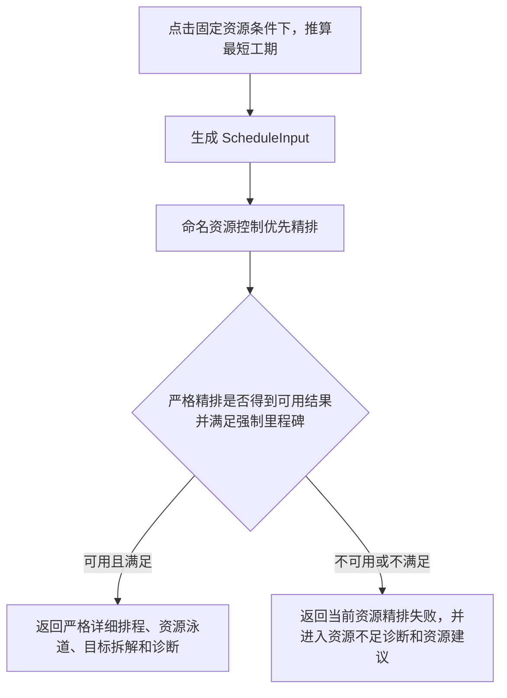

# 固定资源满足分支详细排程算法文档

版本：v1.6

日期：2026-07-04

适用范围：用户点击`固定资源条件下，推算最短工期`后，且当前资源能够满足强制里程碑时的详细排程算法

面向对象：产品、算法研发、后端研发、前端研发、测试、计划工程师

## 1. 文档目标

本文档说明“固定资源条件下，推算最短工期”的详细排程口径。重点说明本版本固定资源主流程直接进入命名资源精排，失败时保持当前资源失败语义并进入资源增量建议；同时保留普通工程差异化均衡规则：

| 工作类型 | 精排优化口径 |
| --- | --- |
| 控制工程、关键工程、控制链前置 | 优先保障节点和控制缓冲 |
| 已配置受限资源普通工程 | 尽量连续施工，减少窝工和路径跳跃 |
| 未配置受限资源普通工程 | 在不影响关键路径时均匀展开，避免短时间集中施工 |

## 2. 总体链路

本文只说明固定资源主流程中的“命名资源控制优先精排”分支；池级最短工期仅保留为资源建议测算或内部诊断辅助，不作为当前资源主结果的预检或失败兜底展示。

### 2.1 严格精排失败后的资源建议分支

固定资源场景不再先运行池级固定资源快排，也不再把池级最短工期作为当前资源主结果的兜底展示。系统先直接运行命名资源控制优先精排；若精排返回 `INFEASIBLE`、`UNKNOWN`、超时，或虽返回可行结果但仍存在硬里程碑迟延，则当前资源主结果保持失败语义，并进入资源增量建议。

当前资源失败时，主结果来源使用 `current_resources_refinement_failed`，`performance_path = direct_named_refinement_failed_resource_recommendation`，`capacity_precheck_status = not_run`。资源增量建议可以继续调用最少资源或容量类测算，但该测算只用于推荐数量和候选方案验证，不替代当前资源失败结论。

### 2.2 桩基钻机墩组两阶段精排

当资源路径连续性目标启用，且桩基任务属于旋挖钻、回旋钻或冲击钻资源池时，命名资源精排会在求解器内部启用墩组两阶段精排。资源配置页已移除“同墩同工艺最多设备数”参数，旧字段不再作为并行上限参与求解；三类机械钻资源默认要求同一墩同一工艺由同一台命名资源负责，人工挖孔桩不进入该聚合：

1. 粗排阶段按“资源组、结构物、构件类型、施工工艺”聚合为机械钻机墩组。墩组不是对外任务，只是内部资源占用节点；墩组工期等于组内原任务工期之和。
2. 粗排阶段不为每台钻机连接全部候选墩组路径环，只完成墩组到钻机的资源分配、资源互斥、工艺前后置、同墩同工艺单命名资源约束、硬里程碑和轻量跳墩偏好。
3. 细排阶段固定粗排得到的 `group -> resource` 关系，只对每台钻机实际分配到的墩组建立小规模路径排序，并以粗排总工期为硬上限。
4. 细排成功时返回细排展开结果；细排失败或超时时返回粗排展开结果，并通过 `drill_group_refinement.status = stage2_fallback` 标明回退原因。

该机制不聚合人工挖孔桩，不改变最终 `ScheduleResult.tasks` 粒度，也不向前端输出虚拟墩组任务。组内原任务最终仍逐根桩、逐原任务展开，并继承墩组确定的钻机资源。

## 3. 命名资源精排做什么

命名资源精排不是重新判断资源够不够，而是在资源已满足强制节点的前提下，把计划排得更适合施工复核。

系统会同时考虑：

| 目标 | 业务含义 |
| --- | --- |
| 控制节点迟延 | 控制节点尽量不晚于目标 |
| 控制链总时差 | 控制链保留必要缓冲 |
| 控制链衔接空档 | 已有风险时减少前后工作空等 |
| 总工期 | 不无意义拉长项目周期 |
| 资源路径连续性 | 同一资源尽量沿相近墩台、相近幅别推进 |
| 资源空闲 | 同一资源活跃期内尽量少停等 |
| 同类资源工作量均衡 | 同类资源之间工作量不要严重偏载 |
| 未配置资源普通工程均衡 | 没有受限资源依据的普通工程不要集中挤在短时间 |

其中前 7 项是既有目标配置口径；“未配置资源普通工程均衡”是后端固定低优先级目标，不作为前端可编辑目标项。

## 4. 普通工程在本分支中的分类

### 4.1 先排除不该均衡的任务

以下任务不进入普通工程时间均衡：

| 任务类型 | 原因 |
| --- | --- |
| 控制工程 | 需要保障控制节点 |
| 关键工程 | 优先级高于普通工程 |
| 控制链普通前置 | 虽然管控级别是普通，但会影响控制工程，不能被普通工程均衡拖后 |

例如“10#墩桩基前置工作”如果是“10#墩盖梁控制任务”的前置，即使它本身标记为普通，也按控制链任务处理。

### 4.2 再区分有资源和没资源

系统看每个普通工程是否存在启用的受限兼容资源候选。

| 判断结果 | 例子 | 排程策略 |
| --- | --- | --- |
| 有启用受限资源 | 左幅 1#墩桩基可使用“旋挖钻 1” | 走资源连续施工 |
| 没有启用受限资源 | 普通附属工作没有启用班组资源 | 走时间均衡 |

“没资源”不是指字段一定为空，而是指当前资源配置下没有可分配的受限命名资源。

## 5. 已配置资源普通工程：连续施工口径

已配置资源普通工程的核心目标是减少窝工、减少路径跳跃、提升资源利用率。

真实案例：

| 资源 | 计划工作顺序 |
| --- | --- |
| 旋挖钻 1 | 左幅 1#墩桩基 -> 左幅 4#墩桩基 -> 右幅 4#墩桩基 |

系统会这样评价：

1. 左幅 1#墩到左幅 4#墩，同幅墩号间隔为 3，产生路径连续性罚分 3。
2. 左幅 4#墩到右幅 4#墩，发生左右幅切换，产生路径连续性罚分 1。
3. 合计资源路径连续性罚分为 4。

该罚分进入资源路径连续性目标。它不会进入未配置资源普通工程均衡。

如果另一种方案让旋挖钻长时间停等，系统还会通过资源空闲目标产生罚分；如果多台旋挖钻工作量差距很大，系统会通过同类资源工作量均衡产生罚分。

## 6. 未配置资源普通工程：均衡施工口径

未配置资源普通工程没有命名资源可用于判断施工连续性。系统改用时间桶统计，避免这些任务全部挤在短时间内。

### 6.1 计算步骤

1. 取出未配置受限资源的普通工程。
2. 按普通工程配置选择统计桶：按周为 7 天一桶，按月为 30 天一桶。
3. 在普通工程允许展开窗口内，统计每个桶内开始施工的任务工期合计。
4. 将未配置资源普通工程总工期平均分到所有桶，得到理想工作量。
5. 每个桶实际工作量偏离理想工作量的部分形成偏差。
6. 所有桶偏差相加，得到均衡罚分。
7. 均衡罚分乘以固定低权重 10，进入精排综合目标。

### 6.2 真实数据案例

假设有 6 个普通附属工作，每个工期 2 天，没有启用受限资源；普通工程允许在 3 周内完成。

| 周次 | 集中施工工作量 | 均匀施工工作量 | 理想工作量 |
| --- | ---: | ---: | ---: |
| 第 1 周 | 12 天 | 4 天 | 4 天 |
| 第 2 周 | 0 天 | 4 天 | 4 天 |
| 第 3 周 | 0 天 | 4 天 | 4 天 |

集中施工的偏差为 8 + 4 + 4 = 16，目标贡献为 160。

均匀施工的偏差为 0 + 0 + 0 = 0，目标贡献为 0。

如果项目另有一个 30 天控制工程决定总工期，普通附属工作在 3 周内均匀展开不会影响关键路径，系统会选择均匀方案。如果均匀展开会导致控制节点风险、控制链缓冲不足或总工期变长，高优先级目标会优先。

## 7. 输出和前端展示

### 7.1 目标拆解字段

| 字段 | 展示含义 |
| --- | --- |
| `unconfigured_normal_balance_penalty` | 未配置资源普通工程均衡罚分 |
| `unconfigured_normal_balance_weight` | 固定低优先级权重 |
| `unconfigured_normal_balance_score` | 未配置资源普通工程均衡评分 |
| `normal_balance_penalty` | 兼容字段，当前等于未配置资源普通工程均衡罚分 |
| `best_effort_refinement` | 最佳努力精排元数据，包含严格精排失败原因、放松目标和目标迟延 |
| `drill_group_refinement` | 桩基钻机墩组两阶段精排诊断，包含粗排墩组数、细排节点/弧数、弧减少比例、跳墩惩罚和回退原因 |
| `relaxed_hard_milestone_lateness_days` | 最佳努力分支中强制里程碑迟延天数合计 |
| `fixed_duration_overrun_days` | 最佳努力分支中固定工期超期天数 |
| `target_relaxation_penalty` | 强制节点迟延和固定工期超期的未加权合计 |

### 7.2 诊断字段

| 字段 | 展示含义 |
| --- | --- |
| `normal_task_count` | 可按普通工程口径处理的普通任务数量，不含控制链普通前置 |
| `configured_resource_normal_task_count` | 已配置受限资源普通工程数量 |
| `unconfigured_resource_normal_task_count` | 未配置受限资源普通工程数量 |
| `bucket_loads` | 未配置资源普通工程按周/月分布 |
| `balance_penalty` | 均衡罚分 |
| `balance_score` | 均衡评分 |
| `schedule_source` | `current_resources_control_priority_balanced` 表示当前资源精排成功；`current_resources_refinement_failed` 表示当前资源精排失败并进入资源建议 |
| `performance_path` | 成功时为 `direct_named_refinement`；失败并进入建议时为 `direct_named_refinement_failed_resource_recommendation` |
| `capacity_precheck_status` | 固定资源主流程不运行池级预检，取值为 `not_run` |
| `skipped_named_refinement_reason` | 当前资源精排未作为可执行主结果的原因 |

前端展示时应使用“未配置资源普通工程均衡”，不要再表达为“全部普通工程均衡”。

## 8. 验收标准

1. 当前资源满足强制里程碑时，系统进入命名资源控制优先精排。
2. 已配置资源普通工程不计入未配置资源普通工程均衡罚分。
3. 已配置资源普通工程仍参与资源路径连续性、资源空闲和同类资源工作量均衡。
4. 未配置资源普通工程输出按桶工作量、罚分、权重和评分。
5. 控制链普通前置任务不进入普通工程均衡，不受普通工程最早开始窗口拖后。
6. `objective_terms_used` 和 `objective_weights` 不恢复废弃的 `normal_balance` 可配置目标项。
7. 当前资源直接精排失败时，主结果来源为 `current_resources_refinement_failed`，前端明确显示“当前资源精排失败”，并保留资源增量建议。
8. 当前资源失败路径不得返回 `current_resources_best_effort_refinement` 或 `current_resources_capacity_shortest_fallback` 作为主结果。
9. 机械钻机桩基墩组启用两阶段精排时，最终任务 ID、任务数量、结构归属、构件类型和工艺口径保持原任务粒度。
10. 细排路径弧只来自每台钻机实际分配的墩组，诊断中的 `stage2_arc_count` 应显著小于全候选路径弧估算。
11. 资源路径连续性目标关闭时，不构建跳墩软目标和细排路径排序，资源互斥、工艺前后置、同墩同工艺单命名资源约束和硬里程碑仍执行。
12. 后端 scheduler 测试和前端构建通过。

## 9. 交付边界

- 本文覆盖当前资源精排失败后进入资源建议的结果口径；资源建议内部的最少资源测算和候选方案验证仍按资源不足诊断文档处理。
- 本次不新增资源配置字段、不新增目标函数前端开关。
- 本次不改变严格精排中的硬里程碑定义，也不改变工艺依赖、资源互斥和普通工程工作面并行上限。
- 本次不引入真实转场时间、道路通行成本或设备迁移费用；墩组路径偏好仍以墩号相邻、左右幅切换和诊断口径表达。
