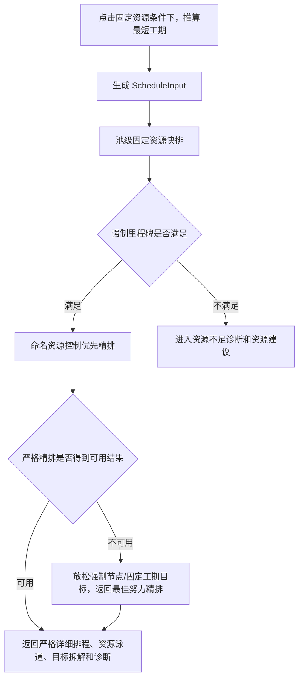

# 固定资源满足分支详细排程算法文档

版本：v1.6

日期：2026-07-04

适用范围：用户点击`固定资源条件下，推算最短工期`后，且当前资源能够满足强制里程碑时的详细排程算法

面向对象：产品、算法研发、后端研发、前端研发、测试、计划工程师

## 1. 文档目标

本文档说明“固定资源条件下，推算最短工期”在当前资源满足强制里程碑后的详细排程口径。重点补充本版本的精排失败最佳努力规则，并保留普通工程差异化均衡规则：

| 工作类型 | 精排优化口径 |
| --- | --- |
| 控制工程、关键工程、控制链前置 | 优先保障节点和控制缓冲 |
| 已配置受限资源普通工程 | 尽量连续施工，减少窝工和路径跳跃 |
| 未配置受限资源普通工程 | 在不影响关键路径时均匀展开，避免短时间集中施工 |

## 2. 总体链路

本文只说明“强制里程碑满足 -> 命名资源控制优先精排”分支。

### 2.1 严格精排失败后的最佳努力分支

当池级固定资源快排已经证明当前资源可满足强制里程碑，但命名资源精排在当前求解时限内没有返回 `OPTIMAL` 或 `FEASIBLE` 时，系统不再直接把主结果退回容量快排，而是追加一次“最佳努力精排”。

最佳努力精排只放松目标类硬约束：

| 放松对象 | 严格精排口径 | 最佳努力口径 |
| --- | --- | --- |
| 强制里程碑 | 必须不晚于目标日期 | 允许迟延，但迟延天数进入最高优先级软目标 |
| 固定工期上限 | 必须不超过目标工期 | 允许超期，但超期天数进入最高优先级软目标 |

以下硬约束不得放松：工艺依赖、任务持续时间、资源互斥、当前资源数量、资源启用状态、同结构同工序资源绑定和普通工程工作面并行上限。

最佳努力结果来源使用 `current_resources_best_effort_refinement`，并在 `best_effort_refinement` 中说明严格精排状态、失败原因、被放松的目标、强制节点迟延天数、固定工期超期天数和最佳努力分值。该结果用于复核“当前资源下最合理的一版精排计划”，不代表强制节点或固定工期目标已经满足。

## 3. 命名资源精排做什么

命名资源精排不是重新判断资源够不够，而是在资源已满足强制节点的前提下，把计划排得更适合施工复核。

系统会同时考虑：

| 目标 | 业务含义 |
| --- | --- |
| 控制节点迟延 | 控制节点尽量不晚于目标 |
| 控制链总时差 | 控制链保留必要缓冲 |
| 控制链衔接空档 | 已有风险时减少前后工作空等 |
| 总工期 | 不无意义拉长项目周期 |
| 资源路径连续性 | 同一资源尽量沿相近墩台、相近幅别推进 |
| 资源空闲 | 同一资源活跃期内尽量少停等 |
| 同类资源工作量均衡 | 同类资源之间工作量不要严重偏载 |
| 未配置资源普通工程均衡 | 没有受限资源依据的普通工程不要集中挤在短时间 |

其中前 7 项是既有目标配置口径；“未配置资源普通工程均衡”是后端固定低优先级目标，不作为前端可编辑目标项。

## 4. 普通工程在本分支中的分类

### 4.1 先排除不该均衡的任务

以下任务不进入普通工程时间均衡：

| 任务类型 | 原因 |
| --- | --- |
| 控制工程 | 需要保障控制节点 |
| 关键工程 | 优先级高于普通工程 |
| 控制链普通前置 | 虽然管控级别是普通，但会影响控制工程，不能被普通工程均衡拖后 |

例如“10#墩桩基前置工作”如果是“10#墩盖梁控制任务”的前置，即使它本身标记为普通，也按控制链任务处理。

### 4.2 再区分有资源和没资源

系统看每个普通工程是否存在启用的受限兼容资源候选。

| 判断结果 | 例子 | 排程策略 |
| --- | --- | --- |
| 有启用受限资源 | 左幅 1#墩桩基可使用“旋挖钻 1” | 走资源连续施工 |
| 没有启用受限资源 | 普通附属工作没有启用班组资源 | 走时间均衡 |

“没资源”不是指字段一定为空，而是指当前资源配置下没有可分配的受限命名资源。

## 5. 已配置资源普通工程：连续施工口径

已配置资源普通工程的核心目标是减少窝工、减少路径跳跃、提升资源利用率。

真实案例：

| 资源 | 计划工作顺序 |
| --- | --- |
| 旋挖钻 1 | 左幅 1#墩桩基 -> 左幅 4#墩桩基 -> 右幅 4#墩桩基 |

系统会这样评价：

1. 左幅 1#墩到左幅 4#墩，同幅墩号间隔为 3，产生路径连续性罚分 3。
2. 左幅 4#墩到右幅 4#墩，发生左右幅切换，产生路径连续性罚分 1。
3. 合计资源路径连续性罚分为 4。

该罚分进入资源路径连续性目标。它不会进入未配置资源普通工程均衡。

如果另一种方案让旋挖钻长时间停等，系统还会通过资源空闲目标产生罚分；如果多台旋挖钻工作量差距很大，系统会通过同类资源工作量均衡产生罚分。

## 6. 未配置资源普通工程：均衡施工口径

未配置资源普通工程没有命名资源可用于判断施工连续性。系统改用时间桶统计，避免这些任务全部挤在短时间内。

### 6.1 计算步骤

1. 取出未配置受限资源的普通工程。
2. 按普通工程配置选择统计桶：按周为 7 天一桶，按月为 30 天一桶。
3. 在普通工程允许展开窗口内，统计每个桶内开始施工的任务工期合计。
4. 将未配置资源普通工程总工期平均分到所有桶，得到理想工作量。
5. 每个桶实际工作量偏离理想工作量的部分形成偏差。
6. 所有桶偏差相加，得到均衡罚分。
7. 均衡罚分乘以固定低权重 10，进入精排综合目标。

### 6.2 真实数据案例

假设有 6 个普通附属工作，每个工期 2 天，没有启用受限资源；普通工程允许在 3 周内完成。

| 周次 | 集中施工工作量 | 均匀施工工作量 | 理想工作量 |
| --- | ---: | ---: | ---: |
| 第 1 周 | 12 天 | 4 天 | 4 天 |
| 第 2 周 | 0 天 | 4 天 | 4 天 |
| 第 3 周 | 0 天 | 4 天 | 4 天 |

集中施工的偏差为 8 + 4 + 4 = 16，目标贡献为 160。

均匀施工的偏差为 0 + 0 + 0 = 0，目标贡献为 0。

如果项目另有一个 30 天控制工程决定总工期，普通附属工作在 3 周内均匀展开不会影响关键路径，系统会选择均匀方案。如果均匀展开会导致控制节点风险、控制链缓冲不足或总工期变长，高优先级目标会优先。

## 7. 输出和前端展示

### 7.1 目标拆解字段

| 字段 | 展示含义 |
| --- | --- |
| `unconfigured_normal_balance_penalty` | 未配置资源普通工程均衡罚分 |
| `unconfigured_normal_balance_weight` | 固定低优先级权重 |
| `unconfigured_normal_balance_score` | 未配置资源普通工程均衡评分 |
| `normal_balance_penalty` | 兼容字段，当前等于未配置资源普通工程均衡罚分 |
| `best_effort_refinement` | 最佳努力精排元数据，包含严格精排失败原因、放松目标和目标迟延 |
| `relaxed_hard_milestone_lateness_days` | 最佳努力分支中强制里程碑迟延天数合计 |
| `fixed_duration_overrun_days` | 最佳努力分支中固定工期超期天数 |
| `target_relaxation_penalty` | 强制节点迟延和固定工期超期的未加权合计 |

### 7.2 诊断字段

| 字段 | 展示含义 |
| --- | --- |
| `normal_task_count` | 可按普通工程口径处理的普通任务数量，不含控制链普通前置 |
| `configured_resource_normal_task_count` | 已配置受限资源普通工程数量 |
| `unconfigured_resource_normal_task_count` | 未配置受限资源普通工程数量 |
| `bucket_loads` | 未配置资源普通工程按周/月分布 |
| `balance_penalty` | 均衡罚分 |
| `balance_score` | 均衡评分 |
| `schedule_source` | `current_resources_best_effort_refinement` 表示目标放松后的最佳努力精排 |
| `skipped_named_refinement_reason` | 严格命名资源精排未作为主结果的原因 |

前端展示时应使用“未配置资源普通工程均衡”，不要再表达为“全部普通工程均衡”。

## 8. 验收标准

1. 当前资源满足强制里程碑时，系统进入命名资源控制优先精排。
2. 已配置资源普通工程不计入未配置资源普通工程均衡罚分。
3. 已配置资源普通工程仍参与资源路径连续性、资源空闲和同类资源工作量均衡。
4. 未配置资源普通工程输出按桶工作量、罚分、权重和评分。
5. 控制链普通前置任务不进入普通工程均衡，不受普通工程最早开始窗口拖后。
6. `objective_terms_used` 和 `objective_weights` 不恢复废弃的 `normal_balance` 可配置目标项。
7. 严格精排失败但最佳努力精排可用时，主结果来源为 `current_resources_best_effort_refinement`，且前端明确显示“目标未满足/最佳努力”口径。
8. 最佳努力结果仍必须通过资源互斥、同结构同工序资源绑定和普通工程工作面并行上限校验。
9. 后端 scheduler 测试和前端构建通过。

## 9. 交付边界

- 本文不覆盖当前资源不满足强制里程碑时的资源建议分支；该分支仍按资源不足诊断和资源建议处理。
- 本次不新增资源配置字段、不新增目标函数前端开关。
- 本次不改变严格精排中的硬里程碑定义，也不改变工艺依赖、资源互斥和普通工程工作面并行上限。
