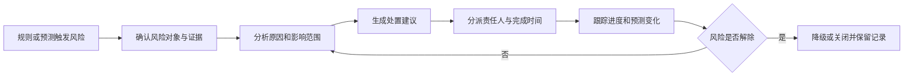

# 基建智能计划管控中枢整体产品方案

版本：v1.0

日期：2026-07-11

适用范围：基建项目计划编制、执行动态管控、进度风险预警与计划调整闭环

面向对象：客户项目管理层、计划工程师、施工技术人员、企业管理人员、产品与实施团队

## 1. 文档定位

本文用于向客户说明基建智能计划产品的整体方向、业务闭环、核心能力和分阶段建设路径，并作为后续真实项目试点沟通的统一方案底稿。

本文描述的是完整产品蓝图，不等同于当前 Demo 已实现能力。当前 Demo 主要验证初始计划生成和方案推演的技术路径；动态进度管控、风险处置闭环、正式权限审批和企业系统集成需要按建设路线逐步落地。

## 2. 产品定位

### 2.1 一句话定位

基建项目智能计划管控中枢，将项目结构、施工知识、资源条件、目标节点和现场进度统一连接起来，形成“初始计划编制—执行动态跟踪—风险提前预警—方案推演调整—计划审批发布”的持续闭环。

### 2.2 核心宣传语

> 让计划从一次性编制，升级为持续感知、动态推演、主动预警的项目控制系统。

### 2.3 三阶段价值

| 阶段 | 价值表达 | 需要回答的核心问题 |
| --- | --- | --- |
| 初始计划 | 算得出、算得清 | 项目应该怎么干、需要多少资源、关键节点能否完成 |
| 动态管控 | 跟得上、调得动 | 当前执行状态会把未来计划带向哪里、应该如何调整 |
| 风险预警 | 看得早、闭得环 | 风险何时发生、影响什么、谁来处理、处理是否有效 |

### 2.4 产品形态

产品定位为基建项目管理平台中的智能计划决策引擎：

- 可以作为独立计划管控产品运行，为计划工程师和项目管理层提供完整工作台。
- 可以接入既有项目管理平台，复用结构物、进度、资源、物资设备和审批数据。
- 以统一任务网络和计划版本为主线，连接计划编制、现场执行、风险处置和管理决策。
- AI 用于辅助资料理解、方案生成和结果解释，确定性规则与排程计算负责业务校验和结果验证。

## 3. 客户面临的典型问题

基建项目计划管理通常不是缺少一张计划表，而是缺少贯穿计划编制、执行跟踪和风险处置的统一机制：

- 项目结构、工程量、工艺工效、资源和节点目标分散在不同文件或系统中，计划编制依赖人工汇总。
- 计划结果难以解释，任务工期、施工顺序和资源投入缺少统一依据。
- 项目发生资源变化、工效下降或工作面受阻后，计划调整依赖经验，难以快速评估对后续节点的影响。
- 进度分析多停留在已完成比例和当前偏差，缺少对未来完成时间的持续预测。
- 风险往往在节点已经迟延后才被发现，预警缺少原因、影响范围、处置窗口和责任闭环。
- 多次调整后的计划版本、规则依据和人工决策难以追溯，无法形成企业级计划知识。

产品建设的重点不是替代计划工程师，而是把数据、规则、计算和人工决策组织成可复用、可解释、可持续校准的计划管控体系。

## 4. 完整业务闭环


### 4.1 前期：初始计划智能编制

#### 4.1.1 阶段目标

将项目原始资料转化为可执行、可解释、可比较的基准计划，帮助项目在开工或阶段计划编制时明确施工顺序、资源投入和节点可行性。

#### 4.1.2 主要能力

- 接入项目、标段、工区、桥梁、墩台、构件和工程量数据。
- 接入合同节点、内部控制节点、施工组织方案和资源配置。
- 通过工艺工效库、工艺逻辑库和企业标准生成任务网络。
- 检查结构数据缺失、工艺缺失、工效异常、逻辑冲突和资源缺口。
- 计算任务工期、前后置关系、资源需求和里程碑影响。
- 支持固定资源求最短工期、目标工期倒推资源等求解方式。
- 生成经济、平衡、抢工等候选资源方案。
- 比较总工期、节点达成、资源投入、施工连续性和主要风险。
- 由用户确认采用方案，形成基准计划版本并进入发布或审批流程。

#### 4.1.3 阶段输出

- 经过数据与规则检查的任务网络。
- 可执行的任务计划和资源分配结果。
- 里程碑达成情况和主要瓶颈诊断。
- 多套资源组织方案及比较结果。
- 经人工确认的基准计划版本。

#### 4.1.4 客户价值

> 项目应该怎么干、需要多少资源、关键节点能否完成、不同组织方案有什么差异。

### 4.2 过程：执行进度动态管控

#### 4.2.1 阶段目标

动态管控不只展示完成百分比，而是持续判断当前执行状态对未来任务、资源和里程碑的影响，并支持项目在风险扩大前完成调整。

#### 4.2.2 动态管控链路

```text
基准计划
  → 采集实际进度与现场变化
  → 计算基准、实际和预测偏差
  → 预测任务及里程碑完成时间
  → 识别受影响的后续任务和资源
  → 模拟调整方案
  → 用户确认调整
  → 形成新的执行计划版本
```

#### 4.2.3 进度与现场输入

系统应逐步接入：

- 任务实际开始时间和实际完成时间。
- 已完成工程量、剩余工程量和预计剩余工期。
- 实际工效、实际班组和设备投入。
- 工作面是否具备、前置条件是否释放。
- 停工、设计变更、资源退出和其他影响计划的现场事件。
- 数据填报时间、来源和确认状态。

首期动态管控 MVP 可采用人工填报和 Excel 导入；外部系统接口在数据口径稳定后逐步接入。

#### 4.2.4 动态分析能力

- 按日或按周形成项目进度快照。
- 对比基准计划、当前实际和预测计划三类状态。
- 识别任务提前、滞后、停滞和长期未更新。
- 根据剩余工程量和实际工效更新预计完成时间。
- 沿施工逻辑链追踪偏差对后续结构物和里程碑的影响。
- 重新预测总工期、关键节点和阶段资源需求。
- 模拟增加资源、调整工序、改变工作面和优化施工顺序。
- 对比“不调整”和不同干预方案的工期、资源和节点结果。
- 保留原基准计划，调整后形成新版本并记录调整原因、影响和确认人。

#### 4.2.5 客户价值

> 现在干到哪里、为什么发生偏差、如果不处理会造成什么后果、应该怎样调整。

### 4.3 后期：风险预警与处置闭环

#### 4.3.1 阶段目标

风险预警不只展示红黄灯，而是形成“发现—解释—处置—跟踪—关闭”的完整管理闭环，使项目能够在节点真正迟延前采取行动。

#### 4.3.2 首期风险范围

首期聚焦与进度直接相关的六类风险：

| 风险类型 | 典型判断 | 主要影响对象 |
| --- | --- | --- |
| 节点风险 | 预测完成日期接近或超过里程碑目标 | 合同节点、内部控制节点、项目总工期 |
| 关键任务风险 | 关键任务滞后、剩余缓冲持续减少 | 后续任务、控制链、关键线路 |
| 资源风险 | 关键资源不足、冲突、闲置或转场不合理 | 任务开工、施工连续性、阶段资源需求 |
| 工效风险 | 实际工效持续低于计划工效，预计工期扩大 | 剩余工期、资源需求、节点预测 |
| 逻辑与工作面风险 | 前置条件未释放、工作面不具备或任务衔接异常 | 任务开工条件、后续施工组织 |
| 数据风险 | 进度缺失、数据过期、来源冲突或状态不一致 | 预测可信度、预警有效性、管理决策 |

质量、安全、成本、合同和物资事件可以作为外部事件影响计划，但首期不建设这些专业领域的完整风险模型。

#### 4.3.3 单条预警信息

每条预警必须能够回答：

- 哪个项目、工区、结构物或任务存在风险。
- 风险由什么数据和规则触发。
- 当前偏差和预测影响是什么。
- 会影响哪些后续任务、资源和里程碑。
- 距离风险真正发生还有多长处置窗口。
- 系统建议采取哪些措施。
- 谁负责处理、计划何时完成。
- 风险处于待确认、处理中、已缓解还是已关闭。

#### 4.3.4 风险处置流程



AI 可以辅助归纳风险原因、生成处置建议和解释方案差异；风险触发、影响测算和调整结果必须由确定性规则、实际数据和排程计算验证。

## 5. 产品能力架构

### 5.1 数据基础

统一管理：

- 项目、标段、工区、桥梁、墩台、构件和工程量。
- 施工工艺、工效、施工逻辑和适用条件。
- 资源池、班组、设备和资源日历。
- 合同节点、内部控制节点、计划版本和审批状态。
- 实际进度、实际资源、现场事件和计划调整记录。

### 5.2 规则与知识

建立三级知识体系：

| 层级 | 内容 | 使用方式 |
| --- | --- | --- |
| 系统默认模板 | 通用施工工艺、工效、资源和逻辑规则 | 新项目初始化和缺省规则 |
| 企业标准 | 企业历史工效、管理要求和资源组织经验 | 企业项目复用和标准化管理 |
| 项目规则 | 项目特有工法、场地、交通组织和节点要求 | 当前项目或方案的个性化配置 |

所有关键计划结论应能够追溯到项目数据、规则版本、计算结果和用户调整记录。

### 5.3 智能引擎

产品由边界清晰的引擎协同完成：

- 任务网络生成引擎：将结构物、工艺和逻辑转换为可计算任务网络。
- 工期与资源计算引擎：根据工程量、工效和资源条件计算任务参数。
- CP-SAT 排程求解引擎：验证工艺逻辑、资源约束和工期目标的可行性。
- 滚动预测与动态重排引擎：基于实际进度更新预测，并生成调整方案。
- 风险识别与影响传播引擎：识别风险并沿任务网络追踪后续影响。
- AI 助手：辅助参数输入、候选方案生成、风险归纳和结果解释。

### 5.4 业务应用

| 使用角色 | 主要应用 | 核心价值 |
| --- | --- | --- |
| 计划工程师 | 计划编制、参数校准、滚动重排和方案比较 | 减少人工测算，提高计划调整效率 |
| 施工技术人员 | 任务逻辑、工作面、工艺工效和风险复核 | 保证计划符合施工组织和现场条件 |
| 项目管理层 | 节点预测、重大风险、资源决策和处置跟踪 | 提前判断影响并选择干预方案 |
| 企业管理层 | 多项目节点、资源需求和企业规则沉淀 | 形成企业计划标准和跨项目决策能力 |

### 5.5 管理闭环

工程化产品需要逐步建设：

- 项目级和方案级数据隔离。
- 基准计划、滚动计划和调整方案版本管理。
- 权限、审批、发布、变更和归档。
- 风险责任人、处置措施、完成时间和关闭记录。
- 数据、规则、计算结果和人工决策的审计追踪。
- 与项目管理、进度填报、物资设备和审批系统的接口。

## 6. 当前 Demo 与产品蓝图的关系

### 6.1 当前 Demo 定位

当前 Demo 是完整产品的“初始计划与方案决策引擎验证版”，用于验证项目数据、施工规则、任务生成、排程求解和方案比较能否形成一条可信的技术链路。

### 6.2 当前已能够验证的能力

- 项目结构及配置数据统一建模。
- 工艺工效和工艺逻辑配置。
- 任务网络生成与诊断。
- 固定资源条件下测算工期。
- 目标工期条件下倒推资源。
- 里程碑偏差和资源瓶颈诊断。
- AI 生成经济、平衡、抢工三类资源方案并逐套求解比较。
- 用户调整资源后重新求解。
- 计划发布与审批入口的产品方向设计。

### 6.3 下一阶段需要补齐的能力

- 基准计划和计划版本模型。
- 实际进度、实际资源和剩余工程量采集。
- 基准、实际、预测三态对比。
- 基于状态日期的滚动预测。
- 进度偏差沿任务逻辑链传播。
- 风险规则、预警记录和处置闭环。
- 调整方案模拟、确认和重新发布。
- 项目级持久化、权限、审计和系统集成。

### 6.4 对客户的统一沟通口径

> 当前 Demo 已验证计划生成和方案推演的核心技术路径；动态管控和风险预警是在同一任务、资源、逻辑和里程碑模型上向执行阶段延伸，不是另起一套独立系统。

演示时应明确区分当前可操作能力、下一阶段试点能力和长期产品目标，不把本地配置、演示接口或尚未实现的闭环描述为已经上线的正式能力。

## 7. 建议建设路线

### 7.1 阶段一：初始计划试点

范围：选择一个真实项目中的一座桥或一个工区。

重点建设与验证：

- 接入真实结构、工艺工效、逻辑、资源和里程碑数据。
- 生成任务网络并由客户业务人员抽查确认。
- 运行固定资源求工期和目标工期倒推资源。
- 比较经济、平衡、抢工三类方案。
- 校准任务、工期、资源和诊断口径。

交付目标：形成一套客户认可、可解释、可继续校准的初始计划。

### 7.2 阶段二：动态管控 MVP

重点建设：

- 基准计划版本。
- 实际进度和剩余工程量录入。
- 项目状态日期和进度快照。
- 基准、实际、预测三态对比。
- 剩余工期和里程碑滚动预测。
- 进度偏差和初步影响分析。
- 增加资源、调整顺序等干预方案模拟。

首期可以采用人工填报或 Excel 导入，不要求立即完成全部外部系统集成。

交付目标：每周更新一次真实进度，系统能够预测节点变化并生成可比较的调整方案。

### 7.3 阶段三：风险处置闭环

重点建设：

- 风险中心和预警分级。
- 风险对象、触发证据和影响范围。
- 处置建议、责任分派和完成时间。
- 风险处理状态、效果复核和关闭机制。
- 风险与计划调整、计划版本的关联。

交付目标：重点进度风险能够提前暴露、说明原因、给出处置建议并持续跟踪。

### 7.4 阶段四：工程化与企业化

重点建设：

- 正式数据接口和项目级持久化。
- 权限、审批、发布、归档和审计。
- 企业工艺工效库、规则库和历史方案库。
- 多项目节点监控和资源协调。
- 企业知识持续沉淀和模型效果评估。

交付目标：从单项目试点升级为企业级计划标准和决策平台。

## 8. 核心业务对象与接口方向

后续产品设计至少需要形成以下核心业务对象：

| 业务对象 | 业务职责 |
| --- | --- |
| `BaselinePlanVersion` | 保存已经确认和发布的基准计划及版本关系 |
| `ProgressSnapshot` | 保存某一状态日期的实际进度、资源和数据来源 |
| `ForecastSchedule` | 保存基于当前实际进度计算的预测任务和节点结果 |
| `RiskAlert` | 保存风险对象、触发依据、影响、等级和处理状态 |
| `MitigationAction` | 保存风险处置措施、责任人、完成时间和处理结果 |
| `ReplanProposal` | 保存调整输入、预测收益、影响范围和比较结果 |
| `PlanChangeRecord` | 保存计划变更原因、审批信息和新旧版本关系 |

正式接口方向应覆盖：

- 查询和发布基准计划。
- 提交或导入进度快照。
- 生成滚动预测和偏差分析。
- 查询、确认、分派、更新和关闭风险。
- 创建、比较和确认调整方案。
- 发布新的计划版本并保留变更关系。

本方案只确认业务对象和接口职责，不提前确定具体字段、HTTP 路径、数据库表或错误码；进入开发前应通过正式规格化流程完成数据模型、接口契约和兼容策略设计。

## 9. 试点验证场景

后续试点至少覆盖以下场景：

| 编号 | 场景 | 可观察结果 |
| --- | --- | --- |
| V-01 | 实际进度与计划一致 | 预测计划与基准基本一致，不产生错误迟延预警 |
| V-02 | 关键任务发生滞后 | 系统识别受影响的后续任务和里程碑，并说明传播链路 |
| V-03 | 关键资源数量减少 | 系统预测工期变化，并提供可比较的资源或施工顺序调整方案 |
| V-04 | 实际工效持续下降 | 系统根据剩余工程量和实际工效更新预计完成时间 |
| V-05 | 现场前置条件未满足 | 系统识别工作面或逻辑释放风险，并展示受影响任务 |
| V-06 | 进度数据缺失或过期 | 系统生成数据风险提示，不输出缺少依据的确定性预测 |
| V-07 | 用户采用处置方案 | 系统保留原基准，记录调整原因并形成新的计划版本 |
| V-08 | 风险影响解除 | 风险根据新进度或处置结果降级或关闭，历史记录仍可追溯 |

## 10. 阶段验收方向

### 10.1 初始计划试点

- 真实项目数据能够形成结构、工艺、逻辑、资源和里程碑的基本闭环。
- 关键任务、工期和前后置关系经过客户业务人员抽查并具备继续校准价值。
- 不同资源方案形成可观察的工期、节点或资源投入差异。
- 结果差异能够定位到数据、规则、模型范围或算法，不出现无法解释的静默错误。

### 10.2 动态管控 MVP

- 系统能够保存基准计划，并按状态日期接收实际进度。
- 系统能够区分基准、实际和预测结果，不使用旧结果冒充当前预测。
- 关键任务偏差能够传播到受影响的后续任务和里程碑。
- 用户能够比较“不调整”和至少一种干预方案，并保留调整前后的计划版本。

### 10.3 风险处置闭环

- 风险能够展示对象、依据、影响、处置窗口和建议措施。
- 风险能够分派责任人并记录处理状态和完成时间。
- 数据不足时生成数据风险，不给出缺少依据的确定性结论。
- 风险解除后能够降级或关闭，触发依据、处置过程和关闭结果可追溯。

## 11. 产品边界与默认假设

- 整体产品定位为基建项目管理平台中的智能计划管控中枢。
- 首期风险范围只覆盖与进度相关的节点、任务、资源、工效、逻辑、工作面和数据风险。
- 质量、安全、成本、合同和物资风险可作为影响计划的外部事件，但不在首期建设完整专业风险模型。
- 当前 Demo 主要证明初始计划、资源方案和排程推演能力，动态管控与风险闭环属于下一阶段产品方向。
- 初始试点以一个真实项目中的一座桥或一个工区为范围，优先采用客户能够提供且可核验的数据。
- AI 结论必须接受业务规则、数据校验和排程计算验证，用户保留最终确认权。
- 项目级持久化、权限审批、正式外部接口和多项目协同按工程化路线分阶段建设。

## 12. 客户沟通建议

客户沟通时建议按以下顺序展开：

1. 先说明当前计划管理为什么容易出现“编得出来、跟不下去、风险发现太晚”。
2. 再展示“初始计划—动态管控—风险预警”的完整业务闭环。
3. 使用当前 Demo 证明初始计划和方案推演已经具备可验证基础。
4. 结合客户真实业务，讨论实际进度如何采集、哪些风险最需要提前识别、哪些调整措施最常使用。
5. 以一座桥或一个工区收敛试点范围，明确数据、人员、校准轮次和验收标准。
6. 最后说明从试点到工程化、企业化的建设路线，不在首次试点中承诺全部远期能力。

本方案对客户传递的核心不是“系统能自动生成一张计划表”，而是：

> 以统一计划模型连接项目前期策划与现场执行，让每一次偏差都能被发现、解释和推演，让每一次调整都有数据依据、计算验证和版本记录。
