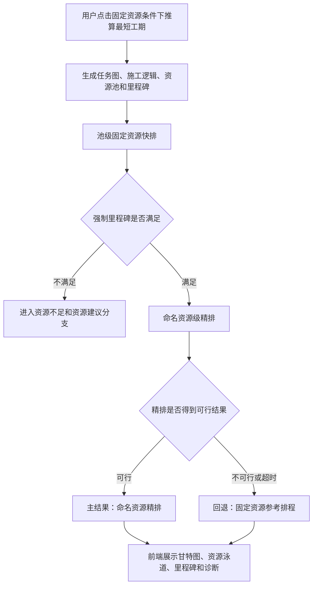
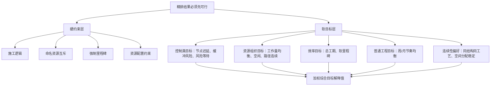
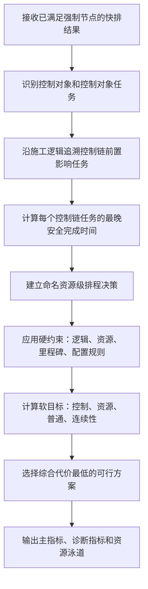
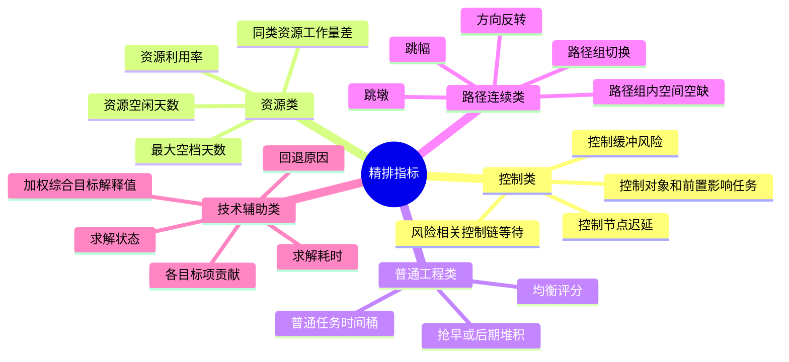

# 精排目标函数算法需求文档

版本：v3.0

日期：2026-07-03

适用范围：当前资源已通过固定资源满足分支验证，能够满足强制里程碑后，系统生成命名资源级详细施工计划的精排阶段。

面向对象：产品经理、计划工程师、算法研发、后端研发、前端研发、测试。

## 1. 文档目标

本文档用于解释精排算法的业务目标、CP-SAT 建模思想、目标函数指标含义和验收口径。它不是代码设计说明，也不要求读者理解具体实现函数；研发和测试应能通过本文理解系统为什么这样排、每个指标代表什么、结果应该如何解释。

精排阶段要解决的问题不是“当前资源够不够”，而是：

> 在当前资源已经能够保住强制节点的前提下，从多个可行排程中，选出一版更适合现场讨论、资源泳道展示、施工组织复核和月计划拆解的命名资源级详细计划。

本文档与《固定资源满足分支详细排程算法文档》配合使用。固定资源满足分支负责判断当前资源是否满足强制节点；本文档负责说明满足之后的精排如何在控制节点、普通工程节奏、资源组织和路径连续性之间做业务取舍。

## 2. 精排在固定资源链路中的位置

用户点击固定资源推算后，系统先做池级快排，判断当前资源数量能否满足强制里程碑。只有当强制节点已经满足时，才进入命名资源级精排。



各阶段职责如下：


| 阶段         | 回答的问题                               | 排程粒度     | 是否是本文重点   |
| ------------ | ---------------------------------------- | ------------ | ---------------- |
| 任务图生成   | 有哪些任务、工期、资源候选和前后置关系   | 工作项       | 否               |
| 池级快排     | 当前资源数量能否保住强制节点             | 资源池容量   | 否，作为精排前置 |
| 命名资源精排 | 哪台设备或班组在什么时间做什么任务最合理 | 具体命名资源 | 是               |
| 回退展示     | 精排失败时是否仍能给用户可检查计划       | 参考排程     | 是，作为异常口径 |

精排不重新承担资源是否足够的判断职责。资源够不够由池级快排先判断；精排只在“已经够”的前提下，选择更适合执行和解释的详细排程。

## 3. CP-SAT 精排的核心原理

CP-SAT 可以理解为“在一组必须遵守的施工规则下，让系统在大量可行排程中挑一版综合代价最低的方案”。它由三部分组成：

1. 决策：每个任务什么时候开始、什么时候结束、分配给哪台资源。
2. 硬约束：施工逻辑、资源互斥、工期、强制里程碑等必须满足的规则。
3. 软目标：在满足硬约束的可行方案中，尽量让计划更符合控制优先、资源均衡、普通工程节奏和路径连续性。


### 3.1 可变决策

精排阶段主要让系统决定三类事情：


| 决策         | 业务解释                                   | 用户看到的结果             |
| ------------ | ------------------------------------------ | -------------------------- |
| 任务开始时间 | 某项工作从项目开始后的第几天启动           | 甘特图任务起点             |
| 任务完成时间 | 某项工作从项目开始后的第几天完成           | 甘特图任务终点、里程碑评价 |
| 命名资源分配 | 某项工作由哪台设备、哪套模板或哪个班组承担 | 资源泳道和资源路径         |

这些决策不是随意组合。每个候选方案都必须先通过硬约束检查。

### 3.2 硬约束

硬约束表示“不能违反”。如果违反，方案就不是可接受精排结果，不能靠其他指标得分来抵消。


| 硬约束           | 业务含义                                               |
| ---------------- | ------------------------------------------------------ |
| 任务工期         | 任务完成时间必须等于开始时间加工期                     |
| 工艺逻辑         | 前置任务未满足时，后续任务不能提前开工或完成           |
| 命名资源互斥     | 同一台设备、模板或班组同一时间不能做两项互斥任务       |
| 资源候选         | 任务只能分配给兼容的资源类型或命名资源                 |
| 强制里程碑       | 业主节点、架梁节点、交通转换、合龙等强制节点不得迟延   |
| 普通工程窗口     | 普通任务需服从最早开始、最晚完成、工作面并行等业务窗口 |
| 同结构同工艺规则 | 配置要求绑定同一资源或限制并行时，精排必须遵守         |

硬约束决定“能不能排”；软目标决定“在能排的方案里哪一版更好”。

### 3.3 软目标

软目标表示“尽量更好”。例如，同类资源工作量越均衡越好、长时间空档越少越好、普通工程不要全部抢早或堆到后期。这些目标会转换为可比较的惩罚值。

惩罚值越大，说明该方案在对应业务目标上越不理想；惩罚值越小，说明越符合该目标。系统会把多个惩罚项按权重合并为一个综合目标，用于在可行方案之间排序。

重要口径：

> 精排采用加权综合目标，不是严格分阶段或字典序优化。强制节点、施工逻辑和资源互斥是硬约束；控制、资源组织、普通均衡和连续性是软目标。

## 4. 精排业务目标分层

精排的目标函数不是一个单纯的“总工期越短越好”。它表达的是多层业务偏好：



当前权重口径如下：


| 目标项              | 业务优先级 | 权重口径      |
| ------------------- | ---------- | ------------- |
| 控制节点迟延        | 最高       | 1,000,000,000 |
| 控制缓冲风险        | 很高       | 1,000,000     |
| 风险相关控制链等待  | 很高       | 1,000,000     |
| 同结构同工艺连续性  | 高         | 100,000       |
| 同类资源工作量均衡  | 高         | 20,000        |
| 资源空闲 / 最大空档 | 中高       | 2,000         |
| 资源路径连续性      | 中         | 500           |
| 总工期和软里程碑    | 中         | 100           |
| 普通工程均衡        | 低         | 1             |
| 空间资源分配偏好    | 低         | 1             |

权重用于表达业务取舍：控制节点和控制缓冲优先，其次是资源组织和连续性，再考虑总工期、普通工程节奏和细粒度路径偏好。若后续业务要求某一层目标绝对不能被低优先级目标影响，需要另行设计分阶段求解或严格优先级证明。

## 5. 关键业务概念


| 概念               | 产品定义                                               | 使用场景                       |
| ------------------ | ------------------------------------------------------ | ------------------------------ |
| 里程碑评价范围     | 用于判断某个节点完成情况的一组任务                     | 计算节点实际完成日期和迟延天数 |
| 控制对象           | 业务上真正需要保障的关键结构物或关键工程对象           | 展示“谁需要优先保障”         |
| 控制对象任务       | 控制对象拆解出的可排程任务                             | 计算控制对象完成时间和缓冲     |
| 控制链前置影响任务 | 自身不一定是控制对象，但会影响控制对象的前置任务       | 解释“谁影响了控制对象”       |
| 最晚安全完成时间   | 某任务不影响后续控制目标或节点兑现的最晚边界           | 判断是否压线                   |
| 必要缓冲           | 控制链需保留的最小安全余量                             | 判断风险是否已经出现           |
| 普通工程           | 未被识别为控制对象或控制链重点任务的常规施工任务       | 可以穿插，但需均衡推进         |
| 路径组             | 按桥梁、工区、幅别、资源类型、工艺等形成的路径评价范围 | 判断资源路径是否连续           |

里程碑评价范围不等于控制对象。例如，里程碑要求“某桥下部结构全部完成”，系统可以用该桥范围内的下部结构任务计算节点是否完成，但不能因此把该桥全部任务都自动提升为控制对象。

## 6. 精排流程

### 6.1 前置条件

进入精排前，系统应已经具备以下条件：


| 条件                 | 说明                                           |
| -------------------- | ---------------------------------------------- |
| 当前资源满足强制节点 | 池级快排已证明强制里程碑无迟延                 |
| 任务图已生成         | 任务包含工期、工艺、结构物、资源候选等基础信息 |
| 施工逻辑已生成       | 前后置、搭接、技术间歇等关系可用于排程         |
| 资源池已展开         | 当前资源数量可落到具体命名资源                 |
| 里程碑已定义         | 强制节点和软控制节点可被评价                   |
| 控制属性已输出       | 任务可区分控制性工程、控制链影响任务和普通工程 |

### 6.2 精排处理步骤



精排成功时，主结果应来自命名资源精排；精排失败或超时时，主结果回退为固定资源参考排程，并说明回退原因。

## 7. 控制对象和控制链规则

### 7.1 控制对象来源

本期控制对象来自两类来源：


| 来源         | 规则                             | 说明                                               |
| ------------ | -------------------------------- | -------------------------------------------------- |
| 任务控制属性 | 任务生成结果中已标记为控制性工程 | 表示上游业务或结构参数已明确该任务需要优先保障     |
| 规则识别     | 现浇连续梁默认识别为控制性工程   | 现浇连续梁、主墩下部结构及合龙相关任务需要优先保障 |

不作为控制对象来源的内容：


| 内容                       | 处理口径                               |
| -------------------------- | -------------------------------------- |
| 里程碑评价范围内的全部任务 | 只用于节点评价，不自动成为控制对象     |
| 普通桥梁下部结构全量任务   | 不因属于某个节点范围而自动成为控制对象 |
| 求解后的瓶颈资源或瓶颈任务 | 可作为诊断，不反向改写控制对象定义     |
| 未确认的经验规则           | 不进入本期自动识别                     |

### 7.2 控制链追溯

系统从控制对象出发，沿施工逻辑向前追溯，找出会影响控制对象的前置任务。


控制链用于解释“哪些任务会影响控制对象”，不表示链上所有任务都要无限提前。普通任务一旦被追溯为控制链前置影响任务，应按其对控制对象的影响计算缓冲风险。

### 7.3 缓冲不足才惩罚

控制链任务的业务目标不是“越早越好”，而是“不能压线，必须保留必要缓冲”。

业务计算口径：

```text
剩余缓冲天数 = 最晚安全完成时间 - 当前计划完成时间
缓冲风险天数 = max(0, 必要缓冲天数 - 剩余缓冲天数)
```


| 场景                             | 处理口径                       |
| -------------------------------- | ------------------------------ |
| 控制链任务远早于最晚安全完成时间 | 不继续奖励无限提前             |
| 控制链任务保留足够必要缓冲       | 缓冲风险为 0                   |
| 控制链任务接近最晚安全完成时间   | 产生缓冲风险                   |
| 控制链任务超过硬节点边界         | 当前精排方案不可接受           |
| 控制链等待导致缓冲不足           | 等待进入风险相关控制链等待惩罚 |

必要缓冲当前按 7 天口径理解，接近风险按 3 天口径提示。它们是控制链安全余量的业务阈值，用于让计划工程师区分“还有余量”和“已经压线”。

## 8. 目标函数指标解释

本章逐项说明精排目标函数中的指标。每个指标都按同一结构解释，便于产品、研发和测试统一口径。

### 8.1 控制节点迟延


| 项目             | 说明                                                                   |
| ---------------- | ---------------------------------------------------------------------- |
| 回答的业务问题   | 控制节点、强制节点或软控制节点是否被晚完成                             |
| 什么时候产生惩罚 | 节点实际完成日期晚于目标日期；强制节点在精排中应作为硬约束，不允许迟延 |
| 计算方法         | 迟延天数 = max(0, 实际完成偏移 - 目标偏移)；控制节点迟延按天汇总       |
| 数值怎么读       | 数值越大，说明关键节点偏离越严重；为 0 表示没有迟延                    |
| 冲突优先级       | 最高优先级，不能为了普通工程均衡、路径顺畅或总工期局部收益牺牲控制节点 |
| 验收口径         | 强制里程碑不得出现迟延；软控制节点如有迟延，应输出迟延天数和影响对象   |

### 8.2 控制缓冲风险


| 项目             | 说明                                                                                 |
| ---------------- | ------------------------------------------------------------------------------------ |
| 回答的业务问题   | 控制对象或控制链任务是否已经压线，是否侵蚀了安全缓冲                                 |
| 什么时候产生惩罚 | 任务完成后剩余缓冲小于必要缓冲；越接近最晚安全完成时间，风险越高                     |
| 计算方法         | 缓冲风险天数 = max(0, 必要缓冲天数 - 剩余缓冲天数)                                   |
| 数值怎么读       | 为 0 表示缓冲充足；大于 0 表示已有压线风险，数值越大风险越高                         |
| 冲突优先级       | 高于普通工程均衡、资源路径连续、总工期局部优化                                       |
| 验收口径         | 控制链任务保留足够缓冲时风险为 0；缓冲不足时应输出风险天数、受影响控制对象和风险来源 |

### 8.3 风险相关控制链等待


| 项目             | 说明                                                                  |
| ---------------- | --------------------------------------------------------------------- |
| 回答的业务问题   | 控制链上是否存在“等资源、等前置”并且这种等待已经导致风险            |
| 什么时候产生惩罚 | 控制链相邻任务之间存在超出逻辑间隔的等待，且后续任务已经出现缓冲风险  |
| 计算方法         | 先计算控制链等待天数，再只把与缓冲风险相关的等待计入惩罚              |
| 数值怎么读       | 数值越大，说明控制链上可解释的等待越严重；为 0 表示等待未造成控制风险 |
| 冲突优先级       | 与控制缓冲风险同属高优先级，但只关注“导致风险的等待”                |
| 验收口径         | 单纯等待但不影响缓冲时不应放大为高风险；等待导致缓冲不足时应进入诊断  |

### 8.4 同类资源工作量均衡


| 项目             | 说明                                                                         |
| ---------------- | ---------------------------------------------------------------------------- |
| 回答的业务问题   | 同一种设备、模板或班组是否被均衡使用，是否存在一部分过载、一部分闲置         |
| 什么时候产生惩罚 | 同类命名资源之间的工作天数差距越大，惩罚越大                                 |
| 计算方法         | 对每个资源类型统计各命名资源工作天数，工作量差 = 最大工作天数 - 最小工作天数 |
| 数值怎么读       | 数值越小越均衡；为 0 表示同类资源工作天数完全一致                            |
| 冲突优先级       | 高于普通工程均衡和总工期局部收益，但低于控制节点和控制缓冲                   |
| 验收口径         | 多台同类资源且任务量充足时，应尽量让每台都有任务，并输出工作量差和均衡状态   |

同类资源工作量均衡评价的是资源队伍自身的承担量，不是普通任务在时间上的均匀分布。

### 8.5 资源空闲 / 最大空档


| 项目             | 说明                                                                                |
| ---------------- | ----------------------------------------------------------------------------------- |
| 回答的业务问题   | 某台资源是否长期驻场但中间空等，计划是否造成资源组织浪费                            |
| 什么时候产生惩罚 | 同一资源从首次施工到末次施工之间存在长时间空档                                      |
| 计算方法         | 资源空闲天数 = 资源活动跨度 - 实际工作天数；最大空档 = 相邻两项任务之间最大正向间隔 |
| 数值怎么读       | 数值越大，说明资源窝工越明显；为 0 表示资源在活动期内基本连续作业                   |
| 冲突优先级       | 中高优先级，但不能为了减少空档破坏控制缓冲或强制节点                                |
| 验收口径         | 存在长空档时，应输出资源空闲天数、最大空档和空闲状态                                |

资源空闲指标用于帮助计划工程师判断资源是否需要调整进退场节奏或任务衔接，而不是简单追求所有资源满负荷。

### 8.6 资源路径连续性


| 项目             | 说明                                                                                 |
| ---------------- | ------------------------------------------------------------------------------------ |
| 回答的业务问题   | 同一资源的施工路径是否可解释，是否跨过太多路径组或形成空间空洞                       |
| 什么时候产生惩罚 | 同一资源跨路径组过多，或在同一路径组内施工位置分布不连续                             |
| 计算方法         | 路径组切换惩罚 + 路径组内空间空缺惩罚；跳墩、跳幅、方向反转主要作为诊断展示          |
| 数值怎么读       | 数值越大，说明资源路径越不连续；为 0 表示路径组织较集中                              |
| 冲突优先级       | 中等优先级，不能牺牲控制节点、控制缓冲或资源工作量均衡                               |
| 验收口径         | 资源路径发生跳墩、跳幅、方向反转时应输出诊断；本期不把每一次跳转都建模为独立目标罚分 |

路径连续性是轻量近似，不等于真实转场时间模型。后续如需计算设备转场时长或转场成本，应单独设计转场模型。

### 8.7 总工期与软里程碑


| 项目             | 说明                                                                   |
| ---------------- | ---------------------------------------------------------------------- |
| 回答的业务问题   | 在控制目标满足后，整体计划是否仍保持合理效率，内部管理节点是否尽量满足 |
| 什么时候产生惩罚 | 项目总工期变长，或软里程碑晚于目标日期                                 |
| 计算方法         | 总工期天数 + 软里程碑迟延罚分                                          |
| 数值怎么读       | 数值越大，表示计划整体效率或内部节点表现越差                           |
| 冲突优先级       | 中等；不能为了缩短总工期牺牲控制缓冲，也不能为了普通均衡无限拉长工期   |
| 验收口径         | 推荐排程总工期应展示，并与池级快排的最短工期基准一起解释               |

精排允许相对快排略微牺牲总工期，以换取资源组织、控制缓冲和普通工程节奏更合理。但这种牺牲应可解释，不应无约束放大。

### 8.8 普通工程均衡


| 项目             | 说明                                                                     |
| ---------------- | ------------------------------------------------------------------------ |
| 回答的业务问题   | 普通任务是否按周/月节奏展开，是否全部抢早或全部堆到后期                  |
| 什么时候产生惩罚 | 普通任务实际开始时间偏离目标节奏，或某些时间桶任务明显集中               |
| 计算方法         | 将普通任务按空间顺序映射到目标施工节奏，统计实际开始时间与目标节奏的偏差 |
| 数值怎么读       | 数值越小，普通工程节奏越均衡；均衡评分越高，说明时间桶分布越平稳         |
| 冲突优先级       | 低于控制节点、控制缓冲、资源组织；普通工程必须给控制链让位               |
| 验收口径         | 普通任务全部抢早或后期堆积时，应能在普通工程均衡状态和时间桶指标中体现   |

普通工程均衡关注的是普通任务在时间上的展开节奏，不替代同类资源工作量均衡。

### 8.9 同结构同工艺连续性


| 项目             | 说明                                                                               |
| ---------------- | ---------------------------------------------------------------------------------- |
| 回答的业务问题   | 同一结构物、同一构件、同一工艺是否被过度拆给多个资源，导致现场组织不可解释         |
| 什么时候产生惩罚 | 同结构同工艺任务被多个命名资源承担，或配置要求绑定但结果发生拆分                   |
| 计算方法         | 统计同结构同工艺拆分次数，并按连续性偏好计入综合目标                               |
| 数值怎么读       | 数值越大，说明连续施工被拆散越严重                                                 |
| 冲突优先级       | 高于普通工程均衡，但受硬约束和控制节点优先级约束                                   |
| 验收口径         | 配置了同结构绑定或并行上限的资源，应按配置执行；未配置时不应仅按资源类型硬编码限制 |

同结构同工艺连续性应来自资源配置字段，而不是由算法按资源类型写死。

### 8.10 空间资源分配偏好


| 项目             | 说明                                                         |
| ---------------- | ------------------------------------------------------------ |
| 回答的业务问题   | 资源分配是否尽量符合空间顺序，减少明显不稳定的任务分配       |
| 什么时候产生惩罚 | 资源被分配到空间距离更不合理、组织解释性更差的任务组合       |
| 计算方法         | 根据任务空间顺序和资源候选关系形成轻量偏好惩罚               |
| 数值怎么读       | 数值越小，说明空间分配越稳定                                 |
| 冲突优先级       | 低优先级，仅在不影响关键目标时发挥作用                       |
| 验收口径         | 作为技术辅助指标和连续性解释使用，不应作为业务主结论单独展示 |

## 9. 指标树与展示口径



### 9.1 业务主指标


| 指标             | 回答的问题                         | 展示口径                       |
| ---------------- | ---------------------------------- | ------------------------------ |
| 推荐排程总工期   | 当前推荐详细计划整体持续多久       | 当前主结果总工期               |
| 最短工期基准     | 精排相对快排是否牺牲了总工期       | 池级快排总工期                 |
| 强制节点状态     | 业主、架梁、交通转换等节点能否保住 | 全部满足 / 存在风险 / 不满足   |
| 控制缓冲状态     | 控制性工程是否压线                 | 正常 / 接近风险 / 缓冲不足     |
| 普通工程均衡状态 | 普通任务是否过早集中或后期堆积     | 均衡 / 偏集中 / 后期堆积       |
| 资源路径状态     | 资源路径是否顺向、连续、可解释     | 顺畅 / 有合理跨越 / 有异常跳转 |
| 方案来源         | 当前结果来自精排还是回退           | 命名资源精排 / 固定资源回退    |

### 9.2 诊断指标


| 指标                 | 业务解释                               | 用途                           |
| -------------------- | -------------------------------------- | ------------------------------ |
| 控制对象列表         | 真正需要优先保障的结构物或关键工程对象 | 解释“谁是控制对象”           |
| 控制对象任务         | 控制对象拆解出的具体任务               | 解释“控制对象由哪些任务实现” |
| 控制链前置影响任务   | 会影响控制对象的前置任务               | 解释“谁只是影响它”           |
| 控制缓冲风险天数     | 必要缓冲与剩余缓冲的差值               | 找出压线任务                   |
| 控制链等待天数       | 控制链相邻任务之间的超额等待           | 找出资源或逻辑等待             |
| 同类资源工作量差     | 同类资源最大工作天数减最小工作天数     | 判断资源是否均衡               |
| 资源空闲天数         | 资源活动跨度内没有工作的天数           | 判断窝工                       |
| 最大空档天数         | 单个资源相邻任务之间最大间隔           | 判断是否存在长空档             |
| 路径组诊断           | 资源经过的业务路径组及异常切换         | 判断路径是否可解释             |
| 跳墩、跳幅、方向反转 | 资源路径中的空间跳转行为               | 供计划工程师复核               |

### 9.3 技术辅助指标


| 指标               | 用途                           | 展示建议              |
| ------------------ | ------------------------------ | --------------------- |
| 求解状态           | 判断是否找到可行或最优结果     | 诊断区展示            |
| 加权综合目标解释值 | 辅助研发和测试比较目标函数变化 | 不作为业务主指标      |
| 各目标项贡献       | 判断哪个目标主导本次排程       | 研发诊断区展示        |
| 求解耗时           | 评估性能和超时风险             | 诊断区展示            |
| 回退原因           | 精排失败时说明为什么回退       | 业务提示 + 诊断区展示 |

加权综合目标解释值只用于研发测试复核和不同方案内部比较，不应向业务用户解释为“计划好坏的唯一分数”。

## 10. 典型案例

### 10.1 普通任务与控制任务争同一资源

场景：普通墩柱任务和现浇连续梁主墩任务都需要同一套模板，且无法同时施工。

业务判断：

1. 如果普通任务先施工会导致主墩任务缓冲不足，普通任务应让位。
2. 如果普通任务穿插后主墩仍保留足够缓冲，可以允许普通任务施工。
3. 结果诊断应能解释普通任务为什么延后，以及它影响的是哪个控制对象。

这体现了精排的核心取舍：普通工程可以穿插，但不能抢占关键窗口。

### 10.2 控制链任务有足够缓冲

场景：控制链上某个承台任务距离最晚安全完成时间还有 20 天，必要缓冲要求为 7 天。

业务计算：

```text
剩余缓冲天数 = 20 天
缓冲风险天数 = max(0, 7 - 20) = 0 天
```

处理口径：该任务不产生控制缓冲风险，也不因为“还能更早完成”继续获得奖励。系统可以把资源留给其他普通任务或资源组织目标。

### 10.3 6 台同类设备的工作量均衡

场景：用户配置 6 台旋挖钻，任务量足够。

业务判断：


| 资源工作量分布        | 工作量差 | 解释                     |
| --------------------- | -------- | ------------------------ |
| 10、10、9、9、8、8 天 | 2 天     | 较均衡                   |
| 20、18、2、0、0、0 天 | 20 天    | 明显不均衡，部分设备闲置 |

精排应尽量选择第一类结果，除非第二类结果是为了满足控制节点、控制缓冲或硬约束所必须。

### 10.4 单台资源存在长空档

场景：一台模板第 1 天完成任务 A，第 25 天才开始任务 B，中间没有其他任务。

业务判断：

1. 该资源存在 24 天左右的长空档。
2. 空档会增加资源空闲惩罚和最大空档诊断。
3. 如果不影响控制节点，系统应倾向于调整任务衔接，减少长时间窝工。

这类指标帮助计划工程师判断资源进退场和任务接续是否合理。

## 11. 前后端职责

### 11.1 后端职责


| 职责                 | 说明                                   |
| -------------------- | -------------------------------------- |
| 接收固定资源满足结果 | 只有当前资源满足强制节点后进入精排     |
| 识别控制对象         | 根据任务控制属性和现浇连续梁规则识别   |
| 追溯控制链           | 沿施工逻辑识别前置影响任务             |
| 计算控制缓冲         | 输出剩余缓冲、缓冲风险和风险来源       |
| 生成命名资源排程     | 将任务分配给具体设备、模板或班组       |
| 计算资源组织指标     | 输出工作量差、空闲、最大空档、利用率   |
| 计算路径诊断         | 输出路径组、跳墩、跳幅、方向反转等信息 |
| 输出目标项拆解       | 输出各目标项贡献、权重和诊断明细       |
| 处理回退             | 精排不可行或超时时回退固定资源参考排程 |

### 11.2 前端职责


| 职责           | 说明                                                     |
| -------------- | -------------------------------------------------------- |
| 展示主结果     | 甘特图、资源泳道、里程碑使用当前主结果                   |
| 展示业务主指标 | 总工期、强制节点、控制缓冲、普通均衡、资源路径、方案来源 |
| 展示分层诊断   | 区分控制对象、控制对象任务和前置影响任务                 |
| 展示资源组织   | 展示同类资源工作量、空闲、最大空档、利用率               |
| 展示路径诊断   | 展示跳墩、跳幅、方向反转和路径组切换                     |
| 区分技术指标   | 求解状态、加权目标、耗时等放在诊断区，不挤占业务主指标   |

## 12. 异常与回退


| 异常场景           | 处理方式                       | 用户解释                                                       |
| ------------------ | ------------------------------ | -------------------------------------------------------------- |
| 精排未找到可行解   | 回退固定资源参考排程           | 当前资源满足强制节点，但命名资源精排未在约束下找到可行详细方案 |
| 精排超时           | 回退固定资源参考排程           | 当前展示参考结果，并提示精排超时                               |
| 控制对象为空       | 继续输出普通均衡和资源路径诊断 | 当前没有明确控制对象，系统按普通工程和资源组织优化             |
| 里程碑无法匹配任务 | 输出里程碑匹配诊断             | 未匹配节点不参与评价，其他节点继续计算                         |
| 路径组信息不足     | 路径指标降级展示               | 资源路径诊断可能不完整，需要补充结构、幅别或工区信息           |
| 现浇连续梁识别失败 | 输出规则识别诊断               | 不应静默当作普通任务处理                                       |

## 13. 验收标准


| 编号 | 场景                                          | 预期结果                                                   |
| ---- | --------------------------------------------- | ---------------------------------------------------------- |
| 1    | 池级快排判断强制节点无迟延                    | 系统进入命名资源级精排                                     |
| 2    | 池级快排判断强制节点迟延                      | 不进入本文档定义的精排分支，进入资源不足和资源建议分支     |
| 3    | 精排成功                                      | 主结果来源为命名资源精排，任务和资源泳道来自精排结果       |
| 4    | 精排失败或超时                                | 回退固定资源参考排程，并输出回退原因                       |
| 5    | 强制里程碑存在于排程范围                      | 精排主结果不得出现强制节点迟延                             |
| 6    | 任务被标记为控制性工程                        | 该任务进入控制对象或控制对象任务诊断                       |
| 7    | 存在现浇连续梁                                | 现浇连续梁及相关主墩任务被识别为控制对象或控制对象任务     |
| 8    | 某桥只是里程碑评价范围                        | 不把该桥全部任务自动升级为控制对象                         |
| 9    | 控制链任务保留足够缓冲                        | 控制缓冲风险为 0，不因未无限提前而受罚                     |
| 10   | 控制链任务剩余缓冲小于必要缓冲                | 输出缓冲风险天数、风险状态和受影响控制对象                 |
| 11   | 控制链等待导致缓冲不足                        | 输出风险相关等待诊断，并计入控制类目标                     |
| 12   | 普通任务穿插后不影响控制缓冲                  | 普通任务允许穿插施工                                       |
| 13   | 普通任务导致控制缓冲不足                      | 普通任务应让位，或输出明确风险诊断                         |
| 14   | 普通任务全部抢早或后期堆积                    | 普通工程均衡指标应识别异常                                 |
| 15   | 同类资源数量大于 1 且任务量充足               | 输出同类资源工作量差，并尽量均衡各资源工作天数             |
| 16   | 某一命名资源存在长时间空档                    | 输出资源空闲天数、最大空档和空闲状态                       |
| 17   | 同一资源跨路径组过多或路径组内空间不连续      | 输出资源路径连续性惩罚和路径组诊断                         |
| 18   | 资源发生跳墩、跳幅或方向反转                  | 输出诊断和人工复核信息；本期不逐次建模为独立目标罚分       |
| 19   | 左右幅应独立评价路径                          | 不把左右幅任务混在同一可施工序列中判断跳墩                 |
| 20   | 人工挖孔桩仅 4#、7# 墩有任务，资源从 4# 到 7# | 不计为真实跳墩                                             |
| 21   | 旋挖钻桩 1# 到 7# 均有任务，资源从 4# 到 7#   | 可计为真实跳墩或路径不连续诊断                             |
| 22   | 输出加权综合目标解释值                        | 只能用于研发测试复核，不表述为严格字典序优化或业务唯一评分 |
| 23   | 配置同结构同工艺绑定或并行上限                | 精排按配置执行，不仅按资源类型硬编码规则                   |
| 24   | 未配置同结构同工艺规则                        | 不额外施加未定义的绑定或并行限制                           |
| 25   | 前端展示精排主结果                            | 能区分命名资源精排、固定资源回退和最短工期基准             |

## 14. 交付边界

本期精排文档定义的是固定资源满足后的目标函数和结果解释口径，不新增接口、字段、数据库表或前端页面。

本期范围：

1. 说明精排在固定资源链路中的位置。
2. 说明 CP-SAT 如何用决策、硬约束和软目标表达排程问题。
3. 说明目标函数各指标的业务含义、计算方法和优先级。
4. 说明控制对象、控制链、缓冲风险、普通均衡、资源组织和路径诊断的验收口径。
5. 说明精排失败时的回退和解释方式。

本期非范围：


| 非范围                     | 说明                                             |
| -------------------------- | ------------------------------------------------ |
| 当前资源不满足强制节点     | 由资源不足和资源建议分支处理                     |
| 严格字典序优化             | 如需绝对优先级，应另行设计分阶段求解             |
| 真实转场时间和转场成本     | 当前仅做路径连续性偏好和诊断                     |
| 成本最优资源方案           | 属于资源成本优化模型                             |
| 动态重排和实际进度锁定     | 属于后续重排能力                                 |
| 材料供应、交地、审批、天气 | 应作为外部条件或工作面约束输入，不由目标函数替代 |

后续若要把路径诊断升级为真实转场模型，或把加权目标升级为严格分阶段优化，应单独形成需求和验收标准。
